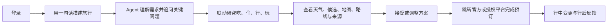

# Travel Agent V1

Travel Agent V1 是一个面向国内与入境自由行用户的旅行决策助手。

用户不需要先填写行程表，只要像和旅行顾问聊天一样描述目的地、日期、同行人、预算和偏好，Agent 就会持续理解需求，联动研究吃、住、行、玩，并把可确认的方案、地图、路线和来源返回到同一个旅行画布中。

> 项目代码不会内置 API Key、平台账号或静态旅行答案。缺少真实数据源时，产品会明确说明哪项信息暂时不可用，不会生成假酒店、假地图或假库存。

## 用户如何使用



一次典型使用过程如下：

1. 用户登录后进入对话，而不是进入“手动添加行程”表单。
2. 用户直接说：“国庆带父母去大理 5 天，从广州出发，住得方便，少走路，想吃本地菜。”
3. Agent 保存已经明确的信息，只追问真正会改变方案的问题，例如抵达方式或单段步行上限。
4. 当信息足够时，Agent 在同一份旅行状态上研究住宿位置、景点、美食、城际与当地交通，而不是运行四套彼此独立的流程。
5. 方案画布展示天气影响、候选地点、照片、地图位置、路线、公共交通和来源；数据是否实时、是否仍需现场确认会明确标注。
6. Agent 提出的变更先作为待确认方案。只有用户接受后，行程才会写入正式计划。
7. 预订环节只准备官方或授权平台跳转，不代替用户付款、购票或退改。
8. 遇到下雨、航班延误、闭店或换酒店时，只重排受影响的部分，保留无关的已确认安排。

## 目前具备的功能

### 对话式旅行规划

- 从自然语言开始创建旅行，不要求用户先录入结构化行程。
- 在多轮对话中增量保存目的地、日期、出发地、预算、节奏和偏好；用户没有再次提到的信息不会被清空。
- 支持多人同行，并将长辈、儿童、体力、步行、换乘、饮食和无障碍要求绑定到具体 Traveler。
- 默认使用 DeepSeek 完成旅行理解、推理与工具调用；可按对话切换模型。

### 吃、住、行、玩联合方案

- 吃、住、行、玩共享同一个 `Trip Control State`，住宿位置、交通时间、天气和预算会互相影响。
- 候选先进入待确认状态，用户接受后才提交到正式行程。
- 支持预算、时间窗、营业状态、外宾住宿资格、证件与支付可操作性等旅行约束。
- 支持方案比较、取舍解释、局部重排、异常处理和行后反馈。

### 地图、路线与旅行执行信息

- 高德 Adapter 已覆盖中国境内 POI、地址、坐标、地点照片、静态地图、天气和城市路线。
- 用户确认地点后，可比较步行、公交地铁和打车，并显示耗时、步行距离、换乘、估价和来源。
- 路线数据允许呈现入口出口、楼梯、电梯、坡道等高德可返回的信息；“设施存在”不会被写成“当前正常运行”。
- 地图和设施字段缺失时会诚实降级，不会阻断其他可用方案。

### 酒店、航班、火车与景点库存

- 飞猪 FlyAI Adapter 可读取酒店、航班、火车和景点信息，并生成飞猪详情跳转。
- 途牛官方 MCP Adapter 可作为酒店、火车、航班和门票的第二来源。
- 高德用于酒店实体、坐标、地图、照片和基础信息；指定日期的价格、房型、早餐、退改和房态必须来自授权 OTA。
- 所有购买动作都保留给用户，Agent 不保存支付信息，也不会自动下单。

### 多端与集成

- Web/PWA：React + Vite，对话和方案画布位于同一产品流程。
- iOS/Android：使用 Capacitor 复用 Web 产品与同一 HTTP API。
- 微信/支付宝小程序：原生工程以对话为首页，共用服务端旅行状态和提交规则。
- MCP：向 Codex、WorkBuddy 等 Agent 客户端暴露 trip、proposal、fulfillment、disruption 和 feedback 等业务能力。
- 数据持久化：本地开发使用原子 JSON repository；生产可切换 PostgreSQL。

## 哪些能力仍需要外部账号

仓库包含接入代码，但不会包含第三方密钥。代码存在不等于平台账号已经授权。

| 能力 | 代码状态 | 使用前需要什么 |
| --- | --- | --- |
| DeepSeek 对话与工具调用 | 已接入 | `DEEPSEEK_API_KEY`，并完成真实模型 smoke |
| Kimi 图片理解与 sub-agent | 后端路由已接入 | `MOONSHOT_API_KEY`；普通用户图片上传入口尚未开发 |
| 高德地点、照片、地图、天气、路线 | Adapter 已接入 | 高德 Web 服务 Key 与真实 smoke；账号网关异常时保持不可用 |
| 飞猪 FlyAI | 只读 Adapter 已接入 | FlyAI Key、启用开关与隔离只读 smoke |
| 途牛官方 MCP | 只读 Adapter 已接入 | 途牛 API Key、启用开关与隔离只读 smoke |
| Google 登录 | Web 主入口已实现 | Google OAuth Web Application、HTTPS 回调与客户端凭据 |
| 微信登录 | Web 扫码和小程序 code exchange 已实现 | 微信开放平台网站应用、小程序 AppID/Secret 与已登记域名 |
| 支付宝登录 | Web 授权和小程序 code exchange 已实现 | 支付宝应用、RSA2 密钥、授权能力与已登记回调 |
| Apple 登录 | Web OAuth 已实现 | Apple Developer Program、Services ID 与 `.p8` Key |
| 小红书/抖音内容检索 | Skill 与只读合同已定义 | 独立受限 Worker、专用账号和真实只读 smoke；当前未接通 |

详细申请入口、回调 URL 和字段说明见 [账号、模型与 API 配置说明](./wiki/current/09-account-configuration-guide.md)。

## 本地运行

### 1. 环境要求

- Node.js `>=22.19.0`
- npm
- 两个终端窗口

安装依赖：

```bash
npm install --ignore-scripts
```

### 2. 创建本地配置

复制示例文件。macOS/Linux：

```bash
cp .env.example env_travel.local
chmod 600 env_travel.local
```

Windows PowerShell：

```powershell
Copy-Item .env.example env_travel.local
```

API 启动时会自动读取项目根目录的 `env_travel.local`。macOS/Linux 要求权限为 `0600`；Windows 使用当前账号的文件 ACL，不错误套用 POSIX 权限位。该文件已被 Git 忽略，仍应只允许当前开发账号读取。

先配置最小本地开发环境：

```dotenv
NODE_ENV=development
PORT=8797
TRAVEL_AGENT_ALLOW_DEVELOPMENT_AUTH=true
TRAVEL_AGENT_DATA_DIR=runtime-data/trips
TRAVEL_AGENT_CORS_ORIGINS=http://127.0.0.1:5173

TRAVEL_AGENT_MODEL_PROVIDER=deepseek
TRAVEL_AGENT_MODEL=deepseek-v4-flash
DEEPSEEK_API_KEY=你的服务端Key
TRAVEL_AGENT_DEEPSEEK_SMOKE_STATUS=not_run
```

开发登录只允许在非生产环境显式开启。它只是本机体验入口，不会冒充 Google、微信、支付宝或 Apple 登录。

### 3. 验证模型

```bash
npm run smoke:models
npm run smoke:conversation
```

真实 smoke 通过后，再按输出结果更新相应的 `*_SMOKE_STATUS`。不要仅因为填写了 Key 就将状态标记为通过。

### 4. 启动 API 和 Web

终端一：

```bash
npm run api
```

终端二：

```bash
npm run web:dev
```

然后访问 [http://127.0.0.1:5173](http://127.0.0.1:5173)。Web 开发服务器会把 `/api` 代理到 `http://127.0.0.1:8797`。

如果没有配置模型，用户输入仍会保存，但界面会明确显示 Agent 当前不可用，不会生成模拟回答。

## 配置完整旅行数据

所有字段均来自 [.env.example](./.env.example)。建议按下面顺序接入，便于定位问题。

### 1. 地点、地图与路线

```dotenv
AMAP_API_KEY=
AMAP_API_SECRET=
TRAVEL_AGENT_AMAP_SMOKE_STATUS=not_run
```

`AMAP_API_SECRET` 只在高德控制台为该 Web 服务 Key 开启数字签名时填写。

```bash
npm run diagnose:amap
npm run smoke:amap
```

### 2. 图片理解

```dotenv
TRAVEL_AGENT_VISION_PROVIDER=moonshotai-cn
TRAVEL_AGENT_VISION_MODEL=kimi-k2.6
MOONSHOT_API_KEY=
TRAVEL_AGENT_KIMI_SMOKE_STATUS=not_run
```

### 3. 天气

开发环境默认可使用 Open-Meteo 非商业回退：

```dotenv
TRAVEL_AGENT_OPEN_METEO_ENABLED=true
OPEN_METEO_API_KEY=
```

生产环境必须使用通过完整 smoke 的高德天气，或配置付费 Open-Meteo Customer API Key。

```bash
npm run smoke:weather
```

### 4. 飞猪与途牛库存

```dotenv
TRAVEL_AGENT_FLYAI_ENABLED=true
FLYAI_API_KEY=
TRAVEL_AGENT_FLYAI_SMOKE_STATUS=not_run

TRAVEL_AGENT_TUNIU_ENABLED=true
TUNIU_API_KEY=
TRAVEL_AGENT_TUNIU_SMOKE_STATUS=not_run
```

```bash
npm run smoke:inventory
```

只有真实隔离只读 smoke 通过后，才能把状态改为 `passed_read_only_isolated`。

## 配置生产登录

生产环境首先需要固定 HTTPS Origin 和两个相互独立、至少 32 字符的随机密钥：

```dotenv
NODE_ENV=production
TRAVEL_AGENT_PUBLIC_ORIGIN=https://travel.example.com
TRAVEL_AGENT_SESSION_SECRET=
TRAVEL_AGENT_AUTH_STATE_SECRET=
```

然后按需配置登录渠道：

```dotenv
# Google
GOOGLE_CLIENT_ID=
GOOGLE_CLIENT_SECRET=

# 微信 Web 与小程序
WECHAT_OPEN_APP_ID=
WECHAT_OPEN_APP_SECRET=
WECHAT_MINIAPP_APP_ID=
WECHAT_MINIAPP_APP_SECRET=

# 支付宝 Web 与小程序
ALIPAY_APP_ID=
ALIPAY_PRIVATE_KEY_PATH=/仓库外/alipay-private-key.pem
ALIPAY_PUBLIC_KEY_PATH=/仓库外/alipay-public-key.pem

# Apple Web
APPLE_CLIENT_ID=
APPLE_TEAM_ID=
APPLE_KEY_ID=
APPLE_PRIVATE_KEY_PATH=/仓库外/AuthKey.p8
```

密钥文件必须放在仓库外并设置为 `0600`。浏览器端、小程序源码和所有 `VITE_*` 变量都不能包含 Secret。

未配置的渠道会在登录页显示“待开放”。配置完成后还必须真实验证：开始授权 → 平台回调 → 建立会话 → 刷新恢复会话 → 注销。

## 生产数据与部署

生产环境使用 PostgreSQL：

```dotenv
DATABASE_URL=postgresql://...
TRAVEL_AGENT_CORS_ORIGINS=https://travel.example.com
```

```bash
npm run db:migrate
npm run web:build
npm run api
```

API 当前监听 `127.0.0.1:8797`，应由同机 HTTPS 反向代理对外提供服务。

原生应用通过公开 HTTPS API 访问服务端：

```dotenv
VITE_TRAVEL_API_BASE_URL=https://travel.example.com
```

```bash
npm run native:sync
```

微信和支付宝原生工程分别位于：

- [`apps/miniapp/wechat/`](./apps/miniapp/wechat/)
- [`apps/miniapp/alipay/`](./apps/miniapp/alipay/)

发布前需要在对应开发者平台填写 AppID、登记 HTTPS request domain，并用真机完成登录和旅行对话 smoke。详见 [小程序工程说明](./apps/miniapp/README.md)。

## 作为 MCP 使用

先在 `env_travel.local` 中填写 `TRAVEL_AGENT_DATA_DIR`，再运行 `npm run mcp`。这种方式在 Windows 与 macOS 上一致，不依赖某一种 Shell 的临时环境变量语法。

MCP 使用与 Web 相同的旅行内核，主要提供：

- 创建和更新旅行需求；
- 读取旅行控制视图、方案和开放决策；
- 联动研究候选；
- 提出、接受或拒绝旅行变更；
- 准备预订跳转并记录用户确认；
- 报告行中异常和提交行后反馈。

未通过安全门的数据源会返回明确的不可用状态，不会用 fixture 或静态候选冒充真实结果。

## 验证项目

```bash
npm run check
```

这个命令依次运行：

- Pi package TypeScript 检查；
- Runtime、HTTP、Agent、Provider、MCP 与持久化测试；
- Web 生产构建；
- 微信和支付宝小程序合同检查。

单独检查多端工程：

```bash
npm run miniapp:weapp
npm run miniapp:alipay
npx cap copy ios
npx cap copy android
```

Fixture 通过只能证明合同正确；Provider 只有完成真实账号、真实网络和只读隔离 smoke 后，才能称为已接通。

### 源码运行与构建产物

仓库当前按内部产品开发方式运行，不要求先生成或提交 `travel-agent-pi-package/dist/`：

- `npm run api`、`npm run mcp` 和 `npm test` 通过锁定的 `tsx` loader 直接加载 TypeScript 源码；
- Pi 从 `travel-agent-pi-package/extensions/*.ts` 和 `plugins/travel-agent/skills/` 加载产品能力；
- `npm run library:build` 只生成可删除、可重建的 `dist/`，用于检查编译输出或未来发包，不是本地启动前置条件；
- `.github/workflows/ci.yml` 会在 Windows、macOS 和 Linux 的 Node `22.19.0` 干净环境中执行 `npm ci --ignore-scripts` 与 `npm run check`。

因此，把仓库克隆到另一台 Windows 或 Mac 后，只需安装锁文件依赖并配置自己的 `env_travel.local`；不能复制旧电脑的 `dist/`、密钥或运行数据来冒充可运行环境。npm 发包保持延期，等公开 API 和完整 Pi package 形态稳定后再单独启用发布门。

## 项目结构

```text
src/http/                         HTTP API、登录与服务入口
src/agent/                        对话 Parent Agent 与模型选择
src/providers/                    高德、天气、飞猪、途牛等 Provider
src/persistence/                  本地 JSON 与 PostgreSQL repository
src/web/                          Web/PWA 产品界面
src/mcp/                          stdio MCP Server
travel-agent-pi-package/src/      TypeScript 合同、旅行核心 Runtime、持久化与 MCP 边界
travel-agent-pi-package/extensions/ Pi 产品工具入口；只暴露业务级合同，不把完整 TripState 放入模型工具参数
plugins/travel-agent/skills/      Travel Agent 语义 Skills 唯一来源
apps/miniapp/                     微信与支付宝原生小程序
wiki/current/                     当前产品和架构规范
wiki/research/                    调研、安全审计与历史决策
tests/                            产品与工程测试
```

继续开发前请阅读：

1. [Wiki 索引](./wiki/README.md)
2. [产品定义与用户体验](./wiki/current/01-product.md)
3. [Agent、上下文与决策架构](./wiki/current/02-agent-architecture.md)
4. [账号、模型与 API 配置说明](./wiki/current/09-account-configuration-guide.md)
5. [开发 Agent 约定](./AGENTS.md) 与 [Travel Parent Agent 行为](./agent.md)

## 安全与产品边界

- API Key、Cookie、Token、证件、手机号和支付信息不得进入 Prompt、日志、artifact 或 Git。
- `env_travel.local`、运行数据和原始会议资料均由 `.gitignore` 排除。
- 社交平台只能通过独立受限 Worker 执行只读搜索、阅读和分享链接解析。
- V1 不自动购买、支付、退改签，也不执行社交发布、点赞、评论、收藏、关注或私信。
- 用户确认前，Agent 和 Skill 都不能直接修改正式旅行状态。

## 许可证

本项目原创代码采用 [PolyForm Noncommercial License 1.0.0](./LICENSE)：允许符合许可证定义的非商业使用、修改和分发；商业使用需要著作权人的单独书面授权。

这是带商业用途限制的 source-available 许可证，不是 OSI 认证的开源许可证。第三方组件继续适用各自许可证，来源和归属见 [NOTICE](./NOTICE)。
