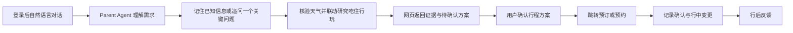

# 产品定义与用户体验

## 产品结论

Travel Agent V1 是面向 C 端的旅行决策与执行助手。用户不是分别使用四个模块，而是在一次对话中完成玩、吃、住、行的联动选择：例如抵达时间会改变入住与当晚餐食，住宿位置会改变路线与游玩节奏，雨天或闭店只重排受影响部分。

目的地仅用于测试覆盖，不能限制支持范围。产品同时服务国内游客和入境游客；英文交互、外宾住宿资格、证件要求、手机号、支付与地图导航必须作为显式的可执行性检查。

## 黄金路径

用户完成的证据是：先在对话中看到 Agent 对需求的理解和下一步，再在网页方案画布中收到一份能解释取舍、覆盖四域、可检查动态信息、可跳转执行的方案；而不是自己先填写行程表，也不是一段看似完整的文字。

## 入口与交互优先级

- 登录后的默认页面是「旅行编辑」对话，而不是旅行库或「添加行程条目」表单。用户可从一句完整需求、模糊愿望或已有事实开始。
- 目的地一旦明确，Parent Agent 就保存当前理解；日期、出发地、抵达方式、预算或住宿位置可以在后续短句中持续补充，省略字段不会被清空。
- 用户需要方案时，缺少出发地只影响城际交通的完整度，不能阻塞目的地内的住宿、美食、游玩和当地交通研究。用户说“住宿你来设计”时，Agent 应提出和比较候选，而不是让用户先填片区。
- 吃、住、行、玩研究返回后，前端的方案画布显示覆盖情况、候选、证据状态和取舍。`TripPatchProposal` 仍需用户明确接受才提交。
- 时间线、地图、公共交通入口/出口、电梯、卫生间、充电宝与储物柜是方案与行中执行的辅助信息面，不是首屏要求用户自行录入的前置条件。
- 用户可以补充已经确认的事实或修改 Agent 的理解，但这属于对话中的修正动作；手动结构化录入不能取代 Agent 的研究与编排职责。
- Schema、Runtime、Provider 状态、revision 等内部合同不是产品内容；失败必须翻译为用户能理解的影响和恢复动作。

## V1 用户能力

| 能力 | 用户获得什么 | 必要约束 |
| --- | --- | --- |
| 旅行理解 | 少量关键追问与个人/多人约束 | 不把小团体压成一个偏好。 |
| 天气约束 | 与旅行日期匹配的预报、风险和四域影响 | 天气不是第五域；超出预报窗口时不得用近期天气替代。 |
| 城市移动 | 已选住宿、活动与餐饮之间的步行、公交地铁、打车比较，含耗时、步行、换乘、估价与来源 | 交通设施 POI 和城际班次不能冒充城市路线；计划路线不能称为实时到站。 |
| 玩 | 体验导向的景点、自然、文化和活动选择 | 支持低剧透摘要、事实详情、证据展开。 |
| 吃 | 菜品、餐厅、排队、饮食限制与动线联动 | 社交发现不能替代营业/预约核验。 |
| 住 | 位置、入住窗口、预算与资格比较 | 入境用户必须显示外宾住宿与证件可操作性。 |
| 行 | 城际、当地交通、时间、行李和导航衔接 | 价格/班次/路况是动态事实，需新鲜度说明。 |
| 变更 | 航延、下雨、闭店或换住宿后的局部重排 | 保留无关锁定项，清晰标出影响。 |
| 履约 | 授权渠道的跳转前检查、跳转与确认记录 | 不代购、不处理支付或证件、不自动退改。 |

## 同行人关怀：从“人群备注”到逐人可执行要求

产品不把“长辈、儿童、孕妇、行动不便”等压成整团标签，也不要求用户披露诊断。用户自然表达“父亲每段最多走 800 米、少换乘”时，系统将“父亲”绑定到稳定同行人 ID，只保存单段步行上限、换乘上限等行动结果；诊断、病史和证明材料不进入旅行状态。

逐人要求覆盖五类当前可执行信息：行动与台阶、体力与休息、出发/返回时间、卫生间/母婴室/婴儿车/安静休息区、感官刺激与饮食排除项。没有明确数字时只记录“需要少走路”等方向，不擅自发明上限；只有答案会改变下一步方案时才追问一个问题。

方案画布必须回显总预算、整体节奏和逐人安排重点。路线超出步行或换乘上限时不能通过 QA；需要连续无台阶、无障碍卫生间或饮食排除核验而来源尚缺时，显示“待核验”，不能把地点存在或普通 POI 字段当作满足证据。

## 天气优先的联合规划

天气与旅行日期、地点共同构成方案成立前的高优先级环境条件。最终候选生成前必须取得带来源和核验时间的预报：雨雪、强风、高低温等会改变户外项目、步行与换乘缓冲、住宿的交通衔接和餐饮动线。预报变化只使受影响决定进入重排，已经锁定且不受影响的部分继续保留。

方案画布在四域候选之前显示天气日期覆盖、风险和影响。行程尚未进入预报窗口时，产品说明何时需要重新核验，不用季节印象或模型记忆假装未来预报。

## 从地点候选到可执行日程

地点列表不是行程。用户确认地点后，系统必须核验住宿锚点、活动与餐饮之间的移动段，比较步行、公交地铁和打车，并按同行人的步行、换乘、行李和无障碍限制选择建议方式。地点、顺序、日期或天气变化时只使相关移动邻域失效。只有地点顺序、时间窗和移动段同时可行，产品才可以称为“按天行程”；否则明确显示仍是候选或未排程路线。

## 内容与信任体验

- 信息发现优先观察小红书，其次抖音，微信常作为用户提供链接的补充；这是一种发现层优先级，而不是动态事实的真相排序。
- 图文、长视频和评论会被拆为地点、菜品、路线、排队、季节和风险等 Claim。用户可先看一句话低剧透，再看事实详情，最后展开图文/视频证据。
- 系统应聚类雷同攻略、同源转载、软广和互相抹黑，避免“很多内容都这么说”形成虚假多数。
- 行后信息进入反馈闭环：个人感受、偏好变化、事实纠错与待核验公共信息分别处理。

## 范围与非目标

V1 只做消费者决策、研究、变更和跳转型履约。长尾资料来自社交发现、用户分享、运营审核资料与行后反馈；不建设商家入驻、广告、佣金、结算、内容社区 Feed 或完整 B 端后台。

小程序、Chatbox 与 MCP 可作为不同入口，但共用同一个旅行内核与业务合同。MCP 不应暴露四域的孤立接口，而应围绕 trip、decision、proposal 与 fulfillment 工作。
