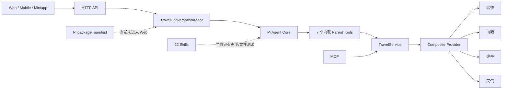
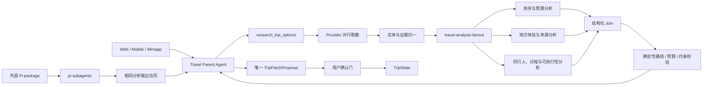

# Agent Runtime、Skills 与动态并行架构

- 日期：2026-08-27
- 状态：四个 Changeset、P0/P1 状态一致性加固与行程 Plan–Check–Repair Harness 已实施；fixture、live model、Pi consumer、Provider、Web 自然会话和浏览器继续按独立验收门记录
- 范围：Travel Parent Agent、Pi package、Extensions、Skills、Provider 研究、动态并行与相关测试
- 约束：本轮只收敛真实运行链与并行能力，不重写 TripState、TravelService、Provider、HTTP/MCP 对外合同、购买边界或现有前端流程

## 1. 结论

当前问题既不是“Extension 全部没必要”，也不是“安装了 package 就等于能力可用”。真实问题是：

1. Web Parent Agent 直接使用 `@earendil-works/pi-agent-core` 并在 `travel-conversation-agent.mjs` 内定义工具，没有加载 Pi package 的 Extensions 与 Skills；
2. Pi package 虽声明 Planner、Registry、Policy、Observability、Social Worker、`pi-subagents` 和 Dynamic Workflow，但大部分只有 manifest、文件或存在性测试，没有产品调用轨迹；
3. `travel-business-runtime.ts` 使用无 Provider 的 `new TravelService()`，Pi package 的研究工具并未获得与 Web/MCP 相同的数据接线；
4. 静态 Capability Registry 仍保留高德历史 `10044` 阻塞状态，已经与当前 live smoke 事实漂移；
5. 22 个 Skills 目前主要由文件存在性测试覆盖，Web Parent Agent 没有实际读取它们；
6. Provider 层已经通过 `Promise.allSettled` 并行调用高德、飞猪、途牛和天气，因此新增 Sub-agent 的价值应是并行语义分析，不是重复请求 Provider；
7. `pi-subagents` 与 Dynamic Workflow 都能承担并行编排，同时放进同一个 Parent Agent 工具面会形成双编排内核。

最终采用：

```text
Provider：并行取数
Dynamic Workflow library：Web 产品内的一次有界并行语义分析
pi-subagents：直接安装 Pi package 的外部 Pi 宿主能力
Skills：提供分析和规划方法
TravelService / Trip Runtime：确定性计算、状态、约束和确认
Parent Agent：汇总、修正条件、解释并生成唯一待确认方案
```

两种并行框架保留并获得真实用途，但不进入同一条编排链。

## 2. 当前真实运行图



### 已核实的声明型证据

- `tests/pi-package-manifest.test.mjs` 只验证 Extension、`pi-subagents` 与 Dynamic Workflow 出现在 manifest，并未执行并行旅行任务；
- `travel-agent-pi-package/tests/contracts.test.mjs` 只验证 Skill 文件存在并声明禁止直接写 TripState；
- Planner、Policy、Observability、Model Routing、Capability Registry 和 Social Worker 的工具名在仓库中没有定义外的消费者；
- Web Parent Agent 的真实工具仍在 `src/agent/travel-conversation-agent.mjs` 内联注册；
- Pi package、Web Agent 和 MCP 目前各自拥有入口定义，但只有 TravelService 是共享业务实现。

## 3. 苏格拉底式决策检查

### 用户要的是更多并行请求吗？

不是。Provider 已经并行取数。重复让多个 LLM 分别访问高德或 OTA 会增加配额、成本和数据冲突。

用户需要的是对同一批已归一化证据进行不同角度的并行判断，然后由父 Agent 合并。

### 是否需要两个编排引擎执行一次 fan-out/join？

不需要。`pi-subagents` 和 Dynamic Workflow 能力重叠，不能在同一个 Parent Agent 工具面中同时负责拓扑、预算、重试和生命周期。

### 为什么 Web 使用 Dynamic Workflow library？

当前 Web Parent Agent直接使用 Pi Agent Core。Dynamic Workflow 导出 `runWorkflow()` 等 library API，可在服务端程序化调用，不要求把 Web 迁进 Pi Coding Agent Extension Host。

### 为什么仍保留 pi-subagents？

Pi package 仍面向直接安装到 Pi 的外部用户；`pi-subagents` 在该宿主中提供自然语言委派、后台运行、并行 `workflowScript` 和运行观察。它不应因为 Web 未使用而被删除，但必须有独立的 Pi consumer smoke 证明可用。

### Skill、Sub-agent 和 Runtime 谁负责什么？

- Skill：分析方法、来源判断、候选比较、日程和取舍解释；
- Sub-agent：执行一个有界、只读、可独立完成的语义任务；
- Provider/Tool：真实取数和确定性计算；
- Runtime：TripState、revision、约束、Patch 和确认；
- Parent Agent：选择任务、汇总、修正并向用户解释。

## 4. 目标架构



## 5. 并行任务合同

### 触发条件

只有以下情况进入并行分析：

- 首次完整、多日旅行规划；
- 同时涉及多个来源和多个重大取舍；
- 导入长视频、长文章或多张截图；
- 整趟深度重规划；
- 当前候选不满足预算、区域、天气或同行人约束，需要换条件研究。

简单补充、单点详情、确认候选、记录已购票和路线解释不启动 Sub-agent。

### 默认三条分析 lane

1. `inventory_budget`：班次、酒店 Offer、价格性质、预算影响与缺失价格；
2. `local_discovery`：餐饮/游玩地方特征、来源独立性、实体冲突和长尾证据；
3. `operability_schedule`：逐人约束、天气、空间关系、按天顺序和执行缺口。

任务可以少于三条；不得为了“显示并行”生成重复任务。

### 输入

```text
trip brief
baseRevision
traveler slice
normalized candidates
evidence refs
weather snapshot
confirmed arrival / locks
task objective
allowed skills
```

不得向子 Agent 传递 Cookie、Token、支付、证件、浏览器配置或 Provider 凭据。

### 输出

```text
analysisId
runId / tripId / baseRevision / criteriaFingerprint
lane
attempt / queuedAt / startedAt / completedAt
findings
recommendedCandidateIds
rejectedCandidateIds
reasonCodes
unknowns
needsContext
evidenceRefs
```

Sub-agent 不能返回 commit 指令，也不能直接修改 TripState。

Join 另外返回 `requiredLanes`、`startedLanes`、`completedLanes`、`failedLanes`、`timedOutLanes`、`coverage`、`degradedReasons`、`joinCount` 和 `joinArtifactId`。Agent 文案、HTTP 与工作台读取同一对象；任一 required lane 未完成时只能显示 `partial` 或 `failed` 并点名受影响的预算库存、地方体验或路线/同行人适配。一个 required lane 也必须真实运行；只有 required lane 为空时才能跳过。

### 预算与停止条件

- 最多 3 个子任务，默认 Child semaphore 为 2，第三条有界排队；
- 每个任务 45 秒硬超时；
- 一个任务只解决一个明确问题；
- 同一 Provider 不因 Sub-agent 数量重复请求；
- 最多允许一次由 Parent 发起的条件修正；
- 整轮深度规划不超过 90 秒；
- 当前不自动重试 Child；日后如启用，相同 lane/输入最多一次且必须有剩余总预算；
- 连续超时会打开本轮 circuit breaker，不再启动尚未开始的 lane；
- 任一 lane 失败时保留其他真实结果并明确缺口；
- 只有 Parent Agent 能合并并生成一份 Proposal。

## 6. 两个并行 package 的分工

### Dynamic Workflow

- 保留依赖；
- 不作为 `pi.extensions` 中的模型可见 Workflow Tool 默认加载；
- Web 服务端通过 library API 运行唯一 `travel-analysis-fanout`；
- 不向普通旅行 Parent Agent开放任意 workflow authoring；
- 只处理已归一化、无凭据的语义分析输入。

### pi-subagents

- 保留在 Pi package 中；
- 面向直接安装 Pi package 的外部 Pi 宿主；
- 配置旅行专用只读 child agents；
- 子 Agent 默认不继承提交、购买、Shell、任意 URL 或社交写工具；
- 禁止递归委派；
- 通过独立 Pi consumer smoke 验证，而不是只检查 manifest。

两者必须输出同一份结构化分析结果，Parent Agent 与 TravelService 不感知具体执行引擎。

## 7. Skills 收敛与真实接线

当前 22 个微型 Skill 保留内容，但新增四个可运行入口：

1. `understand-trip`
2. `research-trip`
3. `plan-trip`
4. `recover-trip`

原有 Skill 转为以上入口的 references，不再要求 Parent 或 Child 同时加载 22 个 Skill。

运行要求：

- Parent 每轮最多加载 1–2 个组合 Skill；
- Child 只能加载 lane 对应的 Skill；
- 记录实际加载的 `skillId` 和版本；
- 测试必须证明 Skill 文本进入运行 context 并改变输出，而不是只检查文件存在。

## 8. Extension 与静态配置修复

| 项目 | 当前问题 | 目标处理 |
| --- | --- | --- |
| `travel-business-runtime` | `new TravelService()` 无真实 Provider | 使用与 HTTP/MCP 相同的 `createTravelService(env)` 工厂 |
| Capability Registry | 保存动态状态且高德状态已漂移 | 只保存能力定义和安全要求；实时状态从 Provider Status 派生 |
| Model Routing JSON | 无运行消费者，与代码路由并存 | 使用同一个 model resolver；删除静态运行事实副本 |
| Planner Extension | 固定四域 Work Units、没有消费者 | 规划方法进入 `plan-trip`；预算/停止条件由执行引擎负责 |
| Policy Extension | 模型可以选择不调用 | 改成 `beforeToolCall` 或 TravelService 强制校验 |
| Observability Extension | 模型主动记录不可靠 | 改成 Agent/Workflow event subscriber |
| Social Worker Extension | 只有校验包装，没有真实 Worker | 未通过隔离 smoke 时不暴露；通过后由 Provider Adapter 调用 |
| QA/Context/Constraint/Patch/State Extensions | 未默认加载且重复 Runtime | 保留核心 TypeScript 函数，移除 Extension 包装 |

## 9. 测试与完成证据

### 必须替换的声明型测试

- manifest 存在性不能证明并行能力；
- Skill 文件存在与禁止写状态不能证明 Skill 参与运行；
- package load 成功不能证明 Provider、模型或 TripState 链路可用。

### 必须新增的行为证据

1. Web 自然语言请求真实触发至少两个不同 lane；
2. 两个 lane 的运行时间发生重叠；
3. Provider 调用次数不随子 Agent 数量重复增长；
4. 子 Agent 输入目标不同，输出通过结构化 Schema；
5. 只发生一次 Join；
6. 只有 Parent 生成 Proposal；
7. 试排与子 Agent 失败都不修改 TripState；
8. Parent 至少根据分析结果修正一次条件或明确说明不需修正；
9. Pi package consumer 能用真实 Provider fixture 完成研究，而不是 `provider_unavailable`；
10. Skill load 事件、版本和效果可追溯；
11. Capability Status 与当前 Provider 状态一致；
12. fixture、live provider、应用链和真实浏览器证据继续分开标记。
13. Run A 已过期而 Run B 已开始时，A 必须 `stale_discarded`；
14. 同一 `(runId, lane, attempt)` 重放不重复记账，一个 run 只 Join 一次并关联一份稳定 Proposal；
15. `empty_verified`、`provider_unavailable`、`rate_limited`、`auth_required` 与 `partial` 的用户文案和行为不同；
16. 默认并发 2、Child 45 秒、Parent 90 秒和 timeout circuit breaker 有可观察证据；
17. 锁定 Pi consumer 运行真实 Child，不兼容宿主在业务 Extension 加载前 fail closed；
18. 无跨实例 coordinator 时只允许 `single_process`，健康检查公开这一限制。

## 10. 实施 Changesets

### Changeset 1：修复真实接线与漂移

- 新增简单 `createTravelService(env)`；
- HTTP、MCP、Pi business runtime 使用它；
- Capability Registry 去除动态状态；
- Model Routing 收敛到同一 resolver；
- 增加 Pi consumer smoke。

### Changeset 2：接线组合 Skills

- 新增四个组合入口；
- 原 22 个 Skill 转 references；
- Parent/Child 记录实际加载 Skill；
- 将存在性测试升级为行为测试。

### Changeset 3：动态并行语义分析

- Provider 保持现有确定性并行；
- Web 使用 Dynamic Workflow library 运行唯一 fan-out；
- Pi package 使用 pi-subagents；
- 统一输入/输出 Schema；
- 实现超时、预算、失败降级和一次 Join。

### Changeset 4：移除重复包装并同步文档

- Policy/Observability 转强制 Hook；
- 移除无消费者或重复 Runtime 的 Extension 包装；
- Dynamic Workflow Extension 不进入 Pi 默认工具面；
- 更新 manifest、README、架构文档与测试；
- 完成 Web、MCP、Pi package 和浏览器黄金路径回归。

## 11. 2026-08-27 实施结果

- Changeset 1：新增 `createTravelService(env)`，HTTP、MCP 与 Pi business runtime 使用同一 Provider 工厂；Capability JSON 只保留描述/安全要求，当前状态由 Provider Status 派生；静态 model-routing JSON 已删除；Pi consumer fixture 已创建旅行并生成四域 Proposal。
- Changeset 2：新增四个组合 Skill；Parent 每轮加载 1–2 个并记录 `skillId`、版本与摘要；三个只读 Child agent 分别加载 lane Skill；原微 Skill 内容原位保留并被引用。
- Changeset 3：Web 在一次 Provider 调用后使用 `runWorkflow()` 对最多三条不同 lane 分析；默认并发 2、Child 45 秒、Parent 90 秒、一次 Join、失败降级、重复调用保护和最多一次研究条件修正已接线。Provider fixture 证明确有重叠执行且调用数保持 1。
- Changeset 4：Dynamic Workflow Extension 不再进入默认工具面；Planner、Policy、Observability、Social Worker 与重复 QA/Context/Constraint/Patch/State Extension 包装已移除，核心 TypeScript Runtime、TravelService 校验和 Agent/Workflow event subscriber 保留；Pi package 保留 `pi-subagents` 与三个 package child agents。
- 回滚边界：`createTravelService(..., { analysisFanout: false })` 可关闭 Web 语义 fan-out，不改变 Provider、TripState、Proposal、HTTP/MCP 操作名或用户确认链。
- 行为证据：fixture 三 lane 的起止区间重叠，Provider 调用保持一次、一次 Join、一个 Proposal、revision 不变。2026-08-28 最新 DeepSeek live fan-out 在 48.7 秒内完成 3/3 required lanes；最新 Kimi 在 25.7 秒内完成 2/2 required lanes。两者都使用同一 Schema、evidence allowlist 与 AbortSignal。此前的 partial/failed 记录保留，证明 smoke ledger 会撤销旧通过；真实自然语言与浏览器证据仍需单独复测。
- 外部 Pi consumer：项目锁定的本地 Pi 0.84.1 已在干净临时 consumer 中真实启动 `zhuanshu-travel.inventory-budget` Child，加载 `plan-trip`，对 fixture 票价与酒店参考价完成只读预算分析；工具面仅允许目标 Skill 的只读加载，未调用 Provider 或写状态。目标全局 Pi 0.74.0 不在 `>=0.84.1 <0.85.0` 兼容范围，Extension 在业务加载前明确 fail closed；不能把本地通过写成通用 Pi package 已可用。
- 浏览器自然路径：在 127.0.0.1 的虚构上海三人行程中，四域各 3 个真实候选与地图可见，最新 run 使用滚动 semaphore；`inventory_budget` 完成后立即释放槽给 `operability_schedule`，两条均完成，`local_discovery` 在 45 秒超时。工作台与聊天共同显示 coverage=partial 和“当地体验与来源尚未完成”，没有称为完整规划；`joinCount=1`、Trip revision=3、selected nodes=0、console error/warn=0。该证据证明降级与状态一致，但不证明自然路径每次都能 3/3 完成。
- 最终回归：`npm run check` 通过 153 项合同/行为测试、严格类型检查、Web production build 与微信/支付宝小程序检查；它不替代上述 live 与浏览器证据。

本节记录代码结果，并继续区分 fixture、独立 live model、Provider/API 组合、自然语言 smoke、浏览器和 Pi consumer。生产多实例不在本轮预建分布式队列：当前仅支持单进程执行；未锁定全局 Pi 兼容性仍未关闭。

## 12. P0/P1 状态一致性与部署门

### 覆盖与陈旧运行

- 每个 run/lane 携带 `runId`、`tripId`、`baseRevision`、`criteriaFingerprint`、lane、attempt 和起止时间；
- 新 run supersede 同一 Trip 的旧 run，并通过 AbortSignal 停止未完成分析；
- Join 前重新读取 Trip revision 与 fingerprint；不匹配结果标记 `stale_discarded`，不会进入候选、解释、页面或 Proposal；
- 前端只接收当前会话的 request sequence，迟到响应不能覆盖新要求。

### Exactly-once Join 与 Proposal

- Lane 完成以 `(runId, lane, attempt)` 幂等，重复 completion 读取首个结果；
- 进程内 coordinator 以 compare-and-set 将 run 从 `analyzing` 仅一次转为 `joining`，生成一个 `join_<runId>`；
- Proposal ID 稳定关联 runId；同条件刷新复用现有 Proposal，不生成竞争提案；
- Child 仍无 commit、accept、booking、Provider 凭据、Shell、任意 URL、社交写或递归委派能力。

### 模型 fallback

- DeepSeek 是 Web 语义分析主路由；Kimi 只有专用的“真实 Child + 组合 Skill + 结构化 Schema + 无状态写入”smoke 为 `passed_live_smoke` 后才进入 fallback；
- 未通过时固定为 `fallback_unavailable`，不能用普通模型调用冒充 Child fallback；
- 主模型与 fallback 使用同一 Schema、candidate/evidence allowlist 和 TripState 不写入检查。
- 2026-08-28 Kimi 首次复验曾为 partial，随后一度因不兼容的 JSON 请求选项变为 failed；门控期间本地 ledger 都正确撤销旧通过。按 Provider 分开 JSON 选项并保留共同的有界对象提取后，最新 2/2 lane 完整通过，当前 Web fallback 才恢复 available。锁定 Pi consumer 的普通只读 Child 成功仍不能替代这项结构化门。

### Provider 空库存

- 请求域按实际来源能力返回 `completed_nonempty`、`empty_verified`、`provider_unavailable`、`rate_limited`、`auth_required` 或 `partial`；
- `empty_verified` 只表示本次适用来源在当前条件下无可核验库存，不表示市场没有；
- 高德的机场、车站、停车场、出入口和市内交通设施不是城际库存来源，不能补位航班或铁路；
- 受影响领域刷新失败时不覆盖其他领域；旧库存继续受 fingerprint、`checkedAt` 与 `freshUntil` 约束。

### 宿主与生产执行模式

- 项目锁定宿主范围是 Pi `>=0.84.1 <0.85.0`；当前项目 Pi 0.84.1 通过，目标全局 Pi 0.74.0 被明确拒绝；
- Workflow coordinator 目前是进程内、单实例实现。`/api/health` 暴露 `workflowExecutionMode=single_process`、worker 数和不支持 background resume/cross-instance steer；
- 配置为多 worker/多实例且无已实现 coordinator 时，语义 fan-out 被关闭，服务退回单请求同步/部分结果模式；不声称跨实例 resume、steer 或 exactly-once；
- 后续确有横向扩容需求时再引入 PostgreSQL lease、heartbeat、event sequence 和原子 Join，本轮不增加 Redis/Kafka/通用队列。

## 13. 禁止事项

- 不把吃、住、行、玩拆成四个拥有各自状态的 Agent；
- 不让子 Agent 调 Provider、commit、购买或社交写能力；
- 不同时在同一 Parent 工具面暴露两个编排引擎；
- 不建立第二份 TripState、第二套 Proposal 或通用任务平台；
- 不用新增文件数、测试数、manifest 存在或 package load 冒充能力完成；
- 不在本轮顺带重写 UI、认证、Provider 数据政策或 MCP 公共操作名；
- 不一次性删除全部旧 Extension，必须按消费者和行为等价证据逐步收敛。

## 14. 追溯关系

本文承接：

- `01-product.md` 的 Agentic 产品定位；
- `02-agent-architecture.md` 的 Parent/Skill/TripState/Proposal 所有权；
- `03-skills-providers-and-mcp.md` 的来源和 Provider 分工；
- `04-runtime-and-development.md` 的 Pi package 迁移背景；
- `10-v2-implementation-decisions.md` 的状态一致性决策；
- `11-intelligent-planning-iteration.md` 的预算、路线、主动补缺和等待体验目标；
- 2026-08-27 用户确认：保留并真实利用动态并行能力，同时审查 package/Skill 的声明式完成和重复工程。

后续实现若偏离本文，必须在 `10-v2-implementation-decisions.md` 记录替代决策、原因、影响和回滚方式。

## 15. 有反馈依赖的行程规划 Harness（2026-08-30）

行程规划不进入 Dynamic Workflow fan-out，也不新增 planning Sub-agent。原因是它的第二步依赖第一次 Checker 结果，属于 Parent 内的顺序反馈循环：

```text
Parent + plan-trip
  → ItineraryPlan attempt 1
  → plan_itinerary_trial
  → AMap + deterministic Checker
  → feasible: one pending proposal artifact
  → needs_repair: Parent attempt 2 once
  → blocked/needs_context: stop
```

### 单一合同与运行身份

- `ItineraryPlanSchema` 是 Parent Tool 输入与 Runtime 校验的同一 TypeBox 对象；字段包括 run/trip/revision/attempt、objective/priorities、locks/fixed anchors、days/stops、timeWindow/duration/role/modes/rationale、assumptions/needsContext/evidenceRefs。
- DeepSeek 对该嵌套 schema 的 `$id` 元数据会静默空返回，现已移除仅用于命名的 `$id`；字段与 Value.Check 没有另存副本。
- `operationId = runId:attempt`；规划复用独立的 `TravelAnalysisRunCoordinator` 实例完成 supersede、AbortSignal、attempt replay、stale discard 与 terminal Join。它是短期运行控制，不是第二份旅行状态。
- 规划上下文由服务端从现有 Trip/Proposal/Environment 只读组装；只在直接规划意图中加载 `plan-trip` 与唯一的 `plan_itinerary_trial`，避免普通回合携带大规划合同，也避免先用一轮模型 Tool 取回服务端已经拥有的事实。

### 状态所有权

- attempt 失败或 repair 不写状态；成功 Trial 可把 canonical plan 与 preview pointer 附着到现有 pending proposal，revision 与 selected nodes 不变。
- 用户“保持当前”只移除 itinerary 字段；研究候选继续保留。用户“采用优化方案”才由现有 `acceptTripChange` 提交候选并把同一份已核验 Mobility 写入 `environment.mobility`。
- 逐段 route mode 先经服务端复核，再随同一 Trial 确认。确认会复用 preview cache；缓存不存在时只能重新核验同一 canonical plan，不能让模型临时改写。
- `buildItineraryDraft()` 只保留为 quick comparison / conservative fallback；正常计划通过 `itineraryPlanToDraft()` 保留模型明确站序，`finalizeItinerarySchedule()` 只顺延 flexible time，不擅自重排。

### 与语义 fan-out 的关系

Provider 研究仍是一批取数后最多三 lane 并行分析；规划 Harness 消费候选与已确认事实，不让 Child 再请求 Provider。一次成功规划 attempt 调一次 `planMobility`，不会随 lane 数增长。研究 partial 可以先提供候选，但 Parent 必须在 Trial 中重新做确定性路线核验，不能把 partial 分析写成完整规划。

本次成功浏览器回合为 `planningAttempt=1`：1 次 `plan_itinerary_trial`、其内 1 次 `planMobility`，Parent 模型经历“生成 Tool 参数 → Tool 后回复”两次响应；没有触发 repair。独立 fixture 另证明 fixed conflict 会触发 attempt 2，第二次仍失败则停止；两类证据不能互相替代。高德独立 live smoke 同日为 `completed/partial`：play 6、food 0、stay 6、transport 6，静态地图、天气与单段 mobility 通过；浏览器的餐饮候选来自应用组合链，不能把高德 `food=0` 改写为高德餐饮已单独通过。
