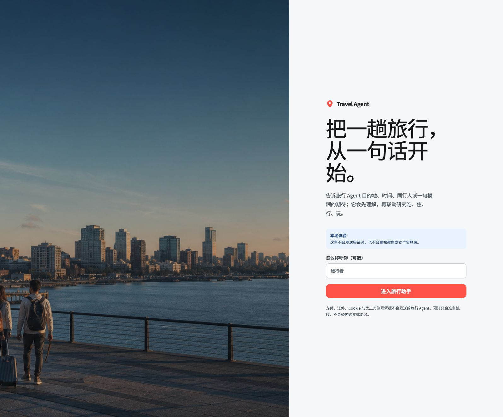
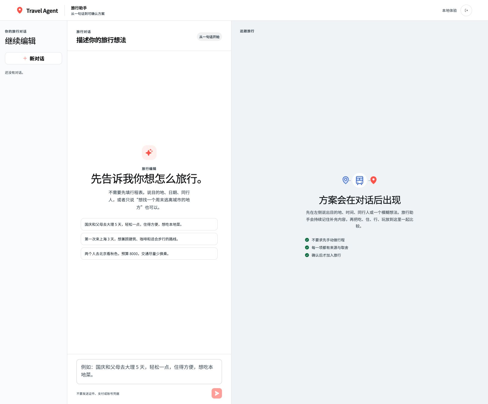
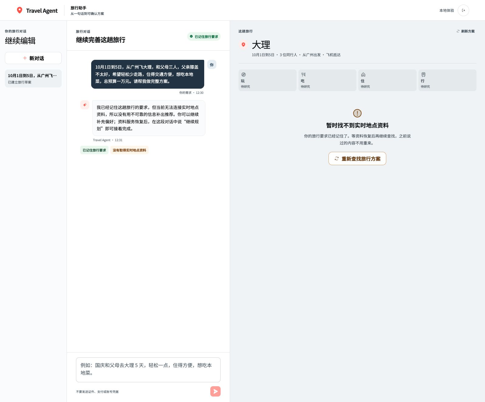
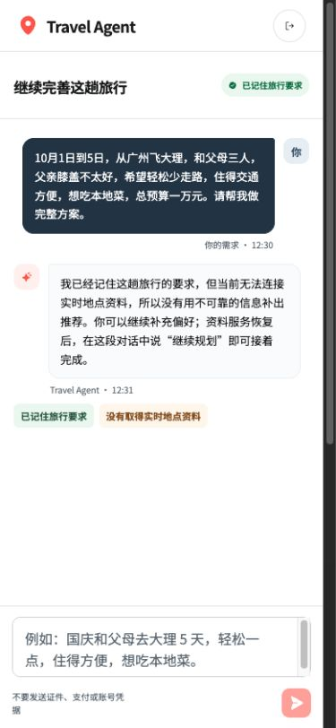
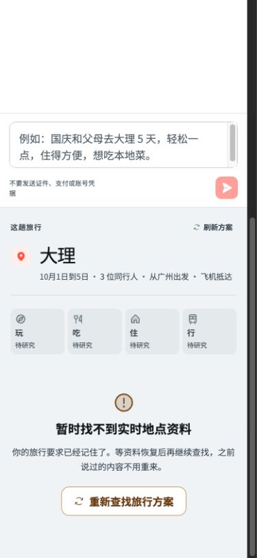

# 2026-08-15 真实旅行者可用性审计

## 总体判定

当前产品可以作为“旅行需求采集与保存助手”使用，但还不能作为普通旅行者真正完成方案的 Travel Agent。真实 DeepSeek 能理解复杂中文需求；真实地点、照片、地图和可执行行程因高德未配置而没有生成。即使配置高德，实时公交路线、站内设施、房态、价格和预订仍需要后续 Provider 开发。

## 审计范围

- 用户目标：一家三口从广州飞大理，父亲膝盖不适，要求轻松少走路、住宿交通方便、本地菜、总预算一万元，并获得完整吃住行玩方案。
- 路径：本地登录 → 对话入口 → 提交完整需求 → 查看方案与恢复方式 → 移动端复核。
- 视口：桌面和 390×844 手机。

## 流程证据

### 1. 登录入口——健康

- 入口明确表达“从一句话开始”，本地模式没有伪装成真实验证码或第三方登录。
- 风险：生产微信、支付宝、Apple 和邮箱登录尚未接线。

### 2. 对话起点——健康

- 用户无需先添加行程，示例能快速说明可输入的信息。
- 桌面端对话与方案区关系清晰；右侧明确说明确认前不会加入旅行。

### 3. 需求理解——部分健康

- 实际保存了大理、10 月 1–5 日、广州、飞机、3 人、父亲膝盖限制、轻松少走路、交通方便、本地菜和一万元预算。
- 界面只展示目的地、日期、人数、出发地和抵达方式；膝盖限制与预算没有可见回显，旅行者无法确认 Agent 是否正确理解了最重要的风险。
- `Traveler Plane` 中三位同行人已建立，但父亲的膝盖限制仍只存在整体 `partyProfile` 文本，尚未绑定到具体同行人；后续路线适配不能据此宣称可靠。
- 高德未配置时没有任何候选，产品诚实降级，但“完整方案”目标没有完成。

### 4. 手机端对话——基本可用

- 消息、状态和输入框在 390px 宽度下无横向溢出。
- 对话结束后页面存在较大空白，方案区在下方且缺少明显的“向下查看方案”提示。

### 5. 手机端方案区——可达但当前阻塞

- 旅行摘要和恢复按钮可见，用户不需要重新输入需求。
- 需要手动向下滚动一个视口才能看到方案状态；未来有真实候选后，应提供对话/方案切换或自动聚焦新方案。

## 最高影响问题

1. **阻断：没有真实地点数据。** 当前普通旅行者无法得到任何吃住行玩候选，因此整体产品尚不可用。
2. **高风险：个人约束没有结构化到具体同行人。** 膝盖、体力、饮食、证件等限制若只留在整段文本中，不能可靠驱动路线和住宿判断。
3. **高风险：关键理解不可见。** 预算和膝盖限制没有在方案摘要回显，用户无法纠错。
4. **功能缺口：Kimi 没有前端入口。** 新 Key 只能让后端图片 smoke 通过，不能让旅行者上传菜单、截图或标识。
5. **能力边界：高德 Key 不是完整交通产品。** 当前只接 POI、照片、静态地图和位置跳转；实时路线与设施仍未接线。

## 可访问性风险与证据边界

- 截图可确认页面具有标题、文本框标签、按钮名称和响应式重排；未发现横向溢出。
- 辅助说明和时间戳字号偏小，灰色文本的对比度仍需自动化与真实设备测量。
- 本轮没有完成屏幕阅读器、全键盘顺序、200% 缩放和动态状态播报的完整验收，因此不能宣称 WCAG 合规。

## 推荐顺序

先配置 DeepSeek、Kimi 与高德并重跑同一旅行用例；随后优先补齐“个人约束绑定与回显”，再接路线/设施，最后开放图片上传和授权旅行供应商。仅配置 Key 不能替代这些产品开发。
