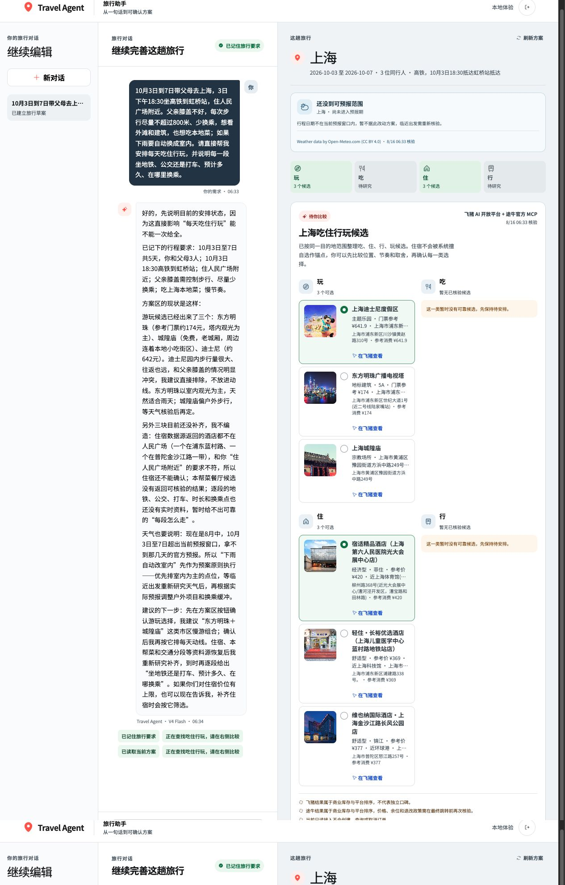
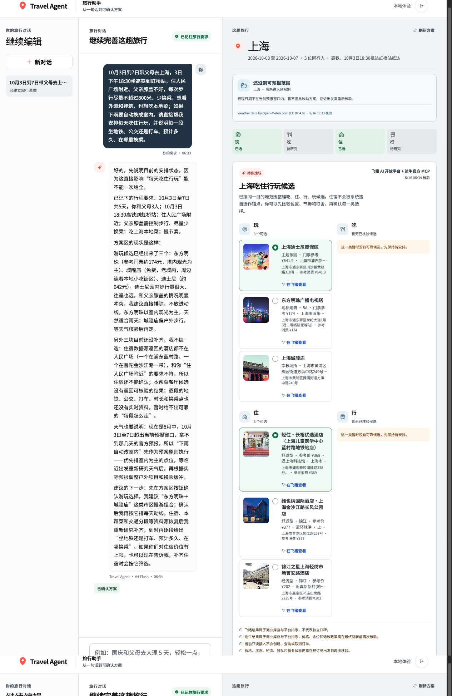
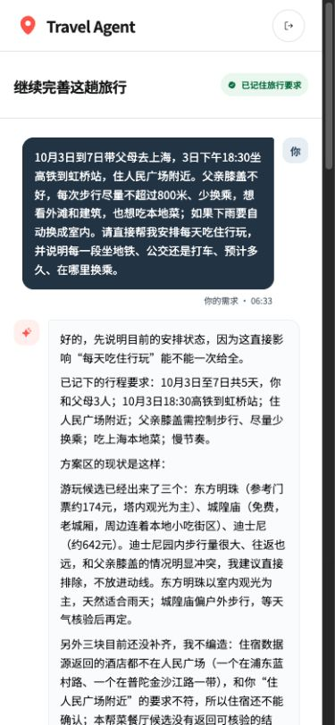
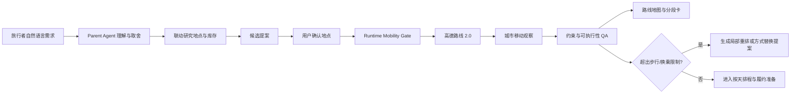
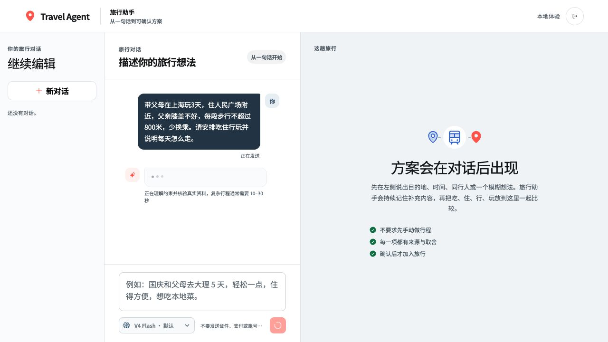
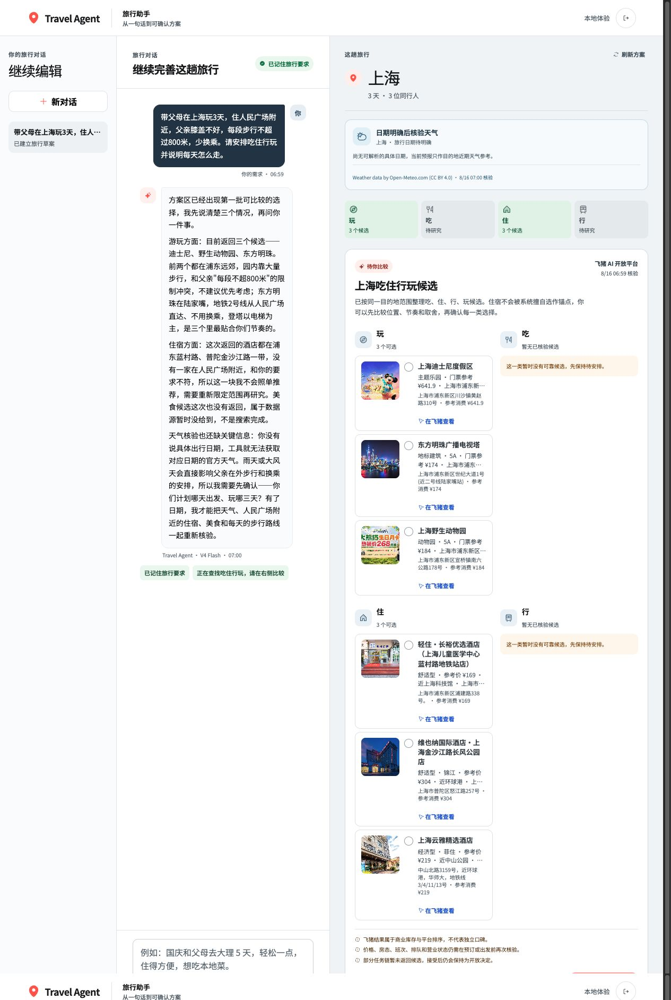
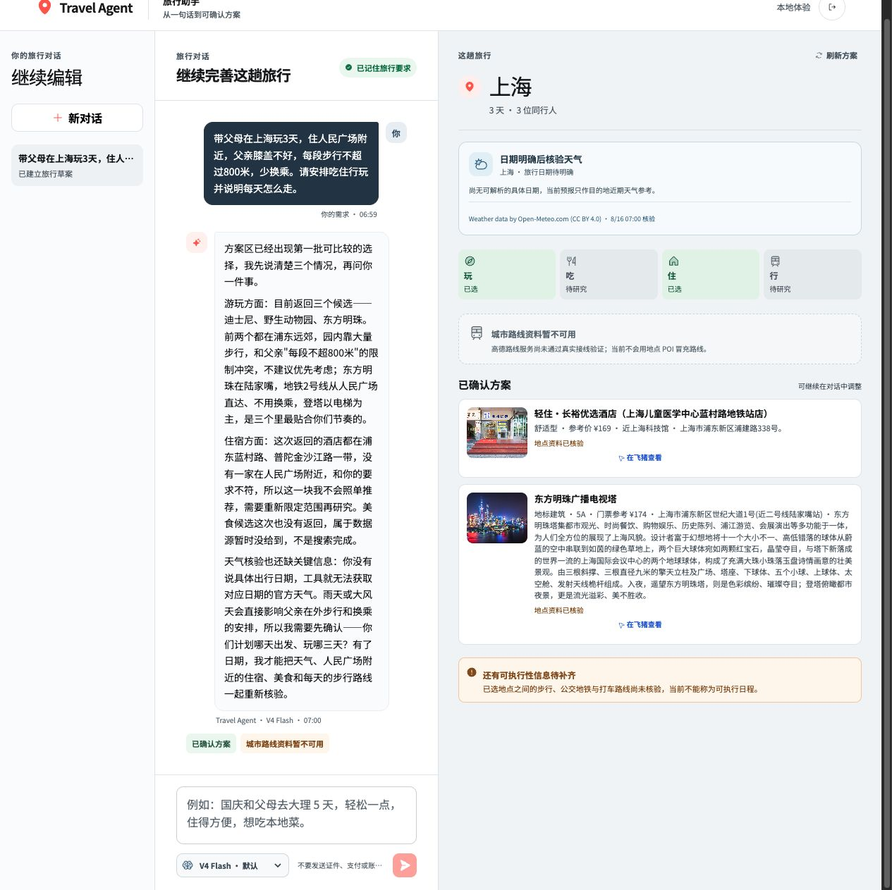
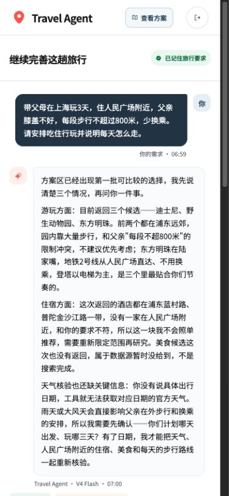
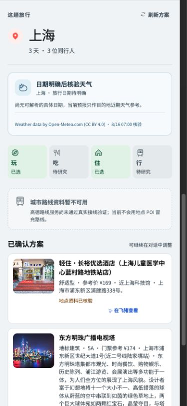

# 高德城市移动能力、旅行者黄金路径与代码实现审计

日期：2026-08-16
范围：Travel Agent 当前 Web 黄金路径、高德 Web 服务、Runtime、父 Agent Prompt、前端方案画布与对抗性测试。

## 结论先行

当前产品此前没有充分利用高德。它实际使用的是 POI 搜索、地理编码、天气、静态地图和位置跳转；所谓“行”主要是交通设施 POI 或飞猪/途牛的城际班次，并没有把已选住宿、景点和餐饮连接为可执行的城市移动段。代码中虽然存在 `transit-segment-v1`，但没有真实路线 Provider 写入，也没有前端路线面板读取，文档一度比实现更超前。

本轮已把城市移动落为 Runtime 强制执行的 **Mobility Gate**：用户确认地点后，服务端调用高德路径规划 2.0，比较步行、公交/地铁和打车估算，按同行人的步行与换乘约束给出建议；结果进入共享 Environment Plane、Context Pack、QA、服务端静态路线图和前端路线卡。地点或行程范围变化会使旧路线失效。高德账号仍处于 `10044` 平台网关异常时，该能力诚实显示不可用，不会用交通设施 POI 或模型常识冒充路线。

这解决的是“已选地点之间能不能走、怎么走”的真实闭环，不等于已经解决完整多日排程。当前候选提案仍以四域选择为主，缺少稳定的按天时间窗、多个活动排序和开闭馆联动；因此产品还不能仅凭一组候选称为完整五日行程。

## 第一性原理：旅行者真正购买的是可行的一天

普通旅行者不是来收集 POI 的。他希望降低五类不确定性：

1. **选择不确定性**：哪些地点真的适合同行人、季节、预算和兴趣。
2. **空间不确定性**：住在哪里，地点之间是否折返，拖行李是否困难。
3. **时间不确定性**：几点出发、是否来得及、营业时间与预约是否冲突。
4. **移动不确定性**：走多远、换几次、在哪里上车、下雨或体力不足时如何改。
5. **履约不确定性**：票、房、班次和价格是否仍然有效，在哪里完成最终购买。

因此产品的价值单位不是“一个候选卡片”，而是“一个有来源、能解释、能局部调整的可行日程”。高德最适合承担其中的地点身份、空间关系和城市移动证据；飞猪、途牛、12306 或授权平台承担库存与履约；Agent 负责把这些事实组织成取舍并向用户解释。

## 当前产品真实取证

### 步骤 1：入口

入口已经符合“从一句话开始”，不要求用户先写行程表。

### 步骤 2：带父母、限步行、少换乘的上海五日请求

本次真实输入明确要求：人民广场附近住宿、父亲膝盖不好、每段步行不超过 800 米、少换乘、下雨换室内、逐段说明地铁/公交/打车。Agent 文本正确识别“迪士尼不合适、返回酒店位置不合适、路线尚未取得”，但画布仍默认选中迪士尼和不符合住宿位置的酒店。用户能够在没有任何选择动作的情况下直接确认。这证明文本推理、候选默认值和提交校验彼此脱节。

请求首次提交还经历了约一分钟的无反馈等待：对话尚未创建时，界面只禁用输入，没有展示正在处理的用户请求与预计等待。这不是模型能力问题，而是前端状态表达缺失。

### 步骤 3：确认后仍不是行程

确认后展示的仍然是按“玩、住”等分类的候选，没有按天安排、地点顺序、移动段或路线图；而且一次 Agent 回合产生了重复研究提案，接受一份后仍有另一份待确认提案。用户看到“已确认方案”，但实际上只是选中了两个地点。

### 步骤 4：移动端

移动端对话长文本会把方案推到首屏之外。虽然页面可以继续向下滚动，但旅行者无法快速在“对话”和“方案”之间切换。本轮增加了移动端“查看方案”跳转，并为首次请求增加可见的处理中状态；后续仍应把按天行程和地图作为移动端独立信息层，而不是放在长回复之后。

## 高德能力应如何进入旅行流程

| 旅行阶段 | 高德能力 | 产品用途 | 不能冒充什么 |
| --- | --- | --- | --- |
| 目的地研究 | POI v3 / POI 2.0、地理编码 | 地点身份、地址、坐标、类别、照片和部分营业信息 | 独立口碑、酒店房态、门票库存 |
| 候选比较 | 坐标、距离、行政区、粗粒度聚类 | 比较住宿锚点、折返和区域集中度 | 实际公交换乘与步行负担 |
| 地点确认后 | [路径规划 2.0](https://lbs.amap.com/api/webservice/guide/api/newroute) | 步行、公交/地铁、驾车路线；公交策略可选择少换乘或少步行；返回路线耗时、步行、换乘、估算费用和折线 | 实时公交到站、即时叫车供给、最终车费 |
| 线路核验 | [公交信息查询](https://lbs.amap.com/api/webservice/guide/api-advanced/bus-inquiry) | 线路、站点、计划首末班和线路状态 | 当班车辆实时位置 |
| 方案展示 | [静态地图](https://lbs.amap.com/api/webservice/guide/api/staticmaps/) | 服务端渲染地点、路线折线，Key 不进入前端 | 可交互地图、实时路况控制 |
| 深度交互 | [JS API 2.0](https://lbs.amap.com/api/javascript-api-v2/summary/) | 桌面动态地图、路线切换、图层、当前定位 | 可直接复用 Web 服务 Key；JS API 需要对应 Web 端 Key 与安全密钥 |
| 行中执行 | [URI API 路径规划](https://lbs.amap.com/api/uri-api/guide/travel/route) | 把已核验起终点和方式交给高德继续导航 | Travel Agent 自己提供 turn-by-turn 导航 |

“基础、2.0、高级”是服务版本与权益维度，不是产品采用顺序。POI v3 足以支持许多基础地点发现，但它和路径规划是不同接口；POI 2.0 字段更多，也不会自动生成城市路线。高德官方路径规划 2.0 支持公交、驾车、步行、骑行和电动车，并允许公交使用少换乘、少步行等策略。公交线路查询可以返回计划首末班，但官方路径结果没有把它声明为实时到站，因此产品必须保持语义边界。

## 代码审计结果

| 发现 | 影响 | 本轮处理 |
| --- | --- | --- |
| `src/providers/amap-travel-research.mjs` 只调用 POI、地理编码、天气和静态地图 | “行”没有城市路线事实 | 已接入高德路径规划 2.0 的公交、驾车和步行；最多处理 6 段、每段最多 3 种方式。 |
| 高德 `transport` 搜索返回的是 `150000` 交通设施 POI | 车站被误当成路线 | 增加 `mobilityRole=transport_facility_poi`；城际库存使用 `intercity_inventory`。 |
| `buildResearchProposal` 对所有 transport 强制写入 `routeVerified:false` | 飞猪/途牛已核验班次被错误降级 | 改为只在字段缺失时补默认值，并增加 `scheduleVerified` 语义。 |
| `transit-segment-v1` 只有 fixture 写入 | 文档和接口存在，但普通用户永远看不到 | 新增 `trip-mobility-v1` 多方式路线合同，Runtime 保存并在前端显示；旧合同保留给将来的站内设施详情。 |
| QA 只检查 transport 节点上的一个布尔值 | 有火车班次就可能被误判成城市路线完整 | QA 改为检查已选住宿/活动/餐饮是否有共享 Mobility Observation。 |
| 前端默认选择每域第一个候选 | 可直接确认与 Agent 结论相反的方案 | 删除隐式默认选择；只有用户明确选择或未来由父 Agent 提供具名推荐时才能确认。 |
| 同一回合可重复建立研究提案 | 接受后仍显示另一份近似提案 | 有待确认研究提案时复用同一份，不重复调用 Provider。 |
| 首次长请求无处理中反馈 | 用户认为页面无响应 | 增加乐观显示的用户请求、处理状态和等待说明。 |
| 移动端长对话遮住方案 | 难以快速查看地图和选择 | 增加“查看方案”跳转；路线卡按移动端单列呈现。 |

## 目标控制链

Mobility Gate 的所有者是 Runtime，而不是模型或普通 Skill。原因与天气 Gate 相同：地点变化必须确定性地使旧路线失效，Provider 失败必须降低可执行性状态，路线必须进入下一轮上下文，不能依赖模型“是否想起来调用”。Semantic Skill 仍可解释为什么选择打车、是否应该换酒店或调整顺序，但不能拥有路线新鲜度或直接修改旅行状态。

## 对抗性验收

本轮新增或强化以下场景：

1. 父亲膝盖不好、每段步行不超过 800 米：公交查询使用“少步行”策略；超过限制时优先比较打车，不可推荐长步行。
2. 城际高铁已核验：不得因为城市路线未完成而把班次事实改成未核验；也不得用高铁班次让城市路线 QA 通过。
3. POI 结果存在、路线 Provider 失败：页面必须显示城市路线不可用，不得展示模型生成的换乘或耗时。
4. `10044`：归为账号/服务网关限制，不按 QPS 无限重试；路线观察为 unavailable。
5. 公交路线返回计划时刻：`realTimeArrival` 固定为 false；用户文案明确不是实时到站。
6. 地点改变：旧路线立即标记需要刷新，不能沿用旧折线和耗时。
7. 恶意导航 URL：路线合同只接受 `https://uri.amap.com`；不向前端传任意 URL。
8. 静态地图：路线折线最多 4 条、每条点数有界，Key 和签名不进入浏览器或状态。

## 已实现与剩余边界

已实现：路线 Adapter、合同归一、Runtime Mobility Gate、失效规则、Context Pack、QA、服务端路线图、前端路线卡、移动端跳转、首次请求反馈、候选默认值修复、重复研究去重、真实 smoke 门槛与对抗测试。

### 修复后产品证据

移动端现在可以从顶部直接跳到方案；跳转后先看到天气、四域覆盖、城市路线状态和已确认地点，不必滑过整段对话：

尚未完成：

- 高德账号 `10044` 异常未解除，因此真实路线调用仍保持阻断；恢复后必须运行扩展后的 `npm run smoke:amap`，它现在同时验证 POI、照片、天气、路线和带折线静态地图。
- 当前仍缺按天时间窗与多活动排程。`trip-mobility-v1.coverage.unscheduled=true` 会明确表示路线只是已选地点之间的移动核验；日程确定后必须重算。
- 高德路径规划 2.0 的 `walk_type` 已补齐到合同、状态、逐人约束和 Web/移动端，可显示直梯、扶梯、阶梯与斜坡的路线记录；高德 POI 的 `navi/indoor` 也会保留入口、出口和室内地图。它们全部标记为非实时，只能帮助选择和提示现场确认。
- 实时公交到站、设施当前运行/开放状态、即时打车供给和最终价格仍无授权数据源；卫生间、储物柜和充电宝在当前来源未返回时保持未知，不能由路线记录替代。
- 动态 JS 地图需要单独申请 Web 端 JS API Key 与安全密钥；当前先使用服务端静态路线图，保证跨 Web、小程序和原生壳的一致安全边界。

## 下一轮产品优先级

1. 将候选提案升级为按天的 `DayPlanProposal`：同一天可有多个玩/吃节点，明确住宿锚点、时间窗和顺序。
2. 在候选排序阶段先用坐标和有界距离矩阵评估折返，再只为待确认组合调用详细路线，控制费用和调用量。
3. 给路线加出发时段、营业时间和天气依赖，超限时返回局部换序或换方式提案。
4. 高德账号恢复后完成真实路线 smoke；之后再申请 JS API Key 构建桌面动态地图，不在 Web 服务 Key 上混用。
