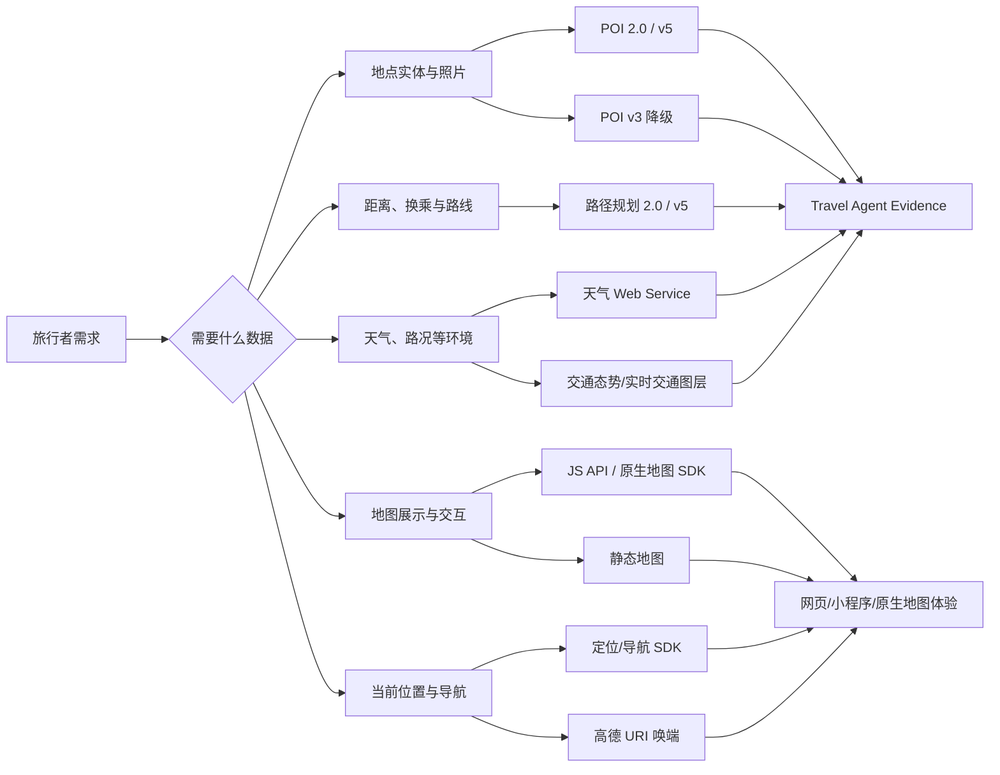

# 2026-08-16 高德数据能力全景与 Travel Agent 采用报告

## 结论先行

1. 高德的“基础服务、POI 2.0、高级 API、SDK、MCP/Skill”不是同一个维度上的等级。应分别理解为**计费服务组、接口代际、产品形态和商业授权能力**。
2. POI v3 并非没有图片：设置 `extensions=all` 后也可能返回 `photos`、评分、参考消费和室内数据。POI 2.0 的核心提升是字段按 `business/indoor/navi/photos` 分组、营业与导航信息更结构化，并能只请求当前需要的扩展数据。
3. POI 不是库存和执行事实。高德评分、参考消费、图片、营业时间和入口信息都可能为空或变化；它不直接等于酒店房态、票务余量、排队、无障碍电梯可用性、卫生间开放状态、储物柜和充电宝实时库存。
4. 当前 `10044` 不像 IP 问题。官方对 IP 白名单和单 IP 封控分别使用 `10005`、`10010`；本次在 0.455 QPS 下跨 v3/v5/地理编码/天气统一返回账号级 `10044`。仍可通过“新 Key × 手机热点”二维 A/B 最终排除异常映射。
5. 对 Travel Agent，合理采用顺序是：POI 2.0 地点实体 → 地理编码/逆地理编码 → 天气环境门 → 路径规划 2.0 → 动态地图展示/URI 唤端。设施细节与库存继续由专门来源补齐，不能把地图字段外推成事实。

## 一张图理解高德能力

## 高德的几套分类不要混用

| 维度 | 高德常见名称 | 实际含义 | 是否等于数据更丰富 |
| --- | --- | --- | --- |
| 计费服务组 | 基础 LBS、基础搜索、基础地图定位、其它基础服务 | 用于共享配额、QPS 和计费 | 不一定；主要是计费边界 |
| 接口代际 | v3、v5、POI 2.0、路径规划 2.0 | 请求和返回合同的新旧版本 | 通常更结构化，但要逐接口比较 |
| 文档导航 | Web 基础服务 API、Web 高级服务 API | 官方文档与产品入口分类 | 不是统一的价格档位 |
| 商业能力 | 多语言 POI、海外地图、物流、猎鹰、货车、高级路径规划 | 需要额外权限、工单或商务合同的能力 | 是独立授权能力 |
| 客户端形态 | JS API、Android/iOS/HarmonyOS SDK、小程序插件 | 地图渲染、定位、导航和交互载体 | 与服务端 Web API 分开申请 Key |
| Agent 接入形态 | MCP Server、Skill、CLI | 给 Agent 使用高德能力的调用封装 | 不产生新的底层数据源 |

高德公开的基础计费组如下：[基础服务计费说明](https://lbs.amap.com/pages/base_service_price)。

| 计费组 | 典型服务 | Travel Agent 用途 |
| --- | --- | --- |
| 基础搜索 | 关键字、周边、多边形、ID、输入提示 | 找景点、餐厅、酒店、车站等地点实体 |
| 基础 LBS | 驾车/公交/步行/骑行路线、距离、地理/逆地理编码、坐标转换、行政区、IP 定位、静态地图 | 位置归一、路线可行性、距离与地图预览 |
| 基础地图定位 | JS 地图图面初始化、在线定位 | 动态地图与用户当前位置 |
| 其它基础服务—天气 | 当前与未来天气 | 旅行环境约束和局部重排 |
| 其它基础服务—智能硬件定位 | 基站/Wi-Fi 定位 | 当前 Travel Agent 不需要 |

## POI v3 与 POI 2.0 的准确比较

官方文档：[POI v3](https://lbs.amap.com/api/webservice/guide/api/search/)、[POI 2.0](https://lbs.amap.com/api/webservice/guide/api-advanced/newpoisearch)。

### 两者都能做什么

- 关键字搜索、周边搜索、多边形搜索和 ID 详情查询；
- 返回 POI ID、名称、经纬度、类型、分类码、省市区、地址等基础字段；
- 按城市/行政区和 POI 类型缩小召回范围；
- 返回结果由高德综合排序，不是独立口碑排名。

### 字段差异

| 数据 | v3 `/v3/place/*` | POI 2.0 `/v5/place/*` | 对旅行产品的意义 |
| --- | --- | --- | --- |
| 基础地点 | 默认返回名称、ID、位置、类别、地址、省市区等 | 默认返回同类基础字段 | 建立统一地点实体 |
| 返回控制 | `extensions=base/all`，扩展结果粒度较粗 | `show_fields` 按字段组选择 | v5 更容易控制响应体、带宽与 Agent 上下文噪声；不代表单次调用自动更便宜 |
| 商户信息 | `biz_ext` 可含评分和参考消费；部分旧订餐/订票/订房标记已逐渐废弃 | `business` 可含商圈、今日/每周营业时间、电话、标签、评分、参考消费、停车类型、别名 | v5 更适合候选卡片和出发前复核 |
| 图片 | `extensions=all` 时可能返回 `photos` | 请求 `show_fields=photos` 时可能返回标题和 URL | 两者都可能有图，但不保证每个 POI 都有 |
| 室内数据 | `indoor_map`、`indoor_data`，可含父 POI 和楼层 | `indoor` 分组，含 `indoor_map/cpid/floor/truefloor` | 判断是否有室内地图数据；不等于已核验无障碍设施 |
| 入口/出口 | `extensions=all` 可返回 `entr_location`、`navi_poiid`、`gridcode`；官方说明 `exit_location` 目前不返回内容 | `navi` 独立分组，可含导航引导点、入口、出口和地理格 ID | v5 结构更清晰，但具体 POI 的入口/出口仍可能为空 |
| 子 POI | `children` 及层级字段 | `children` 独立字段组 | 商场、景区、交通枢纽内部实体归一 |
| 多语言 | 旧接口能力有限，需按具体产品核验 | `langCode` 的 POI 多语言属于高级服务，官方要求商务咨询 | 入境旅行不能默认已有英文 POI 覆盖 |
| 分页 | v3 使用 `offset/page` | v5 使用 `page_size/page_num`，单页 1～25，官方限制总计最多 200 条 | 产品仍应少量召回、排序后展示 |

因此，“POI 2.0 有图片、普通 POI 没图片”是不准确的。更准确的说法是：

> v3 的 `extensions=all` 可能一次返回图片、评分、消费和室内扩展；v5 把这些能力重组为可选择的字段组，并增加更适合导航衔接的结构化信息。数据是否实际存在仍取决于具体 POI 覆盖。

### POI 不能替代什么

| 用户想知道 | POI 能否直接证明 | 需要什么补充 |
| --- | --- | --- |
| 酒店今天是否有房、最终价格 | 不能 | 飞猪、途牛或酒店授权库存 |
| 景点余票和真实排队 | 不能 | 景区官方或授权票务来源 |
| 餐厅当前等位、预约可用性 | 不能 | 商家官方/授权本地生活来源 |
| 电梯是否无障碍且今天可用 | 不能 | 场馆/交通设施官方信息和用户反馈核验 |
| 卫生间、储物柜、充电宝 | 可以按 POI/关键词发现部分设施，但不能保证开放与库存 | 设施运营方、现场/近期反馈或专门 Provider |
| 公交实时到站 | POI 只能发现站点 | 实时公交/路径规划来源 |
| 图片代表当前真实状态 | 不能保证 | 检查图片来源、时间和现场/社交证据 |

## 高德数据能力矩阵

官方总入口：[高德开放平台产品与文档](https://lbs.amap.com/api/)。

| 板块 | 能返回什么 | 适合 Travel Agent 做什么 | 当前项目状态 |
| --- | --- | --- | --- |
| POI 搜索 2.0 | 地点、类别、地址、坐标、商户扩展、室内、导航入口、照片 | 吃住行玩地点发现、实体归一、候选卡片、地图点位 | Adapter 已完成；账号网关 `10044` 阻断 |
| POI v3 | 基础地点及 `extensions=all` 扩展 | v5 单接口权限不可用时降级 | 只在 `10041/10012` 时降级；`10044` 不重试 |
| 输入提示 | 用户输入对应的地点建议 | 搜索框自动补全、减少同名地点歧义 | 未接线 |
| 地理编码 | 地址/地点文字 → 坐标、adcode | 目的地归一、天气查询前获取行政编码 | 高德天气 Adapter 内已使用 |
| 逆地理编码 | 坐标 → 地址、行政区、附近 POI | 用户当前位置、落地点和照片位置解释 | 未接线 |
| 行政区划 | 省市区层级和边界 | 多城市/区县范围、入境地址解释 | 未接线 |
| 路径规划 2.0 | 驾车、公交、步行、骑行、电动车路线，距离、时间、换乘和策略 | 联合排序、日程可行性、雨天缓冲、少步行方案 | 未接线；应作为下一优先级 |
| 距离测量 | 两点或多点间距离/时间估计 | 候选聚类、住宿位置比较 | 未接线 |
| 交通路况/实时交通图层 | 道路拥堵或交通图层 | 出发前重排和地图可视化 | 未接线；不能用 POI 代替 |
| 天气 | adcode 对应的当前天气和预报 | Runtime Environment Gate、户外/换乘/住宿/餐饮联动 | 已接线；当前高德账号阻断，本地回退 Open-Meteo |
| 静态地图 | 一张带标记的地图图片 | 轻量方案预览、服务端安全渲染 | 已接线；需高德账号恢复 |
| JS API 动态地图 | 标准/卫星/路网/实时交通/楼块/室内图层、Marker 和交互控件 | 桌面、折叠屏和移动端可交互地图 | 尚未接入；当前网页只有静态地图 |
| URI API | 调起高德地图的标点、路线和导航页面 | 用户确认后跳转高德执行导航 | 地点唤端已接；更深路线唤端待补 |
| 定位 SDK | GPS、Wi-Fi/基站定位、地址描述、地理围栏 | 原生 App 当前定位和附近推荐 | Web/PWA 暂不需要；原生端未来按需接入 |
| 导航 SDK | 实时导航、偏航、语音播报等 | 重型原生导航体验 | 不建议 V1 自建；优先 URI 唤端 |
| 地铁图 API/插件 | 地铁线路、站点和换乘展示 | 大城市公共交通专题视图 | 未接线，作为动态路线补充而非真相源 |
| GeoHUB/LOCA | 自定义地图、业务数据上图和可视化 | 运营后台或大量地点可视化 | 当前 C 端规划不需要 |
| 猎鹰/轨迹纠偏/物流 | 轨迹管理、道路纠偏、车队和调度 | 车队、户外运动、B 端物流 | 不属于当前 C 端 Travel Agent |
| MCP/Skill/CLI | 对上述能力的 Agent 调用封装 | 降低工具接入成本 | 可评估，但不能替代现有状态、证据和安全门 |

## 对 Travel Agent 的采用建议

### 当前保留

- 服务端 POI 2.0 作为中国地点实体首选；
- v3 只处理明确的 v5 单接口权限降级，不处理账号级 `10044`；
- 高德天气进入 Runtime Environment Gate；
- 静态地图用于轻量预览，URI API 用于用户确认后的导航跳转；
- 飞猪、途牛继续承担房态、票务、航班、铁路等授权库存。

### 下一步优先接入

1. **路径规划 2.0**：把步行、公交、驾车时间和换乘真正纳入吃住行玩联合排序，而不是只展示地图点。
2. **动态 JS 地图**：桌面/折叠屏显示地点、路线和交通图层；移动端使用地图抽屉或全屏切换，不压缩聊天主路径。
3. **逆地理编码与输入提示**：改善当前位置、同名地点、酒店/车站落点和目的地纠错。
4. **设施 Evidence Adapter**：卫生间、无障碍、电梯、储物柜和充电宝使用“高德 POI 发现 + 官方/运营方/近期用户证据核验”，不能只靠 POI 字段。

### 不建议

- 不把高德评分当成跨来源口碑；
- 不因 POI 有 `indoor_map=1` 就宣称场馆无障碍或一定有电梯；
- 不下载和长期复制全部 POI 图片，继续使用具名来源 URL 并遵守平台条款；
- 不在 Web V1 内重建完整导航 SDK，优先使用路线结果与高德唤端；
- 不因高德提供 MCP/Skill 就让其拥有 Trip State 或 Parent Agent 提交权。

## 当前 `10044` 是否可能与 IP 有关

### 官方错误码对应关系

| 错误码 | 官方含义 | 与本次是否一致 |
| --- | --- | --- |
| `10005 INVALID_USER_IP` | 出口 IP 不在 Key 白名单 | 本次不是该错误 |
| `10010 IP_QUERY_OVER_LIMIT` | 未设置白名单时，单一 IP 访问超限并被封控 | 本次不是该错误 |
| `10021 CUQPS_HAS_EXCEEDED_THE_LIMIT` | 账号使用某服务的 QPS 超限 | 低速矩阵已排除 |
| `10044 USER_DAILY_QUERY_OVER_LIMIT` | 账号维度调用被平台阻断 | 与本次响应完全一致，但与控制台额度状态矛盾 |

官方错误码：[Web 服务错误码说明](https://lbs.amap.com/api/web-service/tools/info)。数字签名缺失或错误通常应返回 `10007`，平台类型错误应返回 `10009`，也都不是本次结果。

因此，**常规 IP 白名单错误不是首要原因**。仍不能完全排除高德后台把某个 IP/风控状态错误映射成 `10044`，验证方式如下：

| 新 Web Service Key | 当前网络 | 手机热点 | 判断 |
| --- | --- | --- | --- |
| 成功 | 旧 Key `10044` | 不必测试 | 旧 Key 后台状态异常 |
| `10044` | `10044` | `10044` | 账号级网关或账号风控 |
| `10044` | `10044` | 成功 | 当前出口 IP 或网络链路相关，向高德附两个出口 IP 与时间提工单 |
| `10005` | 任一网络 | 任一网络 | 明确检查 IP 白名单 |
| `10021` | 并发时出现、降速后恢复 | 同样 | 明确是 QPS |

不要使用公共代理做该测试，也不要把完整 Key 发给工单或第三方。使用自己的手机热点即可；每个网络只运行一次 `npm run diagnose:amap`。由于旧 Key 已出现在本地工具输出中，建议先创建并替换新 Key，再用上述矩阵验证并停用旧 Key。

## 官方参考

- [高德开放平台产品与文档总览](https://lbs.amap.com/api/)
- [基础服务计费、服务组与配额](https://lbs.amap.com/pages/base_service_price)
- [POI v3](https://lbs.amap.com/api/webservice/guide/api/search/)
- [POI 2.0](https://lbs.amap.com/api/webservice/guide/api-advanced/newpoisearch)
- [路径规划 2.0](https://lbs.amap.com/api/webservice/guide/api/newroute)
- [JS API 地图图层](https://lbs.amap.com/api/javascript-api-v2/guide/layers/official-layers)
- [JS API 插件能力](https://lbs.amap.com/api/javascript-api-v2/guide/abc/plugins)
- [Web 服务错误码](https://lbs.amap.com/api/web-service/tools/info)
- [URI 路线与导航](https://lbs.amap.com/api/uri-api/guide/travel/route)
