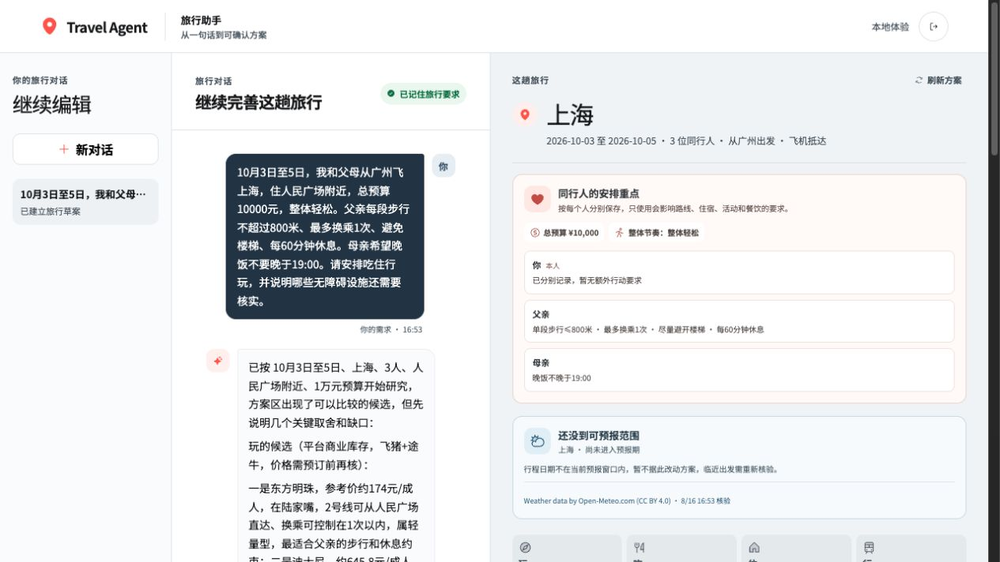
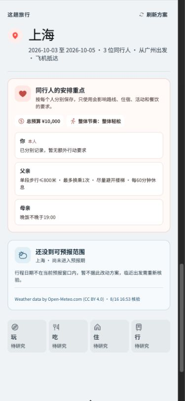

# 高德能力申请与逐人旅行关怀落地报告

日期：2026-08-16
范围：高德 Web 服务/JS API 的申请边界、Travel Agent 同行人状态、路线与设施核验、方案画布和父 Agent 行为。

## 结论

1. 当前申请的 **高德 Web 服务 Key** 类型是对的。同一个 Key 可用于 POI 2.0、地理编码、天气、路径规划 2.0 和静态地图，前提是账号对应服务权益可用并通过真实 smoke；不需要为天气或路线再创建一个特殊“付费 Key”。
2. POI 2.0 的 `show_fields=navi` 可以返回部分大型 POI 的导航点、入口和出口坐标，`photos` 可以返回地点图片；字段可能为空，入口坐标也不等于无障碍入口已核验。
3. 动态、可交互的网页地图属于 **Web 端（JS API）**，需在同一高德应用下另建 JS API Key，并使用配套 `securityJsCode`。它与服务端 `AMAP_API_KEY` 不是同一个平台类型。
4. 实时公交到站、即时叫车供给、车站电梯状态、连续无台阶路线、卫生间开放、储物柜/充电宝库存、酒店房态和最终价格，不是高德基础 Web 服务能够完整承诺的同一数据集；必须采用具名运营方、交通设施或 OTA 的独立来源。
5. 产品此前能在聊天文字中识别“父亲每段步行不超过 800 米”，却把它留在整团 `partyProfile`，正式方案只显示“3 位同行人”。本轮已经把逐人行动要求绑定到稳定同行人 ID，并贯穿路线选择、失效规则、QA 和前端回显。

## 高德：到哪里申请，现有 Key 能做什么

| 能力 | 申请入口 | Key 类型 | 当前产品用途 | 仍不能据此宣称 |
| --- | --- | --- | --- | --- |
| POI 2.0、照片、入口/出口坐标 | [高德应用管理](https://console.amap.com/dev/key/app) | Web 服务 | 地点发现、地址/坐标、图片、部分 `navi` 字段 | 入口无台阶、电梯可用、实时营业或库存 |
| 路径规划 2.0 | 同上 | Web 服务 | 步行、公交/地铁、驾车估算；比较步行量、换乘和估价 | 实时到站、即时叫车供给、最终车费、站内连续无障碍 |
| 天气 | 同上 | Web 服务 | 目的地当前/未来预报和跨吃住行玩的规划影响 | 积水/积雪等高精度高级天气；高级项需[提交工单](https://console.amap.com/dev/ticket/create)商务咨询 |
| 静态地图 | 同上 | Web 服务 | 服务端生成地点和路线预览，不把 Key 发给浏览器 | 交互图层、拖拽缩放和前端定位 |
| 动态网页地图 | 同一应用中“添加 Key” | Web 端（JS API） | 桌面/折叠屏交互地图 | 复用 Web 服务 Key；新 Key 需配套 `securityJsCode` |
| Android/iOS 导航 | 同一应用中添加对应平台 Key | Android / iOS | 将来原生导航与定位 | Web 或小程序直接复用原生 Key |

官方依据：[创建 Web 服务 Key](https://lbs.amap.com/api/webservice/guide/create-project/get-key)、[POI 2.0](https://lbs.amap.com/api/webservice/guide/api-advanced/newpoisearch)、[路径规划 2.0](https://lbs.amap.com/api/webservice/guide/api/newroute)、[天气查询](https://lbs.amap.com/api/webservice/guide/api/weatherinfo)、[JS API Key 与安全密钥](https://lbs.amap.com/api/javascript-api/guide/abc/prepare)。

如果现有 `AMAP_API_KEY` 已创建为“Web 服务”，无需重建。应先让 `npm run diagnose:amap` 和 `npm run smoke:amap` 通过，再把 `TRAVEL_AGENT_AMAP_SMOKE_STATUS` 改为 `passed_live_smoke`。动态地图只有在真正开发交互地图时才需要另填 JS API Key；当前服务端静态地图和路线核验不依赖它。

## 同类产品与公共服务说明了什么

- Airbnb 不是只给房源打一个“无障碍”标签，而是按入口、卧室、卫生间、淋浴、扶手、停车位等具体特征拆分，并要求每项提供清晰照片后才展示。产品启示是：**设施必须细分并保留证据，不能从酒店描述或 POI 类型推断。** [Airbnb accessibility features](https://www.airbnb.com/help/article/1961)
- Google Maps 允许用户在公共交通路线中明确选择 wheelchair accessible，而不是把所有行动需求隐含在“老人同行”中。产品启示是：**路线偏好应由具体旅行者控制，并在路线结果中显示是否满足。** [Google Maps accessibility](https://support.google.com/maps/answer/6396990)
- 12306 的重点旅客服务绑定到具体乘车人和具体行程段；中转换乘需分别预约，线上通常需在乘车前 6 小时提交。产品启示是：**协助需求属于某个人、某一段履约，不是整趟旅行的一句备注。** [12306 重点旅客预约说明](https://kyfw.12306.cn/otn/view/icentre_qxyyInfo.html)
- ISO 21902 将无障碍旅游覆盖到住宿、餐饮、交通、旅行社、活动与目的地管理的完整链路；UN Tourism 的评估同样覆盖行前信息、抵离交通、住宿、餐饮、城市交通和旅游资源。产品启示是：**关怀约束必须跨吃住行玩和履约，不应新建一个孤立 Workflow。** [ISO 21902](https://www.iso.org/standard/72126.html)、[UN Tourism accessible destinations](https://www.unwto.org/global/press-release/2019-05-22/world-tourism-organization-and-fundacion-once-seek-best-accessible-destinat)
- 交通运输部要求城市轨道交通维护无障碍电（扶）梯、招援电话和上下车渡板等设施。产品启示是：**电梯、渡板和预约协助是运营状态，不能被普通地图入口字段替代。** [适老化无障碍出行服务通知](https://xxgk.mot.gov.cn/2020/jigou/ysfws/202401/t20240112_3981845.html)

## 第一性产品原则

1. **问行动结果，不问诊断。** 保存“父亲单段步行不超过 800 米”，不保存“膝盖疾病、病史或证明材料”。
2. **按人保存，按团取最严格约束。** 每个人有稳定 `travelerId`；同走一段路线时采用相关同行人的最严格步行与换乘上限，分组活动则只读取该组切片。
3. **核验粒度与用户风险一致。** “地点存在”只能证明地点；“有入口坐标”只能证明坐标；无台阶、电梯、卫生间等必须有独立证据和新鲜度。
4. **不确定性直接可见。** 确认过的要求、路线是否满足、设施是否尚未核验，都在方案画布显示；不能只藏在 Agent 回复中。
5. **尊重且不过度医疗化。** 使用“需要少走路、需要安静休息区”等中性语言；不替用户定义残障身份，也不把长辈自动等同于行动不便。
6. **不是第五个 Workflow。** 逐人要求是 Traveler Plane 的共享约束，由路线、住宿、活动、餐饮、日程和履约分别读取。

## 产品审查：修复前的真实问题

审查用例：“带父母在上海玩 3 天，父亲每段步行不超过 800 米，少换乘。”聊天模型确实讨论了父亲的限制，但画布只显示“3 位同行人”；已选酒店也不符合人民广场偏好。用户无法确认最重要的行动约束是否真正进入系统，更无法知道路线、住宿和设施是否按父亲的要求核验。

## 本轮工程落地

- `save_trip_understanding` 新增有界 `travelerProfiles`：逐人称呼、关系和 `careNeeds`，覆盖 mobility、stamina、schedule、facilities、sensory 与 food；没有诊断/病史字段。
- `Trip Control State` 为每位同行人保存 `displayName`、`relationship` 和唯一 `careNeeds` 真相源。更新时复用稳定 ID；只改变同行人移动需求时保留天气、使旧城市路线失效。
- 高德 Mobility Adapter 直接读取结构化逐人需求，采用最严格的单段步行和换乘上限；需要避开台阶时明确将站内无障碍连续性标为未核验。
- `trip-mobility-v1.travelerFit` 保存本次路线采用的同行人约束与无障碍证据状态；QA 拒绝步行/换乘超限，并对无台阶、无障碍卫生间、休息节奏、饮食排除和感官适配缺证据分别提示。
- 方案画布回显总预算、整体节奏和逐人安排重点，不显示诊断；路线卡说明步行/换乘已比较，但电梯、台阶和连续无障碍仍待具名来源。
- HTTP/MCP/Pi Extension 共用同一 `travelerProfiles` 业务含义，避免 Web 能保存而其它入口丢失。

真实 DeepSeek 轨迹还发现了一个相邻偏移：第一轮把“母亲晚饭不晚于 19:00”塞进整团 `pace`。这不是视觉问题，而是工具合同缺少明确的个人晚餐边界。随后新增 `careNeeds.schedule.latestDinnerTime`，并要求 pace 只保存整团节奏；同一真实会话纠正后，画布已分别显示父亲的行动/休息要求与母亲的晚餐时间。

移动端通过顶部“查看方案”直接跳到同一份共享状态，逐人信息不被压成横向表格：

## 旅行者路径审查与健康状态

1. 用户自然语言描述同行人：**已修复**。具体需求进入个人档案，不再只进整团描述。
2. 用户核对 Agent 理解：**已修复**。预算、节奏和逐人行动要求在方案画布回显。
3. 地点研究与比较：**部分健康**。地点/照片由已授权 Provider 提供；逐人设施适配仍受数据源限制，缺证据会显示待核验。
4. 城市路线建议：**代码已贯穿，真实高德账号仍阻塞**。步行与换乘约束会驱动路线选择；`10044` 未解除前不展示假路线。
5. 无障碍设施与实时公共交通：**未接线但状态诚实**。需要交通运营方/场馆/酒店或获授权 Provider，不能由 POI 或模型补全。
6. 酒店房态、最终价格和购买：**需 OTA 履约页**。飞猪/途牛可提供发现与跳转，最终库存和价格在供应方页面重新确认，产品不自动购买。
