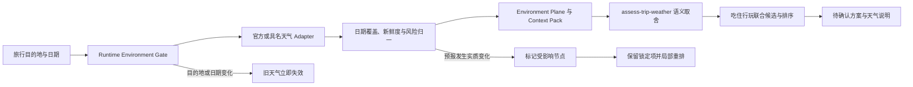

# 2026-08-16 高德配额、千用户成本与天气联动调研

## 结论先行

1. 控制台显示 7 次调用时出现 `10044 USER_DAILY_QUERY_OVER_LIMIT`，**不能解释为个人认证账号公开的 5,000 次月搜索额度已经耗尽**。高德自 2025-05-20 起已取消基础服务组原有日配额，公开的个人认证额度是按月计算。
2. `10021` 才是 QPS 超限；`10044` 的官方定义仍是“账号维度日调用量超限”。用户已确认控制台没有额度耗尽；2026-08-16 的低速矩阵又证明所有接口在参数校验前都被同一账号网关拦截，因此当前准确状态是 `credential_valid_account_gate_10044`，不能再描述为已证实的额度或权益耗尽。
3. 以每月 1,000 名实际创建一次旅行方案的用户估算，高德纯调用费只有约 ¥21～¥81 的含免费额度前等价成本；真正决定生产成本的是技术服务许可、峰值 QPS、动态路线调用量和合规授权，而不是单次 API 单价。
4. 天气已进入共享旅行状态和最终方案生成，不是独立第五域。它会改变户外候选排序、交通缓冲、住宿衔接、餐饮动线，并在预报变化时使吃、住、行、玩四条受影响任务链重新规划。

## 本次账号异常的证据

2026-08-16 的受限检查确认：运行时只读取 `env_travel.local` 中当前这一项 `AMAP_API_KEY`，没有进程环境覆盖，也没有把 Key 输出到日志。

按串行、低于 3 QPS 的方式做了三项最小请求：

| 请求 | 第一次结果 | 后续完整 smoke |
| --- | --- | --- |
| POI 2.0 `/v5/place/text` | `10044` | `10044` |
| 基础 POI `/v3/place/text` | `10000 OK`，返回 1 条 | 随后也返回 `10044` |
| 天气 `/v3/weather/weatherInfo` | `10000 OK`，返回预报 | 随后也返回 `10044` |

控制台所见 7 次用量与之前成功返回的 POI 2.0 请求数量相符，但远低于公开个人认证额度。由于请求已串行，后续 `10044` 也不是 3 QPS 被超过；此前出现的 `10021` 才是并发超限，代码现已通过串行四域检索和一次有界退避避免该问题。

### 2026-08-16 低速诊断矩阵

在用户确认控制台额度没有耗尽后，运行 `npm run diagnose:amap`。7 个请求的启动间隔均为 2,200～2,205 ms，理论请求上限仅 0.455 QPS，远低于个人基础 3 QPS：

| 案例 | 端点与输入差异 | 结果 |
| --- | --- | --- |
| v5 最小关键词 | 北京大学、北京、无扩展字段 | `10044` |
| v5 仅分类 | 上海、餐饮分类 | `10044` |
| v5 关键词 + 分类 + 扩展 | 外滩、景点、`business/navi/indoor/photos` | `10044` |
| v5 故意缺少关键词/分类 | 用于判断是否到达参数校验 | `10044`，没有返回预期参数错误 |
| v3 POI | 上海、外滩 | `10044` |
| v3 地理编码 | 上海市人民广场 | `10044` |
| v3 天气 | 北京 adcode | `10044` |

所有请求 HTTP 都是 200，但业务 `status=0`，且只出现 `USER_DAILY_QUERY_OVER_LIMIT`。故意错误参数也没有进入参数校验，证明拦截发生在服务路由/业务处理之前。由此可以排除：瞬时 QPS、POI 2.0 的 `show_fields`、关键词与分类组合、城市输入、单一 v5 权限、天气参数以及网络传输失败。剩余范围是高德账号维度的隐藏/异常网关状态，或控制台与服务网关的后台状态不同步；只有高德平台能解除或解释。

修正错误分类和 v3 降级条件后又运行了一次完整 `npm run smoke:amap`：四域地点入口和天气仍返回 `ACCOUNT_LIMITED / 10044`，地图因没有任何坐标而正确保持 `not_run`；诊断停留在 `amap_poi_v5`，没有再额外调用 v3。该结果证明应用层现在能准确停止，而不能证明高德平台侧已经恢复。

高德的两份官方说明目前存在需要平台解释的不一致：

- [2025-05-20 配额政策公告](https://lbs.amap.com/news/service_amap)说明取消原有日配额，只保留各服务组月配额。
- [错误码说明](https://lbs.amap.com/api/web-service/tools/info)仍将 `10044` 定义为账号维度日调用量超限。

因此目前只能确定“Key 被网关识别，但账号维度在所有 Web 服务前被 `10044` 拦截”，不能把错误名直接解释成实际额度耗尽。优先检查：

1. 控制台账号是否已经完成“个人认证”，而不是只有应用和 Key。
2. [配额管理](https://console.amap.com/dev/flow/manage)中切换到全部应用、全部 Key，并分别查看基础搜索、基础 LBS、天气服务组的“实际配额”和“已用量”；不要只看某个 Key 的调用次数。
3. 检查错误分析页是否显示失败请求归属到另一个应用/Key、账号级风控或历史封控；由于 v3、v5 和天气同时失败，不再把 POI 2.0 单接口权限作为首要假设。
4. 既然实际配额未耗尽，提交高德工单，附账号认证状态、应用/Key 名、2026-08-16 04:04（香港时间）前后的请求、七个案例、`infocode=10044`、配额页和错误分析截图，请平台核查账号网关状态。无需提供完整 Key。

在高德解除账号网关阻断且 `npm run smoke:amap` 完整通过前，生产状态保持 blocked。只有 v5 明确返回 `10041/10012` 单接口权限错误时才降级官方基础 POI；`10044` 会立即停止该来源，不再用无意义的 v3 重试放大请求。短暂成功或静态结果不能冒充完整接线。

## POI 2.0 是什么，与基础 POI 有何差异

`POI 2.0` 不是另一种地图，也不是“调用一次自动生成旅行攻略”。它是高德新版地点搜索合同，关键字搜索端点为 [`/v5/place/text`](https://lbs.amap.com/api/webservice/guide/api-advanced/newpoisearch)。本产品用它把“上海本地菜”“大理景点”等检索条件变成可核验的地点实体。

| 对比 | POI 2.0 `/v5/place/text` | 基础 POI `/v3/place/text` |
| --- | --- | --- |
| 接口代际 | 当前新版地点搜索 2.0 | 旧版基础地点搜索 |
| 区域与分页 | `region`、`city_limit`、`page_size`、`page_num` | `city`、`citylimit`、`offset`、`page` |
| 扩展信息 | `show_fields` 可按需选择 `business`、`indoor`、`navi`、`photos` | `extensions=base/all`，粒度更粗 |
| 对产品的价值 | 可拿营业信息、评分/消费提示、室内地图标记、入口出口坐标和地点照片，适合候选卡片、地图与可执行性判断 | 能完成名称、类别、地址、坐标等基础发现，用作权益受限时的官方降级 |
| 仍然不代表 | 实时公共交通、无障碍电梯、卫生间/储物柜/充电宝可用状态、酒店实时房态、真实排队和营业承诺 | 同左 |

当前 Adapter 先调用 v5，并只请求 `business,navi,indoor,photos`；若 v5 返回 `10041` 或 `10012` 这类单接口权限错误，再降级 v3。账号级 `10044` 不降级、不重试。降级后的候选会标记 `amap_poi_v3_basic_fallback`，不能把 v3 基础信息写成 v5 已完成。v5 官方最多通过分页返回 200 条、单页 1～25 条；产品当前每域只取少量候选以控制费用和比较负担。

## 为什么控制台几乎没有调用，却返回 `10044`

错误码和控制台计数不是同一个维度：

- `10021` 是瞬时 QPS/并发超限；串行降速或短暂退避可以解决。
- `10044` 按[高德错误码表](https://lbs.amap.com/api/web-service/tools/info)仍叫账号维度日调用量超限，但这与 2025 年取消基础服务日配额的[政策公告](https://lbs.amap.com/news/service_amap)存在字面冲突。
- 控制台常见的“调用次数”可能只显示选定应用、Key、服务组、日期或成功请求；失败请求可能进入错误分析而不是成功/计费图。账号级限制还可能由同一账号下另一个 Key 共享触发，图表也可能延迟。

本次证据不能支持“真的用完 5,000 次”，也不能支持“POI 2.0 本身永远只有 7 次”。在用户确认额度正常后，更可能的范围收敛为账号网关隐藏限制、旧状态残留、风控或平台状态同步异常。实际判定按以下顺序：

1. 先确认高德账号页显示“个人认证已通过”，不是只创建了应用。
2. 在配额管理切换“全部应用、全部 Key”，分别看基础搜索、基础 LBS、天气的**总配额、剩余额度和失败量**；不要只看 v5 POI 成功调用图。
3. 若某服务组实际配额为 0，先完成该账号要求的权益激活/计费协议；若实际配额大于已用量，停止反复 smoke，直接提交工单。
4. 工单附账号 ID、应用/Key 名称（只给名称或末四位，不给完整 Key）、请求时间、接口、`infocode=10044`、配额页截图和错误分析截图，请平台确认限制落在哪个账号/服务组。

只有高德后台能给出这个账号的“真实可用额度”。公开表用于容量模型，控制台实际权益用于测试门，API 返回用于运行状态；三者冲突时不猜测，也不通过连续重试消耗额度。

## 公开个人认证额度与并发

以下是 [高德开放平台基础服务计费说明](https://lbs.amap.com/pages/base_service_price)在 2026-08-16 公示的个人认证开发者权益；账号控制台实际显示的配额优先于这张公开表。

| 服务组 | 本产品相关调用 | 个人认证月配额 | 基础 QPS |
| --- | --- | ---: | ---: |
| 基础搜索 | 关键字、周边、ID 等 POI 搜索 | 5,000 次 | 3 |
| 基础 LBS | 地理编码、路线规划、距离、静态地图等共享 | 150,000 次 | 3/每项服务 |
| 其它基础服务—天气 | 天气查询 | 5,000 次 | 3 |
| 基础地图定位 | JS 地图图面初始化、在线定位 | 1,500,000 次 | 10 |

QPS 包必须按服务单独提升，账号下所有 Key 共享对应服务的 QPS；官方报价为每增加 10 QPS 约 ¥400～¥1,500/月。当前代码不通过四域并发制造峰值，天气结果对同一目的地和日期可复用 3 小时。

以搜索为瓶颈，个人公开额度理论上每月支持：

| 单次旅行规划形态 | 每人搜索调用 | 5,000 次搜索配额对应的月规划数 | 3 QPS 理论上限 |
| --- | ---: | ---: | ---: |
| 基础联动：吃住行玩各查 1 次 | 4 | 1,250 | 约 45 次新规划/分钟 |
| 交互调整：合计查 6 次 | 6 | 833 | 约 30 次/分钟 |
| 执行重度：合计查 10 次 | 10 | 500 | 约 18 次/分钟 |

这是没有缓存、没有失败重试、均匀流量下的数学上限，不是 SLA。真实响应延迟、用户同时发起、重新研究和失败重试都会降低可承载量；天气每趟只查一次时可达 5,000 趟/月，不是首先触顶的服务组。

## 每 1,000 名规划用户的调用与费用

统一假设：1,000 名月活规划用户，每人每月创建或刷新一趟旅行。高德目前对基础 LBS、基础搜索和天气均按 ¥30/万次计价，即 ¥0.003/次；JS 地图图面初始化属于基础地图定位，按 ¥3/万次，但当前网页使用的是静态地图，计入基础 LBS。

| 情景 | 每人调用 | 1,000 人月调用量 | 超出公开个人免费额后的调用费 | 不考虑免费额的等价调用费 |
| --- | --- | --- | ---: | ---: |
| 基础首次规划 | 搜索 4；地理编码 1；静态地图 1；天气 1 | 搜索 4,000；LBS 2,000；天气 1,000 | ¥0 | ¥21 |
| 常规交互规划 | 搜索 6；地理编码 1；静态地图 3；天气 1 | 搜索 6,000；LBS 4,000；天气 1,000 | 约 ¥3 | ¥33 |
| 未来执行重度 | 搜索 10；地理编码 1；静态地图 3；路线 12；天气 1 | 搜索 10,000；LBS 16,000；天气 1,000 | 约 ¥15 | ¥81 |

计算示例：常规交互的搜索为 `6,000 × ¥0.003 = ¥18`，个人月免费额覆盖前 5,000 次，因此理论增量收费约 ¥3；LBS 与天气仍在免费月配额内。当前账号的控制台额度未耗尽，但 API 网关仍返回 `10044`，所以这些数字用于容量规划，不能当作当前 Key 已可直接承载的保证。

生产商业化还要单独预算 [高德技术服务许可](https://lbs.amap.com/upgrade)：基础版 ¥50,000/年，高级版 ¥100,000/年，月摊销约 ¥4,167/¥8,333；这通常远高于 1,000 用户阶段的纯调用费。企业许可公开配额为搜索 500,000/月、基础 LBS 9,000,000/月、天气 9,000,000/月，QPS 100。实际购买、合规授权和发票价格以签约页为准。

## 测试用量策略

- 单元、合同、CI 和前端 QA 全部使用 fixture，不消耗高德额度。
- 每天只运行一次受控真实 smoke；失败为账号级额度时停止，不循环重试。
- 不使用个人账号做并发/压力测试。容量测试在本地模拟 rate limiter，企业授权后才对真实服务做经批准的压测。
- 真实 smoke 分开记录 POI、照片、静态地图、天气；其中任何一项失败都不能标记为完整高德接线。

## 天气能力的采用与边界

Open-Meteo 不是 OpenAI，也不是大模型；它是一个独立的天气数据 API，在本项目中只作为高德受限时的具名备选 Provider。天气来源顺序是：通过完整 live smoke 的高德天气优先；开发环境在高德受限时使用 Open-Meteo 做非商业验证。Open-Meteo 免费端点按[条款](https://open-meteo.com/en/terms)仅限非商业使用，限制为 600 次/分钟、5,000 次/小时、10,000 次/日、300,000 次/月；生产必须使用其[付费 customer endpoint](https://open-meteo.com/en/pricing)和 API Key，或恢复已验收的高德天气。所有 Open-Meteo 展示保留 `Weather data by Open-Meteo.com (CC BY 4.0)` 署名。

高德天气本身**不要求先购买商业套餐才能做个人开发测试**。个人认证账号的公开权益为每月 5,000 次、3 QPS；一个有效的 Web 服务 Key 就能调用 [`/v3/weather/weatherInfo`](https://lbs.amap.com/api/webservice/guide/api/weatherinfo)。本次 Key 曾真实返回预报，说明端点与 Key 类型正确；随后天气与 v3/v5 POI、地理编码一起被同一 `10044` 网关拦截。恢复条件不是“换成付费 Key”这个特殊 Key 类型，而是高德解除账号网关阻断并让天气真实 smoke 通过。商业上线则仍需按高德许可和用量政策完成授权。

2026-08-16 已运行 `npm run smoke:weather`：上海未来旅行日期返回 16 天真实预报，日期覆盖为 `covered`，风险识别为降水、规划严重度为 `high`，输出明确标记 `passed_noncommercial_development_smoke` 和 `productionReady: false`。这证明本地天气数据链可用，不代表已获得商业生产许可。

天气不是一个等待大模型在几十个 Skill 中偶然召回的能力，也不是固定的第五个 Workflow。可执行链路为：

Tool/Adapter 负责数据，Runtime Gate 负责“必须检查、何时失效、失败如何降级”，`assess-trip-weather` Skill 只负责把已验证环境事实转成跨域取舍。单独做 Extension 只能增加一个可调用工具，无法保证模型必调、日期变化后旧预报必失效、或失败时提案必降级，因此不让 Extension 拥有天气真相。

行程超出预报窗口时只显示“尚未进入可预报范围”，不能拿当前天气或气候常识冒充未来预报。常见中文日期范围会在旅行状态入口归一为 ISO 日期区间，避免“标题识别了日期、天气却认为日期未知”的分叉。界面只展示与旅行日期重合的预报日，不把今天起的前四天误放到未来行程中。天气数据不可用时，地点候选只形成带明确说明的暂定提案，不再被描述为完整日程。天气是高优先级环境约束，但仍不自动替用户提交或取消行程。
