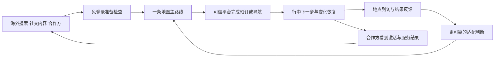

# 入境中国 Travel Agent：市场验证与产品闭环基准

> 日期：2026-08-20
> 性质：市场与产品方向研究基准，不直接覆盖当前 PRD。
> 主要读者：产品、运营、商业合作与后续开发负责人。
> 配套产品稿：[下一迭代产品方向 Brainstorm V2](./2026-08-20-next-iteration-product-brainstorm-v2.md)

## Executive Summary｜结论摘要

- **市场成立，但“再做一个 AI 行程生成器”的论证不成立。** 文化和旅游部公布，2025 年外国游客入境 **3517 万人次**，同比增长 30.6%；这已经是足够大的真实市场。与此同时，Trip.com、地图、OTA、社交平台和同类创业产品都在提供行程、地点或预订能力。新产品不能靠“能聊天、能生成路线”形成差异。
- **首要用户应是首次或第二次来华、停留四天以上、自己做决定的自由行或半自由行游客。** 他们既想体验中国文化和本地生活，又需要跨过支付、地图、实名、票务、语言、外宾住宿、城市交通和平台切换等执行摩擦。数字游民、短时过境客和传统跟团客可以使用产品，但目前没有足够证据支持把他们作为首发主客群。
- **核心价值应从“发现小众地点”上移到“把中国旅行真正执行完”。** 小众美食和在地体验仍是吸引力，但更底层的承诺应是：出发前准备好，旅途中看得懂下一步，变化发生后仍能继续。否则用户会在喜欢一个地点后，仍然回到 Google、Trip.com、12306、支付宝、微信、高德或人工客服完成真正的行动。
- **商业闭环更适合“合作方带客、用户使用”（B2B2C）为主，用户直接付费为辅。** 海外用户通过酒店、航司、eSIM、支付机构、OTA、目的地机构或内容创作者进入；产品先免费完成准备检查和第一条路线，再通过旅行通行证、合作方按激活旅行付费、透明预订跳转等方式变现。不能通过商家付费改变推荐排序。

## 这份研究要回答什么

这份文档只回答四个会改变产品方向的问题：

1. 入境中国的旅行者是否足够多，值得形成独立产品？
2. 哪一类入境游客最值得先服务，他们真正卡在哪里？
3. 现有平台已经解决了什么，我们还有什么不可替代的工作？
4. 产品怎样从一次聊天，形成可持续的获客、使用、付费和反馈闭环？

它不把所有公开数字拼成一张“看起来很大”的市场图。不同机构对“游客”“入境人次”“外国人出入境”“国际访客消费”的定义并不相同，本文只在同一口径内比较，并把推断和事实分开。

## 证据怎样分级

| 标记 | 代表什么 | 本文怎样使用 |
| --- | --- | --- |
| 官方统计 | 中国政府、国家统计局、国家移民管理局等正式发布 | 用于市场规模、入境和支付环境等基础事实 |
| 行业研究 | 中国旅游研究院、世界旅游联盟、Mastercard、Expedia 等报告 | 用于客源地、停留、行为和摩擦趋势；保留样本及数据口径 |
| 企业披露 | Trip.com 等公司公开材料 | 用于观察产品投入和平台行为，不视为独立审计结果 |
| 小样本研究 | 地方媒体访谈、少量游客调查 | 只用于发现问题，不外推总体比例 |
| 产品假设 | 由上述证据推导、但尚未经过本产品真实用户验证 | 明确列入后续实验，不写成市场事实 |

## 市场足够大，但数字不能混用

### 当前可用的核心规模

| 时间与来源 | 数字 | 正确解释 |
| --- | ---: | --- |
| 2025 年文化和旅游部 | 入境游客 1.545 亿人次，其中外国游客 3517 万人次 | 这是旅行人次，不是去重用户；港澳台游客另计在总入境中 |
| 2024 年国家统计局 | 入境游客 1.319 亿人次，其中外国游客 2694 万人次；入境游客总花费 942 亿美元 | 可说明市场恢复速度和总消费，但不能直接当作 2025 年外国游客消费 |
| 2025 年国家移民管理局 | 外国人出入境约 8204 万人次；免签入境外国人 3008 万人次 | 出入境查验与旅游统计口径不同；不能把 8204 万当成游客数 |
| 2025 年政府公开信息 | 全部入境游客境内消费超过 1300 亿美元，移动支付交易约 800 亿元人民币 | 包含不同入境群体；说明支付与消费规模，不等于本产品可服务收入 |

来源：[文化和旅游部《2025 年文化和旅游发展统计公报》](https://zwgk.mct.gov.cn/zfxxgkml/tjxx/202606/t20260602_966073.html)、[国家统计局 2024 年统计公报](https://www.stats.gov.cn/english/PressRelease/202502/t20250228_1958822.html)、[国家移民管理局 2025 年数据](https://en.nia.gov.cn/n147413/c195970/content.html)、[中国政府网 2025 年入境消费信息](https://english.www.gov.cn/news/202603/07/content_WS69aba1f9c6d00ca5f9a09b0f.html)。

另一份 2026 年商务部相关公开信息称，2025 年“国际访客”消费约 3940 亿元人民币（约 570 亿美元）。它与“全部入境游客超过 1300 亿美元”的对象和统计方式不同，因此本文不把两者相加，也不使用其中任一数字推导本产品收入。[来源](https://english.www.gov.cn/news/202604/15/content_WS69df2c8fc6d00ca5f9a0a6c4.html)

**产品含义：** 市场规模不再是最需要争论的问题。真正要证明的是，我们能否低成本触达其中一小部分自由行游客，并让他们在行中反复使用，而不是只生成一次方案。

## 首发客群不是“所有外国人”

### 客源地已经多元，不能只按欧美游客设计

世界旅游联盟、Mastercard 与 Trip.com 的 2024—2025 报告显示，2025 年上半年平台入境预订的主要客源包括韩国、马来西亚、日本、美国、泰国、新加坡、俄罗斯和加拿大；入境消费较高的来源还包括澳大利亚、德国和英国。这是 Trip.com 及支付网络观察到的结构，不代表全国完整排名，但足以说明：

- 东亚、东南亚是高频客源，不应只做“西方人第一次来中国”的想象产品。
- 英文可以先完成一个完整闭环，但如果要覆盖韩国和日本的大盘，最终需要真正的韩语、日语产品与内容核验，而不是只翻译按钮。
- 马来西亚、新加坡、美国、英国、澳大利亚等市场适合成为英文首发的获客试验群体。

来源：[《2024—2025 跨境旅游消费趋势研究报告》PDF](https://www.mastercard.com/news/media/wurepbry/2024-2025-cross-border-tourism-consumption-trends-report.pdf)、[世界旅游联盟摘要](https://www.wta-web.org/chn/news/news_368)。

### 四天以上的行程更可能产生持续价值

同一份 2024—2025 报告按年龄展示了 2025 年上半年的停留时长：

| 年龄 | 4—7 天 | 7 天以上 | 合计 4 天以上 |
| --- | ---: | ---: | ---: |
| 18—24 岁 | 29% | 16% | 45% |
| 50—59 岁 | 33% | 20% | 53% |
| 60 岁以上 | 34% | 27% | 61% |

这不能证明所有入境游客的平均停留，但能支持两个产品判断：

1. 青年游客值得服务，但“年轻人就是唯一 AI 用户”并不成立。
2. 年长游客停留更久，且更需要少走路、少换乘、清楚的入口出口、卫生间、电梯和现场确认提示，可能拥有更高的行中价值。

### 建议的用户分层

| 层级 | 人群 | 为什么现在值得做 | 目前证据强度 |
| --- | --- | --- | --- |
| 主客群 | 首次或第二次来华、停留 4 天以上、自由行或半自由行、以文化/美食/城市体验为主的游客 | 信息多但缺少中国执行经验；会跨城市、跨平台，最需要“一条能走完的路线” | 市场趋势支持；“首次/第二次”仍需本产品访谈验证 |
| 次客群 A | 已多次来华、希望深入地方文化与长尾美食的人 | 对小众发现、证据质量和路线效率更敏感，愿意避开标准景点清单 | 行业趋势支持，规模待验证 |
| 次客群 B | 商务结束后顺带旅行的 bleisure 人群 | 行程短、时间确定、住宿锚点明确，适合酒店/企业/会展合作分发 | 商业假设，缺少全国规模数据 |
| 次客群 C | 50 岁以上或带长辈、儿童的家庭 | 停留更长，对体力、设施、交通和可信解释的价值感更高 | 停留数据支持，支付意愿待验证 |
| 暂不主打 | 数字游民 | 可能停留长，但缺少中国入境数字游民规模与获客成本证据；官方签证分类没有单独“数字游民签证” | 假设偏多，不宜作为首发定位 |
| 暂不主打 | 24/72/144/240 小时短时过境客 | 有明确执行需求，但旅程短、可服务动作少，单次收入与反馈密度可能偏低 | 可做轻量模式，不作为主商业模型 |
| 暂不主打 | 传统跟团游客 | 主要路线、交通和讲解已由旅行社组织，独立决策空间较小 | 产品适配度较低 |

官方签证类型可参考[上海市政府外籍人员签证分类说明](https://english.shanghai.gov.cn/en-VisaClassification/20231209/2855b4cd70084cc680c2887c4b0a77f8.html)。本产品只提供旅行准备提示，不提供法律或签证判断。

## 海外游客怎样找信息：AI 是入口之一，不是唯一可信终点

目前缺少一份覆盖所有入境中国游客、同时记录完整数字旅程的统一研究。因此，下列 Expedia 数据只能作为全球旅行者行为的参考，不直接代表中国入境游客：

- 2025 年对 11 个市场、超过 1.1 万名消费者的调查中，61% 的受访者会通过社交媒体寻找旅行灵感，73% 表示创作者推荐曾影响预订。
- 另一项 7 个市场、5713 人的购买路径研究显示，一次旅行决策平均浏览超过 141 个旅行内容页面、花费超过 5 小时；80% 的旅程涉及 OTA，61% 涉及搜索引擎，58% 涉及社交媒体。
- 2026 年对美国、英国和印度 5700 多名成人的调查中，53% 接受 AI 建议，40% 会用 AI 生成行程；但在美国和英国，只有 8% 依赖 AI 聊天机器人，68% 更愿意在可信旅行品牌完成预订，66% 不愿让 AI 代为下单。

来源：[Expedia 2025 Traveler Value Index](https://www.expedia.com/newsroom/travel-priorities-reinvented-expedia-groups-2025-traveler-value-index-signals-a-shift-in-consumer-priorities/)、[Expedia Path to Purchase](https://www.expedia.com/newsroom/eg-path-to-purchase-research/)、[Expedia 2026 AI Trust Gap](https://ir.expediagroup.com/news-and-events/news/news-details/2026/Expedia-Group-Reveals-The-AI-Trust-Gap-Travelers-Embrace-AI-for-Planning-but-Rely-on-Trusted-Brands-to-Book/default.aspx)。

**更稳妥的推论是：**

- 海外获客不能只依赖 AI 应用商店或 MCP；Google、YouTube、Instagram、TikTok、Reddit、Tripadvisor、OTA 和合作方入口仍然重要。
- 用户会让 AI 帮忙理解、比较和组织，但真正预订仍倾向于可信平台。
- Travel Agent 应保存来源、解释取舍并把用户带到官方或授权渠道，而不是要求用户相信一个黑盒答案或把支付交给 Agent。
- “粘贴一段视频、帖子或已有草稿，让 Agent 变成可执行路线”比要求用户重新描述全部信息更符合现有收集习惯。

## 到中国以后，真正的摩擦不只是“语言不通”

中国旅游研究院对 2024 年入境旅游恢复的研究指出，Google 上与中国相关的航班、酒店搜索量有所增长，同时也明确提到英文地图、景区预约、海外 App 登录和语言障碍等问题。[报告 PDF](https://static.poder360.com.br/2025/06/china-turismo-cta.pdf)

政府已经持续改善外卡绑定和支付体验。2024 年一项覆盖 111 个国家、2077 名外国旅客的调查显示，77.6% 曾在华使用移动支付，58.79% 使用过支付宝；复游旅客中 90.95% 认为移动支付体验有所改善。这说明支付问题在缓解，但并未消失，而且“会不会用”和“能不能顺利完成一次具体操作”是两件事。[调查报道](https://en.people.cn/n3/2024/1219/c90000-20255732.html)、[中国政府外籍人士支付指南](https://english.www.gov.cn/news/202404/11/content_WS6617c858c6d0868f4e8e5f4d.html)

上海一项只有 20 名外籍游客的访谈中，65% 为自由行、55% 首次来华、80% 不懂中文；受访者集中提到 App 复杂、语言、实名、外卡、地图和标识问题。样本太小，不能用这些比例代表市场，但它帮助确认了值得在更大样本里继续验证的摩擦。[来源](https://www.thepaper.cn/newsDetail_forward_29062281)

从旅行者任务看，摩擦可以分为六类：

| 摩擦 | 用户实际想完成的事 | 产品应提供什么 |
| --- | --- | --- |
| 入境准备 | 知道是否需要签证、电话卡、支付工具和必要 App | 基于国籍、行程和设备生成准备清单；明确官方来源与非法律建议 |
| 账号与实名 | 注册、绑定外卡、购买车票、景区预约 | 解释步骤、需要的证件和常见失败；不收集证件到 Prompt |
| 地图与到达 | 找对机场/车站、航站楼、出口、酒店入口和换乘 | 一张跨城到市内接驳的地图；显示步行、换乘、设施和现场确认项 |
| 语言与现场沟通 | 点菜、问路、说明过敏、与司机或酒店沟通 | 可直接展示或朗读的双语短句和地点卡，不只做长篇翻译 |
| 预订与支付 | 找到外宾可住酒店、正确票种、可用支付方式 | 先核验资格和库存，再跳转可信渠道；不把参考价冒充实时房态 |
| 变化与恢复 | 航班延误、闭店、下雨、走错出口后继续旅行 | 只重排受影响部分，给出“现在做什么”和一个可靠备选 |

中国政府的外籍人士在华工作生活指南已经覆盖手机号、支付、交通、住宿和 12306 英文服务，可作为准备信息的官方底座；产品的价值在于把这些规则放回某一趟具体旅行，而不是再做一本百科。[官方指南](https://english.www.gov.cn/2025special/bizexpatsinchina2025)

## 竞争说明：旧定位已经有人在做

| 现有选择 | 已经解决得好的部分 | 对我们的直接提醒 |
| --- | --- | --- |
| Trip.com / TripGenie | 多语言对话、行程、协作、库存、预订、提醒，且与 OTA 交易链直接连接 | 不应重建 OTA；需要成为可信判断与跨平台执行层，或与 OTA 合作 |
| Google、YouTube、TikTok、Instagram、Reddit、Tripadvisor | 海外用户熟悉的发现、口碑和搜索入口 | 应支持链接导入并在这些渠道获客，而不是要求用户先进入一个陌生 App |
| 小红书、抖音、微信、大众点评、高德 | 中国本地内容、地点、近期体验和路线信息丰富 | 它们更适合作为内容与核验来源；不应复制 Feed、榜单和导航 |
| InChina 等创业产品 | 已经把本地推荐、社交趋势、列车/出口、离线、翻译和视频导入组合起来 | “当地人小众推荐 + 路线”本身不再足够差异化 |
| 地方政府和支付平台入境服务 | 官方规则、公共服务、微信/支付宝入口和目的地信息 | 可作为合作与可信来源，不必自己维护所有公共规则 |

Trip.com 在 2025 年业绩材料中称，其平台当年服务约 2000 万入境游客，并投入超过 10 亿元人民币推动入境业务；这些是公司披露，不是独立审计数据，但足以说明大型 OTA 正在把 AI、内容和入境服务组合起来。[Trip.com 2025 业绩材料 PDF](https://investors.trip.com/static-files/931f23d1-d597-4a28-9391-479a54b6107d)、[TripGenie 产品说明](https://www.trip.com/newsroom/tripgenie-new-features-2/)

InChina 的公开页面已经提供本地规划者内容、社交趋势、真实列车与出口、离线使用、翻译以及从视频或草稿生成计划等能力。[产品页面](https://www.inchinatravel.com/) 浙江也上线过面向入境游客、覆盖微信、支付宝和 H5 的 AI 服务平台。[国务院新闻办报道](https://english.scio.gov.cn/chinavoices/2025-06/27/content_117951221.html)

**产品含义：** 我们不能把竞争优势写成“能用 AI 做攻略”“能找小众地点”“有一张地图”或“支持全平台”。这些都是必要能力，但不是独占价值。

## 用苏格拉底式问题检验产品论证

### 问：外国游客真的缺少旅行信息吗？

**不缺。** 他们可以通过搜索、社交媒体、OTA、地图、官方指南和创作者获得大量信息。产品不能以“信息更多”为核心承诺。

### 问：那他们缺少什么？

**缺少把信息转成当下可执行行动的连续过程。** 用户需要知道某个地点为什么适合自己、从哪里过去、是否需要实名或预约、用什么支付、如何向司机或店员表达、变化后怎样继续。现有工具往往各自只完成一段。

### 问：“小众、当地人知道”能成为核心定位吗？

**能吸引注意，但不能单独构成闭环。** 如果一个小众地点无法核实营业、无法导航、无法处理语言和支付，它只是另一条收藏。小众发现必须服从适配性、可信度和可执行性。

### 问：为什么用户不直接用 Trip.com、Google Maps 或高德？

**很多时候他们应该直接用。** Travel Agent 不应阻止用户使用成熟工具，而应减少在这些工具之间反复翻译、比较和重新输入的成本，并在合适时把用户送回可信渠道完成预订或导航。

### 问：为什么不把数字游民作为最早客群？

**因为目前只是听起来合适，证据不足。** 他们可能停留长、使用 AI 多，但缺少中国境内规模、进入路径、付费和签证稳定性的直接数据。可以参与研究，不能替代已被证明更大的自由行文化游客。

### 问：中国本土 AI 重度用户还要不要做？

**要，但作为第二增长曲线。** 他们可复用同一套联动规划、地图、社交发现和行中重排能力；不过其支付、语言和 App 摩擦更低，首屏价值、获客渠道和付费理由都与入境游客不同，不应在一套推广文案中混合。

### 问：我们的护城河已经存在吗？

**还没有。** 对话界面、Pi Runtime、地图、跨端壳、MCP 和通用行程都能被复制。可能逐渐形成的优势是：

- 中英文及后续多语言下的中国地点、交通、规则和现场表达映射；
- 哪种建议最终被执行、在哪里失败、怎样恢复的结果数据；
- 同行人限制与真实到访结果之间的适配反馈；
- 酒店、航司、eSIM、支付、OTA 和目的地合作形成的分发网络；
- 不被付费排序污染、能解释来源和取舍的信任。

## 市场范围：用情景而不是假精确

目前没有权威数据直接告诉我们“2025 年外国游客中，有多少是会使用 AI 的自由行者”。因此这里只做透明的机会区间，不把它写成预测。

基准分母采用文化和旅游部公布的 **3517 万外国游客入境人次**。再分别假设其中自由行/半自由行比例，以及产品通过数字渠道和合作方可触达的比例：

| 情景 | 自由行/半自由行假设 | 可触达比例假设 | 可服务旅行人次 |
| --- | ---: | ---: | ---: |
| 保守 | 35% | 35% | 约 431 万 |
| 基准 | 50% | 50% | 约 879 万 |
| 积极 | 65% | 65% | 约 1486 万 |

公式为：`3517 万 × 自由行/半自由行比例 × 可触达比例`。

这些百分比是待验证假设，不是公开研究结论。它们的作用是告诉团队：即使只取中间情景的一小部分，也足以支持产品实验；下一步最重要的是测真实获客成本和激活率，而不是继续扩大总市场数字。

若以基准情景的 0.5%—2% 作为早期可达到份额，则对应约 **4.4 万—17.6 万次激活旅行/年**。这里的“激活旅行”指用户获得可执行方案，并完成至少一次保存、分享、导航或可信预订跳转；它不是下载量，也不是聊天次数。

### 收入敏感性，不是收入预测

如果每次激活旅行的综合收入在 4—14 美元之间，可能来自旅行通行证、合作方服务费和透明转介收入，则情景如下：

| 年激活旅行 | 每次 4 美元 | 每次 14 美元 |
| ---: | ---: | ---: |
| 4.4 万 | 17.6 万美元 | 61.6 万美元 |
| 17.6 万 | 70.4 万美元 | 246.4 万美元 |

这个表不包含企业接入费，也没有扣除模型、地图、内容核验、客服、支付、渠道和获客成本。它只能用于判断实验是否有经济意义，不能用于融资预测。

## 商业闭环：谁付钱，为什么继续付

### 建议的收入结构

1. **合作方带客、用户使用（B2B2C）为主。** 入境友好酒店、航司、机场、eSIM、支付机构、OTA、会展和目的地机构，可以按激活旅行、服务包或嵌入能力付费，因为产品能降低客人准备和现场求助成本，并带来可追踪的后续动作。
2. **B2C 单次旅行通行证为辅。** 用户为行中实时核验、完整路线、变化恢复、多人约束和离线/跨端连续体验付费。价格必须通过真实测试确定，不在文档里先锁死。
3. **预订或服务跳转收入作为补充。** 只在授权、披露清楚且不改变排序时使用。推荐理由必须来自旅行适配，而不是佣金高低。
4. **MCP 或嵌入接口作为分发。** 面向 AI 重度用户和合作产品提供同一旅行能力，不另做一套产品，也不假设它会自然带来大规模海外流量。

### 闭环应该长这样

闭环成立的条件不是用户看过一次方案，而是：

- 用户能从合作方或海外常用渠道进入；
- 第一次使用不被登录和中国本地账号阻挡；
- 用户在可信渠道完成至少一个真实行动；
- 旅途中再次回来查看下一步或处理变化；
- 行后反馈能改善下一位相似旅行者的判断；
- 合作方能看到服务是否减少摩擦或增加有效转化，而不是只看到曝光量。

## 下一步最值得验证的未知

### 仍然缺少的关键事实

- 外国游客中自由行、半自由行、首次来华和复游的全国占比。
- 不同客源国的获客成本、英语可用程度和中国 App 熟悉度。
- 用户最愿意为“准备检查、行中接管、变化恢复、当地发现”中的哪一项付费。
- 酒店、eSIM、支付、OTA 或目的地机构愿意按什么结果付费。
- 社交内容核验需要多少人工运营，能否在不依赖平台爬取的情况下保持质量。
- 多语言地点名称、地址、入口、票务和现场表达的错误率。
- 一年一次或低频旅行中，账号连续和复购能否覆盖获客成本。

### 建议的验证顺序

1. **访谈而不是继续泛调研。** 覆盖英语客源、东南亚、日韩、首次来华、复游、家庭和商务延伸旅行；记录他们从灵感到现场的真实屏幕和平台切换。
2. **用真实任务做可用性测试。** 让用户完成“从机场到酒店、找到适合同行人的晚餐、购买或跳转交通、处理一次变化”，观察是否仍需外部人工帮助。
3. **在结构不同的目的地做小范围试点。** 例如一线入境门户城市与一个长尾文化/自然目的地组合；这是验证样本，不是产品范围限制。
4. **并行测试两种获客。** 一种是 Google/社交内容直达，另一种是酒店、eSIM、支付或 OTA 合作方入口，比较激活成本与完成率。
5. **先测付费动作，再定价格。** 分别测试用户付费、合作方按激活付费和透明转介；不要用“愿意付费吗”的口头回答代替真实支付或合同。

## 对下一迭代的直接约束

根据以上证据，下一版产品方向必须满足：

- 入境游客是首要客群，国内 AI 重度用户是第二客群；两者共用能力，但入口和价值表达分开。
- 首页承诺从“帮你做攻略”改为“让你在中国每一步都能完成”。
- 小众美食和在地体验保留，但每条推荐必须回答“为什么适合这次旅行、怎么去、怎么完成、哪里仍需确认”。
- 海外 Web/H5 负责出发前获客和准备；手机负责行中；微信、支付宝负责中国境内服务连接；不是每个平台机械复制同一页面。
- 用户先体验，再在保存、跨端或执行时登录；Google/Apple 不能成为中国境内唯一的账号恢复方式。
- Agent 帮助理解和比较，预订与支付交给官方或授权平台；不自动购买。
- 点评首先是与真实地点和旅行关联的到访结果，用于帮助下一位旅行者，不先建设公开社区。
- 商业验证必须同时测消费者价值和合作方价值，避免只做出“大家觉得很酷”但没有获客和收入闭环的 Demo。

## 局限与假设｜阅读这些数字时要记住

- 本文的市场分母是“外国游客入境人次”，同一个人在一年内多次来华会重复计算。
- 不同年份、机构和平台的数据不能直接拼接成趋势线；本文因此保留原口径，没有绘制单一增长曲线。
- Trip.com、Expedia、Mastercard 的样本来自各自平台、支付网络或调查，不等于所有入境游客。
- 竞争产品页面只能说明公开能力，不能证明其真实使用率、留存和商业表现。
- 市场范围、可触达比例和每次旅行收入均为情景假设，必须通过真实获客、使用和付费实验更新。
- 签证、证件、支付和平台政策会变化，产品必须引用官方来源并显示核验时间。

## 主要来源清单

1. [文化和旅游部：2025 年文化和旅游发展统计公报](https://zwgk.mct.gov.cn/zfxxgkml/tjxx/202606/t20260602_966073.html)
2. [国家统计局：2024 年国民经济和社会发展统计公报（英文）](https://www.stats.gov.cn/english/PressRelease/202502/t20250228_1958822.html)
3. [国家移民管理局：2025 年出入境数据](https://en.nia.gov.cn/n147413/c195970/content.html)
4. [中国政府网：2025 年入境旅游与消费信息](https://english.www.gov.cn/news/202603/07/content_WS69aba1f9c6d00ca5f9a09b0f.html)
5. [世界旅游联盟、Mastercard、Trip.com：《2024—2025 跨境旅游消费趋势研究报告》](https://www.mastercard.com/news/media/wurepbry/2024-2025-cross-border-tourism-consumption-trends-report.pdf)
6. [中国旅游研究院：China Inbound Tourism Development Annual Report 2024–2025](https://static.poder360.com.br/2025/06/china-turismo-cta.pdf)
7. [Expedia Group：2025 Traveler Value Index](https://www.expedia.com/newsroom/travel-priorities-reinvented-expedia-groups-2025-traveler-value-index-signals-a-shift-in-consumer-priorities/)
8. [Expedia Group：Path to Purchase Research](https://www.expedia.com/newsroom/eg-path-to-purchase-research/)
9. [Expedia Group：2026 AI Trust Gap](https://ir.expediagroup.com/news-and-events/news/news-details/2026/Expedia-Group-Reveals-The-AI-Trust-Gap-Travelers-Embrace-AI-for-Planning-but-Rely-on-Trusted-Brands-to-Book/default.aspx)
10. [中国政府网：Guide to Payment Services in China](https://english.www.gov.cn/news/202404/11/content_WS6617c858c6d0868f4e8e5f4d.html)
11. [中国政府网：Working and Living in China as Business Expatriates 2025](https://english.www.gov.cn/2025special/bizexpatsinchina2025)
12. [Trip.com：TripGenie 产品说明](https://www.trip.com/newsroom/tripgenie-new-features-2/)
13. [Trip.com：2025 年业绩材料](https://investors.trip.com/static-files/931f23d1-d597-4a28-9391-479a54b6107d)
14. [InChina 产品页面](https://www.inchinatravel.com/)
15. [国务院新闻办：浙江入境旅游 AI 服务平台](https://english.scio.gov.cn/chinavoices/2025-06/27/content_117951221.html)
