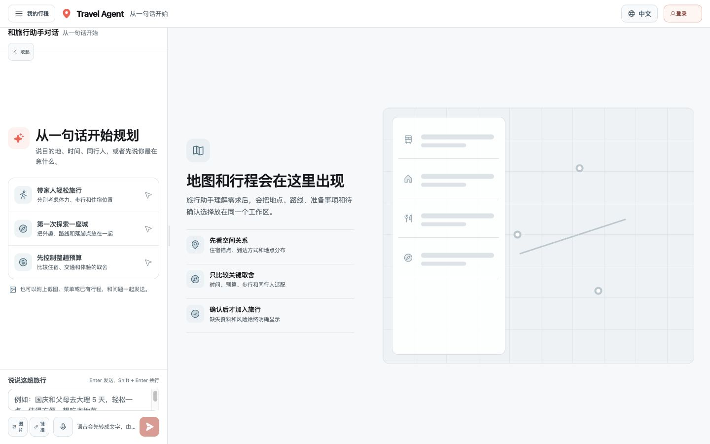
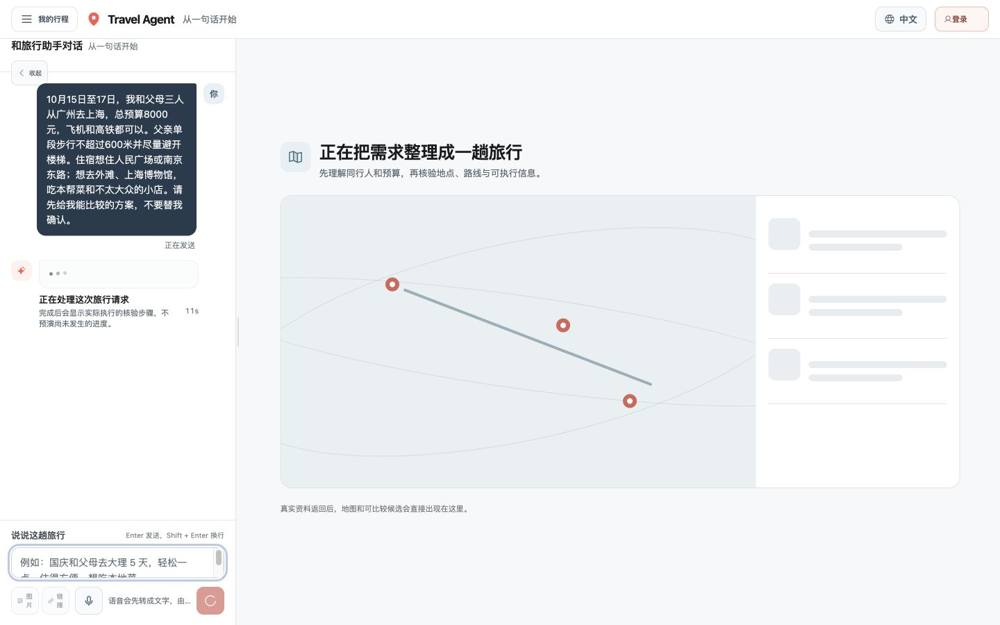
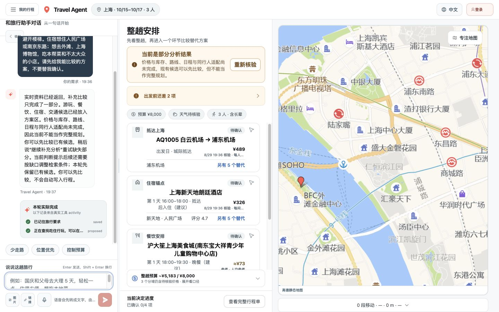
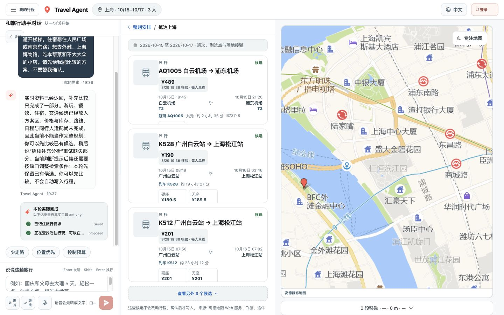
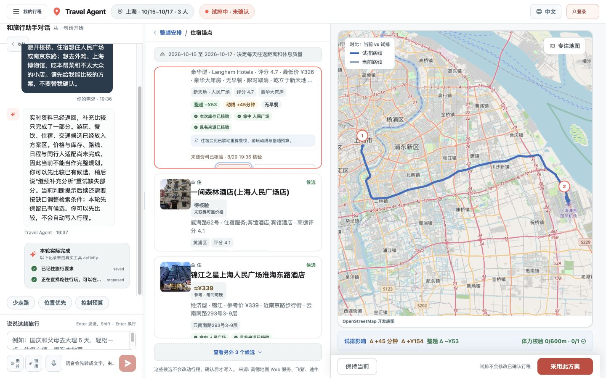
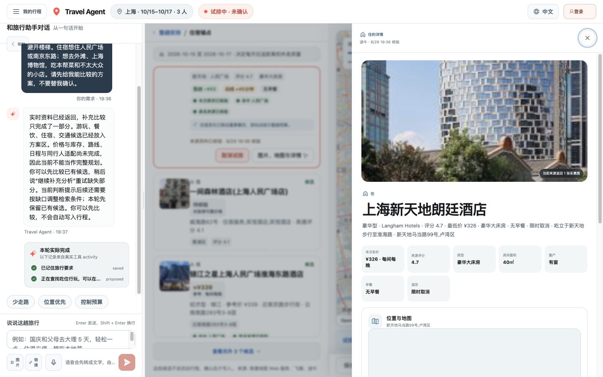
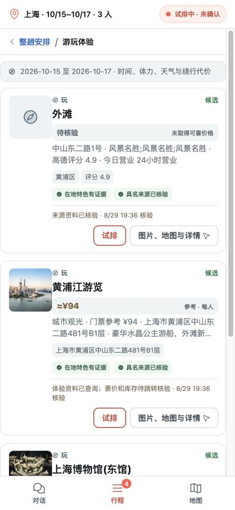
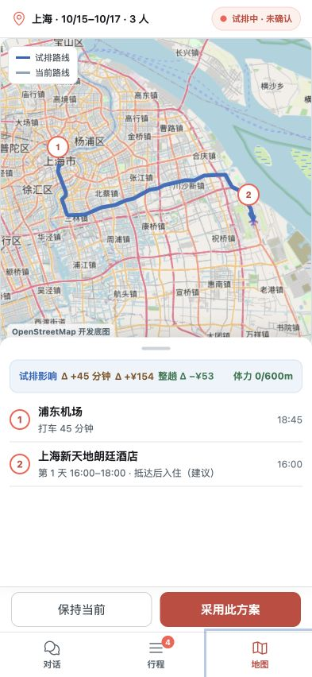
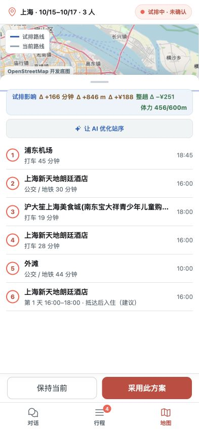

# Travel Agent 当前版本真实用户使用审计与 Fix Checklist

> 审计日期：2026-08-29
> 审计性质：真实自然语言、真实当前 Provider、桌面与移动响应式路径
> 当前状态：**14 项问题已完成代码修复；同一上海家庭旅行的桌面、移动、真实 Provider 与 TripState 复验通过，设备级边界见 §12。**
> 代码定位：分支 `codex/v2-deployment-readme-release`，审计前可复现 baseline `1cadbd2`
> 重要说明：审计时工作区有 104 项未提交变更，因此本文对应的是当时本地运行快照，不是可由单一 Git commit 复现的发布版本。后续每次复验必须记录新的 commit、时间与 Provider `checkedAt`。

## 1. 审计目标

从真实旅行规划用户视角验证当前产品是否能完成：

```text
表达旅行需求
  → 等待 Agent 研究
  → 理解候选和缺口
  → 比较跨城交通、住宿、餐饮与游玩
  → 试排地图和路线
  → 判断时间、费用、体力与同行人影响
  → 决定是否采用方案
```

本报告只记录本轮实际观察到的界面和行为，不用单元测试、旧截图或历史完成说明代替真实用户证据。

## 2. 测试用户与输入

角色：一名为父母规划上海家庭旅行的普通用户，不熟悉 Provider、Schema、Runtime 或内部 Agent 架构。

真实输入：

> 10月15日至17日，我和父母三人从广州去上海，总预算8000元，飞机和高铁都可以。父亲单段步行不超过600米并尽量避开楼梯。住宿想住人民广场或南京东路；想去外滩、上海博物馆，吃本帮菜和不太大众的小店。请先给我能比较的方案，不要替我确认。

审计边界：

- 使用隔离的临时 Trip/Conversation 数据目录；
- 没有点击最终“采用此方案”；
- 没有购买、支付、预订、登录生产账号或修改源码；
- 浏览器控制台没有出现 error 或 warning；
- 移动端为 `393×852` 响应式视口，不等于真实手机多点触控验收。

## 3. 总体结论

当前产品已经具备真实价值，但只能定位为：

> **真实候选发现 + 价格证据 + 地图试排工作台**

目前不能定位为：

> **用户可以放心确认并照着执行的旅行规划 Agent**

原因不是单纯 UI 不够精致，而是最终路线存在严重的日期/时间顺序错误，并且错误方案仍允许用户点击采用。

本轮主观体验评分：

| 维度 | 分数 | 结论 |
| --- | ---: | --- |
| 候选发现 | 7/10 | 能返回真实地点、酒店、航班和图片 |
| 价格与证据透明度 | 7/10 | 实价、参考价、估算和未知基本可区分 |
| 地图与试排交互 | 8/10 | 当前/试排路线和影响同屏是核心亮点 |
| AI 推荐能力 | 5/10 | 能整理，但尚未像旅行顾问一样筛选和解释 |
| 行程时间正确性 | 2/10 | 本轮出现抵达、入住、晚餐明显逆序 |
| 可直接执行程度 | 3/10 | 不建议用户确认后直接照此出行 |
| 综合 | **5.5/10** | 可用于发现与比较，不能作为最终行程 |

## 4. 实际用户路径与截图

### Step 1 — 首次进入：Healthy



- 无登录墙，自然语言是默认入口；
- 场景示例能帮助用户开始；
- 右侧清楚解释地图、候选和确认边界；
- 右侧在首次价值出现前仍占用较大空间，空会话的“收起”价值不明确。

### Step 2 — Agent 等待：At Risk



- 等待状态没有伪造内部研究阶段；
- 本轮约等待 90 秒；
- 没有预计耗时、已完成来源、部分结果先看、取消或后台继续入口。

### Step 3 — 整趟概览：Mixed



- 抵达、住宿、餐饮、游玩的主顺序清楚；
- 价格性质、预算、同行人和 partial 状态可见；
- 地图很大，但地图点与决定行的对应关系不够明确；
- “重新核验”“出发准备”“四个决定”同时争夺注意力；
- Activity 出现 `saved`、`proposed` 等内部状态码。

### Step 4 — 跨城交通比较：Weak



- 首屏只有一趟航班；
- 另两个首屏候选是 19–23 小时普通列车，并且没有余票；
- 用户要求“飞机和高铁都可以”，但没有真正出现高铁，也没有明确 verified no-match；
- 只显示每人价格，没有三人合计与门到门成本；
- 桌面候选卡主要操作发生布局越界，视觉上看不到“试排/详情”。

### Step 5 — 住宿试排：Mixed / Valuable



- 当前路线、试排路线、时间、费用、预算和体力影响同屏；
- “试排不会修改行程”表达清楚；
- `Δ +45 分钟 / +¥154` 相对空基准，缺乏可解释价值；
- 页面只显示一种推荐交通方式，用户不能直接切换公交、打车和步行比较；
- `0/600m` 主要源自推荐打车，不应被理解成整体方案自然适配。

### Step 6 — 酒店详情：Mixed



- 房型、面积、窗户、早餐、价格和退改规则可见；
- 设施、地图与到访反馈缺失时没有伪造；
- 只有一张低信息量外观图；
- 有地址但没有坐标，地图区域为空；
- 卡片标“本次实价”，设施说明又称“参考价格”，口径矛盾；
- “命中人民广场”没有转换为实际距离、时间或步行代价；
- 没有可执行的 OTA/官方查看或预订交接入口。

### Step 7 — 移动候选比较：Mostly Healthy



- 图片、价格、证据和主要操作均在卡片内可见；
- Chat / Trip / Map 三入口清晰；
- 顶部只显示“试排中”，看不到当前试排组合；
- “在地特色有证据”的语气强于现有地图/供应方证据；
- “让 AI 优化站序”触控高度实测 38px，顶部试排按钮 30px，低于建议的 44px。

### Step 8 — 两点移动路线：Failed on Time Semantics



- 航班 18:45 从广州起飞、21:20 到浦东；
- 路线却把浦东机场节点显示为 18:45，误用了出发时间；
- 酒店入住显示 16:00，早于航班起飞与落地；
- 错误路线仍允许点击“采用此方案”。

### Step 9 — 完整多点路线：Failed / Blocking



实际显示顺序：

```text
1. 浦东机场 18:45
2. 酒店 16:00
3. 晚餐 18:00
4. 酒店 16:00
5. 外滩 10:00
6. 酒店 16:00
```

问题：

- 时间不按日期和先后顺序排列；
- 晚餐发生在真实航班落地前；
- 酒店重复三次，但没有第几天或“返回住宿”的时间语义；
- 外滩只有时间，没有日期；
- “采用此方案”仍然启用；
- “让 AI 优化站序”只把一段文本填入对话框，不会直接执行优化，且生成的提示本身没有带完整日期/时间约束。

## 5. Fix Registry

状态枚举：`OPEN` / `IN_PROGRESS` / `FIXED_PENDING_QA` / `VERIFIED` / `WONT_FIX`。

| ID | 优先级 | 问题 | 当前状态 | Owner | 修复 PR/Commit | 复验日期 |
| --- | --- | --- | --- | --- | --- | --- |
| TA-UX-001 | P0 | 航班到达节点误用出发时间，导致首日时间逆序 | VERIFIED | Codex | `Fix executable itinerary and confirmation gates` | 2026-08-29 |
| TA-UX-002 | P0 | 时间不可能、路线不完整时“采用此方案”仍可点击 | VERIFIED | Codex | 同上 | 2026-08-29 |
| TA-UX-003 | P0 | 多日路线缺少 Day/Date 语义，住宿回环重复且时间相同 | VERIFIED | Codex | 同上 | 2026-08-29 |
| TA-UX-004 | P1 | 交通候选没有满足“飞机/高铁”意图，无票普通列车占据首屏 | VERIFIED | Codex | 同上 | 2026-08-29 |
| TA-UX-005 | P1 | 首次规划等待约 90 秒，无部分结果、ETA、取消或后台继续 | VERIFIED | Codex | 同上 | 2026-08-29 |
| TA-UX-006 | P1 | 路线 Δ 使用空基准，且缺少交通方式切换比较 | VERIFIED | Codex | 同上 | 2026-08-29 |
| TA-UX-007 | P1 | “命中人民广场”没有转换成距离、耗时和实际可达性 | VERIFIED | Codex | 同上 | 2026-08-29 |
| TA-UX-008 | P1 | 本地/小众餐饮相关性不足，低评分商业美食城成为首选 | VERIFIED | Codex | 同上 | 2026-08-29 |
| TA-UX-009 | P1 | “让 AI 优化站序”仅预填文本，行为与按钮承诺不一致 | VERIFIED | Codex | 同上 | 2026-08-29 |
| TA-UX-010 | P1 | 桌面候选卡操作发生布局越界，主要 CTA 不可见 | VERIFIED | Codex | 同上 | 2026-08-29 |
| TA-UX-011 | P1 | 酒店详情价格文案矛盾、图片/坐标/跳转不足 | VERIFIED | Codex | 同上 | 2026-08-29 |
| TA-UX-012 | P2 | Activity 与地图暴露 `saved/proposed/开发底图` 等工程语言 | VERIFIED | Codex | 同上 | 2026-08-29 |
| TA-A11Y-001 | P2 | 移动端部分可点击控件不足 44px | VERIFIED | Codex | 同上 | 2026-08-29 |
| TA-CONTENT-001 | P2 | Provider 营销长文和错字直接进入体验卡，影响可信度与扫描 | VERIFIED | Codex | 同上 | 2026-08-29 |

## 6. 单项问题、修复方向与验收标准

### TA-UX-001 — 航班到达节点误用出发时间

- **证据：** Step 8、Step 9。
- **复现：** 选择 `AQ1005 白云机场 → 浦东机场`，再试排酒店。
- **实际：** 浦东机场节点显示 `18:45`，这是广州起飞时间；真实落地为 `21:20`。
- **用户影响：** 入住、晚餐和首日接驳全部可能被排在落地前。
- **修复方向：** intercity arrival node 必须使用 `arrivalAt`；`departureAt` 只属于出发节点。跨日列车必须保留完整日期。
- **验收：** AQ1005 路线起点显示 `10/15 21:20 浦东机场`；后续酒店不得早于 `22:05` 左右的路线到达时间。

### TA-UX-002 — 不可执行方案仍允许确认

- **证据：** Step 8、Step 9 的“采用此方案”处于启用状态。
- **实际：** 日期逆序、地点未全部排入时间窗时仍可提交。
- **修复方向：** 在确认前强制执行 chronological feasibility gate：日期单调、移动耗时可达、开放时间不冲突、required route 已完成。
- **验收：** 任一硬冲突存在时按钮禁用，并显示唯一、用户可理解的阻断原因；TripState revision 不变化。

### TA-UX-003 — 多日住宿回环缺少 Day 语义

- **证据：** Step 9。
- **实际：** 酒店出现三次且均为 `16:00`，外滩 `10:00` 没有日期。
- **修复方向：** 路线节点必须带 `dayIndex/date/startAt/endAt/role`；住宿回环显示“Day 1 入住”“Day 1 返回酒店”“Day 2 从酒店出发”。
- **验收：** 每个站点都能回答“哪一天、几点、为什么在这里”；地图可按天切换；跨天不能使用同一时间窗排序。

### TA-UX-004 — 城际候选与用户意图不一致

- **证据：** Step 4。
- **实际：** 一趟航班 + 两趟 19–23 小时无票普通列车；无高铁。
- **修复方向：** 候选排序优先满足 `flight/train/flexible + inventory + duration + party fit`；无票候选移入“库存对照”；高铁 no-match 必须点名。
- **验收：** 首屏只展示可执行候选；若无高铁，显示“本次来源未返回可核验高铁，不代表市场无票”，而不是用普通列车替代。

### TA-UX-005 — 长等待缺少阶段性价值

- **证据：** Step 2；本轮约 90 秒。
- **修复方向：** Provider 各域返回后即时显示真实部分结果；显示剩余 required lanes、取消、后台继续与失败重试。不要伪造百分比。
- **验收：** 20 秒内至少出现真实已完成领域或明确说明尚未取得任何结果；用户可以取消且旧结果保留。

### TA-UX-006 — 路线影响缺少有效基准与模式切换

- **证据：** Step 5、Step 8。
- **实际：** `+45 分钟/+¥154` 与空路线比较；用户看不到公交、打车、步行三者完整指标。
- **修复方向：** 基准应为当前已确认方案或“未选择此候选”的可比路线；同屏提供模式 tabs 和每段时间、步行、换乘、费用。
- **验收：** 用户能回答“为什么推荐打车、地铁是否可行、三人差多少钱”，且每个数字可追溯到同一 route artifact。

### TA-UX-007 — 地理命中不等于实际方便

- **证据：** Step 6 的新天地酒店标记“命中人民广场”。
- **修复方向：** 将字符串/商圈命中降级为召回信号；最终 fit 必须使用坐标、到核心地点时间、首末接驳和每日路线代价。
- **验收：** 酒店卡明确显示距人民广场/南京东路的步行、地铁和打车数据；无坐标时不得显示“位置适合”类推荐理由。

### TA-UX-008 — 小众/当地餐饮证据不足

- **实际：** 首选是评分 3.7 的商业美食城；候选主要来自地图 POI，没有排队、招牌菜、预约、点菜和当地用户证据。
- **修复方向：** 增加长尾证据权重与反推广聚类；首屏排序结合地方特色、路线代价、评分、证据独立性和用户“不要大众”意图。
- **验收：** 每个长尾候选至少回答“为什么当地、为什么适合这次、从当前路线多绕多久、怎么点/是否排队”；无法证明时标记“当地特色待核验”。

### TA-UX-009 — AI 优化按钮是伪直接操作

- **证据：** Step 9。
- **实际：** 点击后只预填 Composer，需要用户再次发送；预填顺序本身缺少日期/时间。
- **修复方向：** 二选一：按钮改名“向 AI 询问更优顺序”；或真正执行有界优化并返回可撤销的新 Trial。
- **验收：** 文案与行为一致；优化输入包含日期、时间窗、路线指标、同行人限制和当前顺序；未确认前不写 TripState。

### TA-UX-010 — 桌面候选卡 CTA 布局越界

- **证据：** Step 4 截图中卡片无可见 CTA；本轮测量首个“试排”按钮 `y≈489`，而其所属卡片底部 `y≈355`。
- **修复方向：** 修复 card grid/flex 和 overflow；不要让 action 使用错误的 `margin-top:auto` 脱离卡片可视边界。
- **验收：** 1440/1180/100%/125% 缩放下，每个首屏候选的“试排/详情”均在卡片内部、可见、可键盘聚焦。

### TA-UX-011 — 酒店详情不足以进入履行

- **证据：** Step 6。
- **实际：** 一张外观图、无地点坐标、无 OTA 跳转；同时出现“本次实价”和“参考价格”。
- **修复方向：** 统一 price quality 文案；优先融合高德实体坐标和 OTA Offer；无可用跳转时明确“当前只能比较，不能查看库存详情”。
- **验收：** 价格性质全页一致；地图可定位或明确 entity resolution 失败；有 Offer 时出现来源、房型、早餐、退改和预订交接链接。

### TA-UX-012 / TA-A11Y-001 / TA-CONTENT-001 — 表达与可访问性清理

- 将 `saved/proposed/开发底图` 替换为普通用户语言；
- 移动端所有主要可点击目标达到至少 `44×44px`，当前实测“让 AI 优化站序”为 38px、试排状态按钮为 30px；
- Provider 营销长文先做摘要和事实抽取，原文放在展开层，不直接进入主卡；
- 不根据截图宣称完整 WCAG 合规，仍需键盘、屏幕阅读器、200% zoom 和真机测试。

## 7. 建议修复批次

### Batch A — 先关闭行程正确性

- [x] TA-UX-001 到达时间语义
- [x] TA-UX-002 确认前可执行性 Gate
- [x] TA-UX-003 Day Plan 与住宿回环

**门禁：** Batch A 未通过前，不应将当前版本描述为“可直接执行旅行方案”。

### Batch B — 再关闭交通与地图决策

- [x] TA-UX-004 城际候选排序
- [x] TA-UX-006 有效基准与模式切换
- [x] TA-UX-007 地理适配
- [x] TA-UX-009 AI 优化真实行为

### Batch C — 提升候选价值与可信度

- [x] TA-UX-008 长尾餐饮证据边界与排序
- [x] TA-UX-011 酒店实体/Offer/详情融合
- [x] TA-CONTENT-001 内容摘要与去推广

### Batch D — 人体工学与等待体验

- [x] TA-UX-005 真实等待反馈与后台继续
- [x] TA-UX-010 桌面 CTA 越界
- [x] TA-UX-012 工程语言清理
- [x] TA-A11Y-001 触控目标与浏览器辅助技术复核

## 8. 每个 Fix 的统一关闭模板

开发者完成一项后，在对应 ID 下补充：

```md
- 状态：FIXED_PENDING_QA
- Owner：
- Commit / PR：
- 修改范围：
- 新增测试：
- Fixture 证据：
- Live Provider 证据：
- 浏览器复现步骤：
- 复验截图：
- TripState revision 前后：
- 残余风险：
```

QA 只有在同一自然语言场景完成复验后才能改为 `VERIFIED`。以下证据不能单独关闭问题：

- 文件或 Schema 存在；
- 单元测试为绿；
- Fixture 返回预期；
- 静态截图；
- Provider 直接 smoke；
- 文档宣称已完成。

## 9. 回归验收场景

继续使用本报告第 2 节的同一家庭上海旅行请求，至少断言：

1. 交通首屏包含可执行飞机/高铁，或明确 verified no-match；无票普通列车不占据主推荐位。
2. 航班接驳使用 `arrivalAt`，不是 `departureAt`。
3. 首日晚餐和酒店到达不得早于落地 + 路线耗时。
4. 每个站点有日期、开始时间、结束时间和 Day 分组。
5. 酒店回环显示“返回酒店”，且时间在当天最后活动之后。
6. 任何硬时间冲突都会禁用确认，TripState 不变。
7. 父亲每段步行、换乘和楼梯证据逐段可见；未知不当作满足。
8. 交通、住宿、餐饮和游玩的整趟预算口径一致，未知项继续可见。
9. “让 AI 优化站序”产生真实可撤销 Trial，或明确只是预填提问。
10. 桌面与移动均能看见主要操作，不发生 CTA 裁切。

## 10. 证据限制

- 本轮只覆盖一个上海家庭旅行场景；
- Provider 内容和价格是 2026-08-29 当次动态快照；
- 没有验证生产 OAuth、真实预订、支付或售后；
- 没有在真实 iOS、Android、微信、支付宝设备测试触摸和 safe area；
- 没有进行屏幕阅读器和完整 WCAG 验收；
- 因工作区未提交修改较多，修复前应先由主开发线程记录新的 Git baseline。

## 11. 归因分析（2026-08-29，苏格拉底式问证）

> 回答的问题：这批问题是技术实现脏、架构过度工程化，还是产品设计矛盾？
> 结论先行：**三者叠加，但主次分明——主因是领域建模缺口（「时间与可执行性」从未进入路线模型）；并行改动与存在性验收是放大器；另有两个真实的产品设计矛盾需要单独修。不是「为单一目标过度工程化」，而是投资错位：基础设施层超前，领域模型层欠账。**

### Q1：是不是「脏改动、并行改动太多」造成的？

部分成立，但只解释边缘问题。

- 审计时工作区 104 项未提交变更、无单一可复现 baseline（§10）。这直接解释 TA-UX-010（CTA 布局越界）、TA-A11Y-001（触控目标回退到 38/30px——44px 早在 8/24 就验收过）、TA-UX-012（`saved/proposed` 工程语言泄漏）这类**回归型缺陷**：并行改动下，没有人对「已验收标准被破坏」负责。
- 但 Batch A 的时间逆序用脏改动解释不了：路线链路从未有过日期/时间语义。TA-UX-003 的酒店三次 16:00 是模型缺失；TA-UX-001 用 `departureAt` 填充到达节点，是接驳排程实现时就没有区分两个时间字段。任何一个 commit 切面上这些缺陷都存在。
- **判定：并行脏改动是放大器（制造回归与验收失真），不是主因。** 流程修复只有一个动作：先落库建 baseline，之后每批修复单独可复现。

### Q2：是不是架构错了，或为单一目标过度工程化？

不是典型的过度工程化，而是**投资错位**：

- 同期工程投入集中在 Agentic Runtime 并行 lane、一致性 Join、fallback ledger（见 `current/12-agent-runtime-and-parallelism-architecture.md`）。这些方向本身正确，但建在了「行程时间不可信」的地基上：系统能并行查出更多候选，却把候选排成时间上不可能的路线。
- 真正的欠账是**欠建模**：路线是单链条、无 dayIndex/date/role（TA-UX-003）；确认门校验步行与换乘、不校验时间单调性与可达性（TA-UX-002）；地理命中用字符串而非坐标与路线代价（TA-UX-007）；试排 Δ 与空基准比较而非与当前已确认方案比较（TA-UX-006）。四个问题同属一层缺失：**行程可执行性模型**。
- 既有架构的好部分恰好反证机制没错：TripState proposal / write contract 让「试排不落盘」一次就做对了。门是有的，只是可执行性从未被接进这扇门。

### Q3：是不是产品设计本身的矛盾？

有两处真实矛盾，与代码质量无关：

1. **承诺-能力矛盾**：「让 AI 优化站序」承诺执行、实际只预填文本（TA-UX-009）；「采用此方案」承诺可执行、实际没有可执行性校验（TA-UX-002）。设计系统允许 UI 承诺先于能力存在，这直接损害用户对「智能」的信任：按钮说它能，实际它不能。
2. **价值排序矛盾**：本轮评分地图试排 8/10、时间正确性 2/10。旅行产品的第一性原理是「时间与空间上能走通」是那个  1，其余交互是后面的 0；过去几轮把 0 做到了 8 分，1 还缺着。迭代文档 11 把 agentic 智能立为核心价值是对的，但「按天动线」排在 P 1——本审计证明它是 P0 级地基，已相应提前（见 `current/11` §11 路线图 A0）。

另有一处半矛盾：诚实降级原则落实到了 partial 展示，却没有延伸到动作层。「不可执行的方案禁止确认」才是诚实原则的完整形态。

### Q4：为什么每轮 QA 都说通过，真实路径还是 2/10？

验收测的是「功能存在」而不是「结果正确」：截图证明按钮在，不断言按下去的结果对不对；fixture 证明字段在，不证明到达时间用的是哪个字段。本文档 §8 的关闭模板（单元测试、fixture、静态截图、文档声明均不能单独关闭问题）就是对此的制度修复，后续批次必须沿用。

### 归因总表

| 类别 | 问题 ID | 性质与去向 |
| --- | --- | --- |
| 领域建模缺口（主因） | TA-UX-001 / 002 / 003 / 006 / 007 | 技术：时间语义、可执行性门、有效基准、实体解析。并入路线图 A0（`current/11` §11） |
| 工程纪律缺口（放大器） | TA-UX-010、TA-A11Y-001、TA-UX-012 | 流程：先建 baseline；已验收标准进入回归清单 |
| 承诺-能力矛盾（产品） | TA-UX-009，TA-UX-002 兼有 | 产品：新增全局约束「承诺与能力一致」（`current/11` §4 第 6 条） |
| 数据能力缺口（已知门） | TA-UX-004 / 008 / 011、TA-CONTENT-001 | Provider：候选排序、长尾证据、实体融合、内容清洗；部分已在上线门清单 |
| 已设计待落地 | TA-UX-005 | 迭代文档 11 §2.7 已覆盖，随 M1/B 阶段交付 |

### 对修复批次的两点调整

1. **Batch A 不是修三个 bug，而是建一层**：行程时间语义模型（dayIndex/date/startAt/endAt/role）+ 确认前可执行性门 + 试排有效基准必须一起进。按字段单点修补会反复漏——TA-UX-001 的 `departureAt` 误用就是同类单点修补漏网的例子。
2. Batch 顺序维持 A → D，但新增一条全局门禁随 Batch A 验收：**任何承诺动作的 UI（采用、优化、跳转）必须绑定真实能力或降级为明确文案**（承诺-能力一致性）。

## 12. 修复结果与同场景复验（2026-08-29）

### A0 行程正确性

- 新增派生的 `trip-itinerary-v1` 与 `trip-feasibility-v1`，不增加第二份 TripState。每个 stop 具有 `dayIndex/date/startAt/endAt/role/timeSource/fixed`；同一住宿可以分别表达入住、返回和次日出发。
- 城际目的地路线从 `arrivalAt` 开始。真实晚班 `9C8932` 显示 `10/15 23:40 抵达虹桥 → 10/16 00:05 入住`，不再使用 21:15 起飞时间。
- `2026-10-15 至 17` 会展开为 15/16/17 三天，外滩固定进入 Day 2；不再把范围终点误当 Day 2。
- 确认前检查日期单调、移动覆盖、已知营业窗口、楼梯硬冲突和 required route。fixture 反例中确认被拒绝、TripState revision 与 selected nodes 均不变化；真实可行 preview 确认后复用同一 Mobility，5 秒内完成并保存 `feasibility.canConfirm=true`。

### 交通、位置与候选

- “飞机和高铁”保留 `high_speed_train` 语义；真实首屏返回航班与 G246/G254 等高铁。无票 K/K/G 班次不进入可采用候选；没有可用高铁时明确说明本次来源 no-match，不推断市场无票。
- 首次试排没有已确认基准时显示绝对时间/费用，不再展示对空路线的伪 Δ；有已确认 Mobility 才显示差值。
- 每段路线可在公交地铁、打车、步行间切换，地图和整趟总账同源重算。真实切换曾从 108 分钟 / 708m / ¥87 变为 142 分钟 / 1744m / ¥40。
- 住宿片区命中只作召回。试排后真实显示到人民广场、南京东路的公交、打车、步行时间/步行/费用；无坐标时详情明确写 entity resolution 未完成，不再把字符串命中当位置适合。
- 餐饮排序加入评分、商业美食城惩罚与长尾证据边界；真实首选从 3.7 分商业美食城变为 4.7 分餐厅。当前没有独立社交/到访证据时固定标“当地特色待核验”。

### 承诺、人体工学与内容

- 伪直接操作改名为“向 AI 询问更优顺序”，预填内容包含完整日期、时间窗、role 和当前顺序；它不再承诺已执行优化。
- 候选卡禁止 flex shrink，1440 与 1152×720（125% 等效）下 CTA 均位于卡片内部；393px 主要操作、顶部试排状态、Sheet grip 与模式按钮至少 44px。
- Activity 只显示“处理中 / 已完成 / 需要处理”；地图显示“互动位置对比地图 / 高德地图快照”，不暴露 `saved/proposed/开发底图`。
- 酒店详情统一 `firm/reference/estimate`，路线解析可补坐标；无 OTA 跳转时明确“当前只能比较”。设施仍固定注明非实时。
- Provider 主卡摘要采用事实段落白名单和长度门，营销原文只保留在 `providerSummary`，不进入扫描层。
- 20 秒仍无新结果时明确说明“尚无新可确认结果”；已有方案时出现“回到旧方案，后台继续”，真实操作证明旧方案不被清空。

### 验收边界

- 同一上海家庭旅行在 1440×900、1152×720 与 393×852 浏览器完成；console error/warn 为 0。
- 真机多点触控、屏幕阅读器、生产 OAuth、交易与实时设施仍是独立上线门；本节 VERIFIED 只代表本报告定义的浏览器与合同验收，不扩张为完整 WCAG 或生产上线结论。
