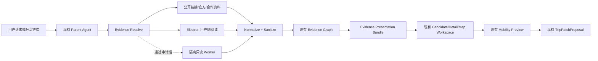

# Evidence Companion 下一阶段技术调研

> 日期：2026-08-31
>
> 状态：调研收敛；E0 / E1 已按研究边界实现。本文仍不代表 Electron、小红书自动搜索或 OTA 原页能力已经接线。
>
> 代码基线：`29e7a11d69ef393338b15c2f233c584089e1801f`。地图分层与跨端改动已在当前工作区完成验证，但截至本次调研仍未形成新的 Git baseline；本文只修改独立研究文档。

## 1. 结论先行

下一阶段不应从“把 Web 改成 Electron”或“接一个小红书爬虫”开始，而应先完成一个平台无关的用户闭环：

```text
候选地点
→ 看懂原始图文证据
→ 区分原文、翻译与 Agent 判断
→ 放入当前多点路线试排
→ 看见时间、预算、体力和同行人影响
→ 用户确认
→ 交易回到官方渠道
```

技术收敛为四个决定：

1. **保留 React/Vite Web Core。** Electron 是增强桌面壳，不替换 Web、PWA、Capacitor 和小程序共享的前端与服务端核心。
2. **先交付无账号 Evidence Companion。** 用户分享链接、现有 Provider/官方资料、授权图片和图文翻译先构成可用闭环。
3. **Electron 先做安全 Spike。** 只证明双视图、会话隔离、AMap JS、OAuth/Deep Link、内存与打包，不在 Spike 中顺带建设完整桌面产品。
4. **自动小红书搜索继续留在隔离门后。** 当前没有可确认的官方公共笔记搜索 API；开源候选均有登录态、非官方接口或写面，不能直接进入 Parent Agent。

## 2. 第一性原理问证

### Q1：旅行者真正缺的是一个内嵌浏览器吗？

不是。旅行者缺的是“这条当地内容为什么值得信、是否适合我、放入行程后会发生什么”。内嵌页面只是取得原始证据的一种手段。

因此，第一交付物必须是跨平台的证据读模型与决策闭环，而不是桌面壳。

### Q2：没有小红书账号，产品还应当可用吗？

必须可用。否则入境用户会在价值出现前被中国社交账号注册阻断。

默认路径应使用：

- 用户提供的公开分享链接；
- 地图、OTA、商家官方和创作者授权资料；
- 已经取得且允许展示的内容摘要；
- 到访点评闭环。

账号登录只提升“查看受限原帖”的深度，不成为开始规划的门槛。

### Q3：Electron 能否让 OTA 和小红书体验更连贯？

可以，但只对桌面端成立，而且安全成本真实存在。Electron 官方明确指出：远程不可信内容会放大本地应用权限风险；应使用隔离的 `WebContentsView`，关闭 Node integration、启用 context isolation 和 sandbox，并限制权限、导航、窗口与外部 URL。[Electron Security](https://www.electronjs.org/docs/latest/tutorial/security)

所以 Electron 的价值是：

- 在同一桌面窗口保留旅行上下文；
- 使用用户自己的本机会话阅读受限原页；
- 对当前可见文本或图片做用户主动翻译；
- 返回当前候选与路线，不丢失上下文。

它不应该承担：Provider 调用、LLM 密钥、TripState、购买自动化或任意网页 Agent。

### Q4：能否通过多个小红书账号稳定获得内容？

不能把它作为产品稳定性策略。多个账号会增加实名、Cookie、风控、账号治理和条款风险，也容易滑向绕过限制。合理路线是一个受限专用账号完成真实只读 smoke，长期覆盖依赖正式合作、创作者授权与到访闭环。

### Q5：图文翻译为什么不能只是把网页正文丢给模型？

因为旅行判断依赖图片、位置和语境：门面是否好找、菜单有什么、房间实际大小、入口是否需要走楼梯、排队信息写在哪里。正确输出必须把原始媒体、原文、译文、Claim、实体和当前行程影响关联起来。

## 3. 当前代码基线复核

### 3.1 已经存在且应复用

- React 19 + Vite Web Core；
- Capacitor 原生壳、微信和支付宝小程序；
- `EvidenceGraphSchema` 的 `contentItems / claims / entities`；
- Candidate 的 `sourceRefs / claimRefs / media / operability`；
- `TripPatchProposal`、Mobility Preview、Plan–Check–Repair；
- `RouteMapScene`：跨端 Day、leg、mode、route role 和真实 geometry 投影；
- `TripMapExplorer` 与地点详情 Overlay；
- AMap JS 薄渲染器与服务端安全代理；
- OTA booking URL 与外部官方跳转。

### 3.2 仍不存在

- Electron 依赖、桌面 main/preload 或安装包；
- 用户分享链接进入 Evidence Graph 的真实产品入口；
- 图文证据展示的 canonical projection；
- 图片展示权利、Claim 关联和翻译状态的统一表达；
- 小红书公开内容的官方搜索 API；
- 通过固定版本审计和真实隔离 smoke 的社交 Worker；
- Electron 下 AMap JS、自定义 origin、OAuth deep link 和外部页面会话的真实验证。

### 3.3 当前基线含义

地图已经具备承接证据候选试排的能力，因此下一阶段不应重写地图。新增能力只需把“证据 → 已归一 nodeId → 现有 Trial”接通。

但当前地图改动仍在工作区，下一阶段第一步必须先形成可回滚 baseline；否则 Electron 和 Evidence Companion 会与地图修改混在同一个不可审查变更里。

## 4. Electron 技术调研

### 4.1 框架判断

建议：**现有 Vite Renderer + 最小 Electron Main/Preload + 独立打包配置**。

不建议把现有 Web 工程迁移到新的 Electron 前端框架，也不建议首轮采用 Electron Forge 的 Vite 插件；官方文档仍将该插件标记为 experimental，且不保证 API 稳定。[Electron Forge Vite Plugin](https://js.electronforge.io/modules/_electron_forge_plugin_vite.html)

建议结构：

```text
apps/desktop/
├── main.ts
├── preload.ts
├── protocol.ts
├── evidence-view.ts
└── forge.config.ts 或等价最小打包配置

src/web/
└── 继续作为共享 React/Vite Renderer
```

Renderer 继续由现有 `vite build` 生成；Electron main/preload 使用最小 TypeScript 构建。打包工具只负责 package/make，不接管现有 Web 构建。

### 4.2 窗口模型

桌面 Evidence Companion 推荐：

```text
BaseWindow
├── Trusted App WebContentsView
│   └── Travel Agent、翻译伴随栏、地图、Trial
└── Untrusted Evidence WebContentsView
    └── 受支持的小红书/OTA/官方页面
```

`BaseWindow` 可以组合多个 `WebContentsView`；但官方文档说明关闭窗口时子 `webContents` 不会自动销毁，必须显式关闭，否则会产生内存泄漏。[Electron BaseWindow](https://www.electronjs.org/docs/latest/api/base-window)

不用 `<webview>`；Electron 官方当前建议优先考虑 `WebContentsView` 或避免嵌入远程内容。[Electron webview](https://www.electronjs.org/docs/latest/api/webview-tag)

### 4.3 信任边界

| 进程/视图 | 可持有什么 | 明确禁止 |
| --- | --- | --- |
| Main | 窗口、白名单、Session、受限动作路由 | LLM Key、Provider Cookie 导出、任意 Shell |
| Trusted App View | Travel UI、Evidence Projection、路线 Trial | Node、Cookie API、通用 IPC |
| Evidence View | 当前白名单远程页面 | preload Node 能力、TripState、Agent 工具、任意导航 |
| 服务端 | Provider、模型、TripState、Evidence Graph | 用户 Electron Session Cookie |
| Social Worker | 专用 Profile、三个只读动作 | Parent 凭据、发布互动、任意浏览器控制 |

远程内容视图统一：

```text
nodeIntegration: false
contextIsolation: true
sandbox: true
webSecurity: true
```

权限请求、导航、新窗口、下载和外部协议全部 fail closed。Electron 官方还建议使用自定义协议而不是 `file://`，并限制 IPC sender 与 `shell.openExternal` 输入。[Electron Security](https://www.electronjs.org/docs/latest/tutorial/security)

### 4.4 Session 与登录

- 每个来源使用独立持久化 partition，例如 `persist:travel-source-xhs`；
- Session 只属于本机用户，不能交给 Agent 或 Worker；
- 用户主动打开登录页并完成扫码；
- 退出来源或“清理登录”只删除对应 partition；
- Google/Apple/微信/支付宝的 Travel Agent 登录仍走系统浏览器和 deep link，不在不可信 Evidence View 中完成；
- OTA 的实名、支付、保险、提交和退改统一交给系统浏览器或官方 App。

### 4.5 Electron Spike 的 Go/No-Go

必须在功能开发前用一个独立 Spike 证明：

1. 打包后的本地 Renderer 可加载并通过 CSP；
2. AMap JS 在自定义 `app://travel-agent` origin 下可用，安全代理正常；
3. 小红书与一个 OTA 页面能在隔离 View 中打开，登录状态只留在各自 partition；
4. 未知跳转、弹窗、下载、摄像头、麦克风和地理位置默认阻断；
5. 关闭/重开 20 次无残留 `webContents` 与显著内存增长；
6. 1440、1000 和最小窗口下双视图不会遮挡现有地图与 Trial；
7. OAuth/deep link 与官方 App 跳转可恢复当前 Trip/候选焦点；
8. macOS 签名准备、Windows 打包路径和更新策略有明确成本。

任一核心项失败，首发继续使用 Web/PWA 的证据摘要 + 系统浏览器跳转，不阻塞主产品。

## 5. 小红书能力调研

### 5.1 官方能力

截至 2026-08-31，小红书开放账号平台文档显示仅开放 `basic_info`；`read_notes` 仍是规划中，并且描述为读取“用户发布的笔记”，不是公共笔记检索。[授权范围](https://openaccount.xiaohongshu.com/docs/scope) [API 参考](https://openaccount.xiaohongshu.com/docs/api-reference)

小红书分享开放平台提供的是把第三方图文/视频分享到小红书，而不是搜索或读取公共旅行帖子。[分享开放平台](https://agora.xiaohongshu.com/doc)

因此不能把“官方小红书公共搜索 API”写入下一阶段依赖。可继续申请开放平台账号，用于登录与后续权限观察，但不能以申请账号代替公共内容来源。

### 5.2 开源候选复核

| 候选 | 许可 | 获取方式 | 只读能力 | 写面与敏感面 | 当前结论 |
| --- | --- | --- | --- | --- | --- |
| OpenCLI | Apache-2.0 | 已登录浏览器自动化 | search/note/comments 等 | publish、follow/unfollow、download、通用 browser/plugin 能力 | 能力广但边界过大；只可作为固定 SHA 隔离 A/B 候选 |
| xiaohongshu-mcp | Apache-2.0 | 二维码登录 + 浏览器自动化 | search/feed/detail/comments/profile | publish、comment/reply、like、favorite、Cookie 管理与预编译二进制 | 不能原样接入；必须自建 read-only facade 并移除写工具 |
| redbook | MIT | 读取本机浏览器 Cookie并调用非官方签名接口 | search/read/analyze | publish、comment/reply/favorites；Cookie 导出与明文文件路径 | 不适合服务端 Worker；可借鉴数据结构，不接触用户浏览器 Cookie |

证据：OpenCLI 的适配器目录同时列出 search、note、comments、download、publish、follow/unfollow，并标记依赖浏览器登录。[OpenCLI adapters](https://github.com/jackwener/OpenCLI/blob/main/docs/adapters/index.md)；xiaohongshu-mcp 注册发布、评论、回复、点赞和收藏等写工具。[xiaohongshu-mcp README](https://github.com/xpzouying/xiaohongshu-mcp/blob/main/README_EN.md)；redbook 明确使用浏览器 Cookie 和非官方 API，并提供 Cookie 导出/保存及发布互动能力。[redbook README](https://github.com/lucasygu/redbook/blob/main/README.md)

这些仓库也持续暴露 DOM/API 漂移问题。OpenCLI 的小红书搜索曾因 API 返回结构和 DOM selector 变化返回空结果；这说明任何 Browser Adapter 都必须有 `SOURCE_CHANGED`、`EMPTY_VERIFIED` 与真实 smoke，而不能把空数组解释为没有内容。[OpenCLI issue #10](https://github.com/jackwener/OpenCLI/issues/10) [OpenCLI issue #1506](https://github.com/jackwener/OpenCLI/issues/1506)

### 5.3 采用结论

当前没有候选可以直接进入主代码。若进入 Worker 审计，必须同时满足：

- 固定 SHA；
- 许可证与依赖审计；
- 删除/禁用所有发布、互动、下载、任意 URL、Shell 和通用 browser/plugin 路径；
- Worker 只暴露既定三动作；
- Cookie 只在专用 Profile；
- 无凭据、无登录和专用账号三层 smoke；
- Challenge/限流立即停止；
- 真实结果与 `EMPTY_VERIFIED`、`SOURCE_CHANGED` 分开；
- 平台条款和商业使用完成书面审查。

## 6. 图文翻译与证据投影

### 6.1 单一读模型

新增一个非持久化 `EvidencePresentationBundle`，只投影现有 `EvidenceGraph` 和 Candidate：

```text
Source identity + checkedAt
→ 允许展示的媒体
→ 原文 section
→ 目标语言译文
→ Claim groups
→ 与当前 Traveler/Itinerary 的影响
```

它不是第二份事实源，不写 TripState，不替代 Claim。一个 canonical TypeBox schema 同时驱动 TypeScript 和 Runtime 校验；首版不加入公共 MCP。

### 6.2 文本翻译

- 固定提取器只读取用户当前可见或选择的正文；
- 过滤脚本、隐藏节点、输入框、账号资料和页面指令；
- 使用 DeepSeek 生成结构化翻译与摘要；
- 保留 sectionId、原文、译文、uncertainty 和 claimRefs；
- 地名、价格、时间和专名无法确认时保留原文；
- 来源内容按 Prompt Injection 处理，翻译上下文没有 Tool。

### 6.3 图片翻译

- 用户主动选择当前图片或区域；
- Electron 只截取当前可见区域，不下载整帖媒体；
- 使用通过真实 smoke 的 Kimi 视觉能力识别菜单、标牌、房型截图和入口说明；
- 不识别人脸、证件、二维码、手机号和支付资料；
- 图片观察先是待核验 Claim，不直接成为营业、价格、房态或无障碍事实；
- 输出在可信 App View 中显示，不覆盖第三方页面 DOM。

### 6.4 缓存键与删除

```text
contentItemId + contentHash + targetLanguage + extractorVersion
```

缓存保存翻译结果和来源引用，不默认保存原始图片。来源变化、授权撤回或 hash 变化后旧结果标记 stale。正式上线前还需确定保存期限与删除 SLA。

## 7. 推荐的最小架构



建议只新增三个清晰边界：

1. **Evidence Resolve**：支持的分享 URL、来源状态与内容归一；
2. **Evidence Presentation**：图文、翻译、Claim 与展示权利投影；
3. **Desktop Shell**：只提供可信 App View、不可信 Evidence View、Session 与安全跳转。

不新增通用浏览器服务、内容 CMS、第二个 Agent、第二份 TripState、第二套 Proposal、社交 Feed 或分布式抓取平台。

## 8. 下一阶段 Changeset

### E0：形成稳定 baseline

- 提交并标记当前地图/跨端成果；
- 重新跑当前 golden path；
- 记录 AMap JS 外部配置仍未通过的边界；
- 保证下一阶段可独立回滚。

### E1：无账号 Evidence Companion

- canonical `EvidencePresentationBundle`；
- 用户分享链接白名单解析；
- 候选卡“当地人怎么说”；
- 图文详情、快速翻译、来源和 checkedAt；
- 从证据候选进入现有多点路线 Trial；
- Web/PWA 新标签降级。

完成门：英语用户无需小红书账号即可从一条真实餐饮证据进入 Trial，并看见路线、时间、预算和父亲步行影响；确认前 TripState 不变。

### E2：Electron 安全 Spike

- 最小 main/preload/build；
- `BaseWindow + 2 WebContentsView`；
- 自定义协议、CSP、白名单与 Session；
- AMap JS、OAuth/deep link、XHS/OTA 页面、内存和打包验证；
- 不接 Provider、不接购买、不接自动搜索。

完成门：Go/No-Go 清单全部有真实桌面证据；否则停止 Electron 产品化。

### E3：Electron Evidence Reader

- 用户主动打开来源；
- 文本选择翻译；
- 当前图片/区域翻译；
- 可信伴随栏呈现原文、译文与行程影响；
- 返回当前候选和地图焦点；
- OTA 交易跳系统浏览器/官方 App。

### E4：隔离自动发现

- 仅在第三方固定版本审计、条款审查与专用账号 smoke 通过后启动；
- 一个 Worker、一个专用 Profile、三个只读动作；
- 与公开链接共用相同 Evidence 输出；
- 不通过时保持 `blocked`，不影响 E1–E3。

### E5：正式内容合作

- 创作者授权资料；
- 平台合作与删除/撤回流程；
- 依据 Trial/确认转化决定是否扩展抖音、微信等来源。

## 9. 验收与观测

### 9.1 产品黄金路径

使用现有上海家庭旅行：

1. 用户请求“不太大众的本帮菜”；
2. 候选展示真实图片、来源、翻译和 Claim；
3. 用户查看一条小红书或创作者图文证据；
4. 用户试排餐厅；
5. 地图形成酒店 → 景点 → 餐厅 → 酒店多点路线；
6. 显示交通方式、时间、预算和父亲 600 米步行约束；
7. 用户确认后才提交同一 Trial；
8. 预订或原页交易跳官方渠道。

### 9.2 分层证据

- 合同 fixture：只证明 schema/错误语义；
- Provider live：只证明当前来源调用；
- 应用组合：证明 Evidence → Candidate → Trial；
- Web 浏览器：证明无账号路径；
- Electron 桌面：证明 Session、原页、翻译和安全边界；
- 商业授权：单独记录，不由代码测试代替。

### 9.3 关键指标

- 证据详情 → Trial 转化率；
- Trial → 确认率；
- 用户从中文内容得到可理解决定的完成率；
- 原文/翻译/Agent 判断混淆率；
- 地点归一成功率；
- 社交来源失败时旅行主方案完成率；
- Cookie/Token/证件/支付进入 Prompt 或日志必须为 0。

## 10. 未决外部事项

- 高德 JS Key 与 Security Code 的真实浏览器配置；
- Electron macOS 签名、Windows 签名和自动更新成本；
- 小红书公共内容的商业使用与平台条款审查；
- OTA 页面允许展示、翻译和链接的范围；
- 社交图片缩略图和翻译派生内容的授权；
- 翻译缓存保存期限与删除机制；
- 目标八语的质量评测和阿拉伯语 RTL 真机验收；
- 专用社交账号、实名与运维责任人。

这些事项未通过前，产品可以完成无账号证据闭环，但不能宣称“自动搜索小红书”“桌面原页阅读已上线”或“社交内容已获得商业授权”。
