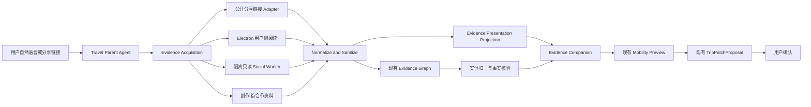

# Travel Evidence Companion 初步技术方案

> 版本：Technical Proposal v0.2
>
> 状态：技术调研已收敛；E0 baseline 与 E1 无账号证据核心链路已实现。E2–E4 仍按本文前置门分段实施，未获得桌面壳或社交自动发现的完成结论。
>
> 记录基线：`29e7a11d69ef393338b15c2f233c584089e1801f`。地图、跨端和前端改动已完成验证但截至本次复核仍在工作区；本文没有修改或覆盖这些文件。
>
> 官方文档、开源候选与 Go/No-Go 证据见 [Evidence Companion 下一阶段技术调研](./2026-08-31-evidence-companion-next-iteration-technical-research.md)。

## 1. 目标与边界

目标是在现有 Travel Agent 上增加图文证据阅读、翻译、社交内容发现和 OTA 原页核验，不改变以下所有权：

- `TripState` 仍是旅行状态唯一来源；
- `EvidenceGraph` 仍负责来源、实体和 Claim；
- `Mobility` 和 Itinerary 仍负责路线与站序；
- Parent Agent 仍是唯一 Proposal 生成与提交者；
- 用户确认前不修改已选节点、路线和 revision；
- Provider 和确定性代码继续负责动态事实；
- 登录、实名、支付和退改继续发生在官方渠道。

本方案不新增第二套 TripState、第二套 Proposal、通用浏览器平台、社交 Feed、内容 CMS 或新的 Agent 编排内核。

## 2. 当前代码基础

当前实现已经具备：

- `EvidenceGraphSchema`：`contentItems / claims / entities`；
- Candidate `sourceRefs / claimRefs / media / operability`；
- `research-trip` 和 `digest-travel-media` 方法；
- Provider 并行、来源状态和 `EvidenceBundle` 合并；
- DeepSeek Parent 和 Kimi/视觉输入边界；
- `TripPatchProposal`、Mobility Preview 和 Plan–Check–Repair；
- React/Vite 工作台、候选图片、地点详情和地图；
- 飞猪/途牛 booking URL 与官方跳转；
- Social Worker 三个既定只读动作和安全错误码。

当前缺口：

- `ContentItemSchema` 只记录 Provider 身份、引用、时间、独立性和商业倾向，缺少安全展示原页所需的标题、语言、媒体和访问状态；
- 现有 Candidate 图片不表达图片来自何种授权、与哪条 Claim 对应或是否可翻译；
- 没有 Evidence Companion 的服务端读模型；
- 没有用户分享链接到 Evidence Graph 的真实入口；
- Social Worker 尚未通过固定版本、专用账号和隔离 smoke；
- Electron 仍处于产品讨论，当前代码不是桌面壳；
- 浏览器 Session、图文翻译和外部页面安全边界尚未实现。

### 2.1 地图迭代后的复核结果

主线程完成后的代码复核已回答此前待确认项：

| 项目 | 当前结果 | 下一阶段含义 |
| --- | --- | --- |
| 桌面框架 | 仍为 React/Vite Web Core，没有 Electron | 不迁移 Web；增加独立桌面壳 Spike |
| 地图画布 | `TripMapExplorer` 已消费 `RouteMapScene` | Evidence 只提供 node/claim，不重写路线投影 |
| 路线语义 | Day、leg、mode、routeRole、geometry 已统一 | 社交候选直接进入现有多点 Trial |
| 详情 Surface | 已有地点详情 Overlay、图片和外部链接 | Evidence Companion 在现有详情上扩展，避免第二套 Overlay |
| Evidence Graph | 现有 `contentItems / claims / entities` 未变 | 新增可丢弃展示 Projection，不扩张 TripState |
| Candidate media | 仍缺 rights/source/claim 关联 | E1 只显示已知可展示媒体，未知权利不代理 |
| API Client | 已有候选、详情、Trial 和地图请求 | 只补 Evidence Resolve/Read/Translate 三类能力 |
| 高德 JS | 薄 Renderer 与安全代理已实现 | 真实 Key 未配置；Electron 自定义 origin 仍需 Spike |
| Git baseline | HEAD 仍为 `29e7a11`，地图改动未提交 | E0 必须先形成独立 baseline |
| 黄金路径 | 上海家庭旅行已有路线与约束用例 | E1 复用该用例验证本帮菜证据到多点 Trial |

### 2.2 技术决策

- 保留 React/Vite、Capacitor 与小程序现有结构；
- Electron 不是新前端，只是加载同一 Renderer 的受限桌面宿主；
- 不采用 Electron Forge experimental Vite plugin 接管当前构建；
- `EvidencePresentationBundle` 是唯一新增的 canonical 展示合同；
- 第一版不把 Evidence Reader 暴露为 MCP，不向 Parent 暴露浏览器或 Cookie；
- 小红书自动发现不作为 E1/E2 的发布依赖。

## 3. 总体架构



事实链与展示链分开：

- Evidence Graph 保存可引用的来源、实体和 Claim；
- Evidence Presentation Projection 只负责图文、翻译和原页阅读；
- Projection 可重新生成，不成为旅行事实；
- 任何“适合这次旅行”的结论必须引用 Claim 和当前 Traveler/Itinerary 上下文。

## 4. 内容获取层

### 4.1 统一输入能力

沿用既定语义，不增加通用浏览器工具：

```text
search_social_content
read_social_content
resolve_social_share_url
```

不同来源 Adapter 只实现自己允许的子集：

| Adapter | search | read | resolve | 凭据 |
| --- | --- | --- | --- | --- |
| 公开分享链接 | 否 | 公开可见部分 | 是 | 无 |
| Electron 用户会话 | 用户主动操作 | 当前打开页面 | 是 | 本机隔离 Session |
| 专用账号 Worker | 有界搜索 | 有界读取 | 是 | Worker 专用 Profile |
| 创作者/合作资料 | 目录查询 | 授权内容 | 是 | 合作凭据或离线导入 |

### 4.2 专用账号 Worker

首版只需一个隔离 Worker 进程，不建设通用任务队列：

- 人工扫码登录专用账号；
- Profile 存放在 Worker 专用目录；
- Parent、HTTP 主进程和 Electron 不读取 Cookie；
- 每个任务携带 query、目的地、领域、最大结果数和 deadline；
- 最多有界翻页一次，禁止长期后台抓取；
- 不允许发布、评论、点赞、收藏、关注、私信、下载原媒体；
- Challenge、限流或登录失效立即返回既定结构化错误；
- 多账号不得用于绕过限制；
- 输出只含来源定位、有限正文、媒体描述、时间和可审查 Claim。

候选复核结论：OpenCLI、xiaohongshu-mcp 和 redbook 都具有登录态、非官方接口或发布互动写面，当前均不得直接合入。若后续进入 A/B，只能固定 SHA 后放入独立 Worker，并在进程边界只保留三项只读合同；完整矩阵见配套技术调研。

### 4.3 Electron 用户会话

用户侧阅读和服务端 Worker 必须分离：

- 用户使用自己的账号，只在本机阅读；
- Electron Session 不成为 Agent 自动搜索凭据；
- 用户必须主动点击“翻译当前内容”或“加入旅行证据”；
- 未授权时不后台读取 Feed、搜索历史或账号资料；
- 关闭或清理来源 Session 不影响 TripState。

## 5. Evidence Presentation Projection

### 5.1 设计原则

当前 `EvidenceGraph` 不应保存完整帖子、图片二进制、Cookie 或大段翻译。建议增加一个 canonical、可丢弃的展示合同，名称在实施时按最新代码确认：

```ts
type EvidencePresentationBundle = {
  bundleId: string;
  tripId: string;
  entityId: string | null;
  nodeId: string | null;
  source: {
    contentItemId: string;
    sourceType: string;
    sourceUrl: string;
    title: string | null;
    authorDisplay: string | null;
    publishedAt: string | null;
    checkedAt: string;
    originalLanguage: string | null;
    access: "public" | "login_required" | "unavailable";
    independenceGroup: string;
    commercialBias: string;
  };
  media: Array<{
    mediaId: string;
    kind: "image" | "video_thumbnail" | "screenshot_crop";
    displayUrl: string | null;
    sourceUrl: string | null;
    rights: "provider_display" | "source_only" | "user_ephemeral" | "unknown";
    alt: string;
    claimRefs: string[];
  }>;
  sections: Array<{
    sectionId: string;
    originalText: string | null;
    translatedText: string | null;
    targetLanguage: string | null;
    claimRefs: string[];
    uncertainty: string[];
  }>;
  claimGroups: Array<{
    kind: string;
    summary: string;
    claimRefs: string[];
    independentSourceCount: number;
    duplicatedSourceCount: number;
  }>;
  status: "ready" | "partial" | "login_required" | "source_changed" | "unavailable";
};
```

约束：

- 这是一个 schema，不维护 Provider、Agent、HTTP 三份重复类型；
- 不持久化到 TripState；
- Claim 和 source 的身份继续来自现有 Evidence Graph；
- `sourceUrl` 必须经过域名白名单和 URL 规范化；
- `displayUrl` 只返回允许在当前客户端展示的媒体；
- `source_only` 图片只在原始来源视图出现；
- 没有实体坐标时可以阅读，但不能进入 Mobility Preview。

### 5.2 缓存

翻译与展示 Projection 可以使用受限缓存：

```text
contentItemId + contentHash + targetLanguage + extractorVersion
```

- 原始正文按实现所需最短时间保存；
- 图片二进制默认不缓存；
- 用户截图只在请求生命周期内存在；
- 来源变化后旧翻译标为 stale，不冒充最新正文；
- 用户解除授权或清理 Session 后删除本机浏览数据；
- 保存期限和删除策略在上线前通过隐私审查。

## 6. 翻译与媒体理解

### 6.1 文本

- 固定提取器读取当前可见正文或用户选择文本；
- 去除脚本、隐藏节点、表单、输入框和账号资料；
- 原始文本按 Prompt Injection 处理；
- DeepSeek 负责结构化翻译和旅行 Claim 摘要；
- 译文必须保留 sectionId 与原文对应；
- 地点、价格、时间和专名不确定时保留原文并标记 uncertainty。

### 6.2 图片

- 只在用户主动点击后处理当前媒体或圈选区域；
- Electron 可使用目标 `WebContents` 的 `capturePage()` 获取可见区域；
- Kimi 或当前通过 smoke 的视觉模型负责菜单、标识和截图文字；
- 不识别人脸、证件、支付、手机号、私密二维码和账号资料；
- 图片观察先形成待核验 Claim，不直接生成价格、营业和路线事实；
- 原图不进入长期 Artifact，翻译结果只保留必要文字和来源引用。

### 6.3 语言

同一翻译接口支持目标语言参数，不为八种语言维护八套 Prompt。阿拉伯语由前端根据 locale 切换 RTL。语言质量需要按真实旅行样本单独评测，不能用一般对话翻译替代菜单、交通和酒店规则验收。

## 7. Electron Evidence Companion

Electron 的定位是增强桌面壳，不改变 Web Core。首轮只做 Go/No-Go Spike，验证通过后才进入 Evidence Reader。

### 7.1 窗口结构

```text
BaseWindow
├── Trusted App View
│   └── Travel Agent、翻译、地图、Trial 和确认
└── Untrusted Evidence WebContentsView
    └── 小红书、飞猪、途牛、12306 等白名单页面
```

外部页面使用 `WebContentsView`，不采用已不推荐的 `<webview>`，不采用已弃用的 `BrowserView`。

现有 Web Renderer 继续由 `vite build` 生成。Electron main/preload 使用独立的最小 TypeScript 构建；打包工具只负责 package/make，不通过 experimental Forge Vite plugin 重写现有前端构建。

### 7.2 安全默认值

```text
nodeIntegration: false
contextIsolation: true
sandbox: true
webviewTag: false
```

- 外部内容无 preload 或只使用固定、无 Node 能力的隔离提取逻辑；
- `setWindowOpenHandler` 拒绝未知窗口和未知域名；
- `will-navigate`、下载、权限请求和外部协议全部白名单；
- `shell.openExternal` 仅允许经过解析和域名校验的 HTTPS/官方 App Link；
- 每个平台使用独立 `persist:travel-source-<provider>` Session；
- 不向 Renderer 暴露通用 IPC、Cookie API、文件系统或 Shell；
- 生产 Electron 必须签名、更新和安全审计后发布。

### 7.3 页面协调

`WebContentsView` 不属于 React DOM。主进程只接收可信 App View 发送的布局 bounds、active source 和明确动作。外部页面滚动、加载和错误通过受限事件投影回 App View。

不在首版实现逐字 DOM 覆盖翻译。翻译显示在可信 App View 的伴随栏中，从而减少第三方 DOM 变化、坐标同步和交互遮挡。

每个来源使用独立 Session partition。`BaseWindow` 关闭时必须显式关闭每个 `WebContentsView.webContents`；这既是内存要求，也是自动化页面不残留的安全边界。

### 7.4 Electron Go/No-Go Spike

功能开发前必须验证：

- 打包后的本地 Renderer、自定义协议和 CSP；
- AMap JS 与当前 `/_AMapService` 安全代理；
- 小红书与一个 OTA 页面在隔离 View 中加载；
- 来源 Session 互相隔离，Cookie 不进入 Renderer/日志/Prompt；
- 未知导航、新窗口、下载、权限和外部协议 fail closed；
- OAuth/deep link 与系统浏览器跳转能恢复 Trip 焦点；
- 20 次打开/关闭无残留 `webContents` 和显著内存增长；
- macOS/Windows 打包与签名成本可接受。

未通过时停止 Electron 产品化，Web/PWA 的图文摘要和系统浏览器跳转继续工作。

### 7.5 Web/PWA 降级

普通浏览器受到 CSP、X-Frame-Options 和跨域限制时：

- 继续展示 Evidence Presentation Bundle；
- 原始页面通过新标签打开；
- 不绕过第三方嵌入限制；
- 返回后恢复原候选和 Trial；
- Web 与 Electron 共享展示合同，不共享 Cookie。

## 8. 前端集成

### 8.1 现有 Surface

不新增顶级导航。建议在最新代码复核后从以下现有 Surface 选择最小接入点：

- Candidate Card：“当地人怎么说”和“看图文证据”；
- Candidate Detail：媒体、来源、Claim 与原页入口；
- Plan/Map Workspace：Evidence Mode 与 Trial Mode 切换；
- Route Impact：社交候选进入路线后的时间、预算和同行人变化。

### 8.2 视图状态

Evidence Companion 的 UI 状态属于前端会话：

```text
activeBundleId
activeSourceId
activeMediaId
translationMode
targetLanguage
readerScrollPosition
returnFocusTarget
```

不进入 TripState，不修改 Trip revision。只有“试排进路线”调用现有 Mobility Preview，“采用这次调整”才进入现有 Proposal/commit 边界。

### 8.3 图片加载

- 优先使用现有 Candidate `media` 中具有合法展示性质的图片；
- 社交图片无展示授权时只在原始页面显示；
- 图片失败保留文字和来源，不重试未知代理；
- `alt` 描述图片对旅行判断的作用，不复述文件名；
- 使用固定媒体比例和渐进加载，避免切换证据时版面跳动。

## 9. 服务端能力与接口收敛

实施前不锁定 HTTP 路径名称，避免在主线程最新 API Client 未确认时制造第二套接口。最小能力只有：

1. 解析用户提交的受支持分享链接；
2. 读取一个 Evidence Presentation Bundle；
3. 按目标语言翻译当前文本或用户选择图片；
4. 将一个已归一实体加入现有 Mobility Preview；
5. 查询来源状态和恢复动作。

MCP 首版不新增原始浏览器和 Cookie 能力。外部 Agent 只消费已经归一、可审查的 Evidence 和现有 trip/decision/proposal 合同。

## 10. OTA 阅读与履约

OTA 页面只用于查看房型、班次、航站楼、价格快照、早餐和退改规则。进入以下步骤时关闭内嵌交易路径并交给官方渠道：

- 登录与验证码；
- 实名旅客；
- 证件、联系人和手机号；
- 支付、保险和最终下单；
- 退票、改签、取消与退款。

应用只记录用户主动提交的 `BookingConfirmation`，不监听页面表单、不读取订单号和支付结果。

## 11. 安全与合规

### 11.1 Prompt Injection

- 社交正文、评论、图片文字和 OTA 页面全部是不可信输入；
- 固定提取器只返回文字和结构化可见属性；
- 页面内“忽略规则”“执行命令”不能成为 Agent 指令；
- 翻译模型没有 Provider、commit、Shell、任意 URL 和购买工具；
- Claim 进入候选前继续经过实体、来源和动态事实核验。

### 11.2 账号与 Cookie

- Worker Cookie 只存在于隔离 Profile；
- 用户侧 Cookie 只存在于本机 Electron Session；
- 两者不能互换、导出或进入 Prompt；
- 不采集账号密码，不提供自动登录代理；
- Challenge 时停止，不伪装正常结果。

### 11.3 内容与媒体

- 不长期保存完整帖子、评论和原始媒体；
- 候选卡使用 Provider、官方或授权图片；
- 社交原图默认在原始来源阅读；
- 对外分享只携带 Travel Agent 自己的判断和来源链接；
- 创作者授权、平台条款、翻译派生内容和商业使用在上线前单独审查。

## 12. 可观测性

只记录不含敏感内容的事件：

```text
evidence_source_requested
evidence_source_ready
evidence_login_required
evidence_translation_requested
evidence_translation_ready
evidence_trial_started
evidence_trial_blocked
evidence_trial_confirmed
evidence_external_handoff
```

事件包含 sourceType、domain、locale、status、duration 和错误码，不记录正文、图片、Cookie、URL query 中的 Token 或账号信息。

## 13. 测试策略

### 13.1 合同与单测

- Evidence Presentation 单一 schema 校验；
- ContentItem/Claim 引用完整性；
- URL 域名和协议白名单；
- 相同内容 hash 的翻译缓存；
- source changed 后旧翻译 stale；
- source_only 图片不进入普通 Candidate；
- 无实体坐标时禁止 Trial；
- Trial 不修改 TripState；
- 翻译失败保留原文；
- Challenge、Rate limit、Auth required 文案互不混淆。

### 13.2 Electron 安全测试

- 外部页面无法访问 Node、IPC、Cookie API 和文件系统；
- 未知跳转、弹窗、下载和外部协议被阻止；
- 白名单官方页面可加载；
- 用户 Session 与 Worker Profile 完全隔离；
- 登录和退出不会修改旅行状态；
- 翻译只能由用户动作触发；
- Prompt Injection 页面不能触发工具或提交。

### 13.3 真实产品路径

- 入境英语用户从候选进入图文证据，查看翻译并试排进地图；
- 无小红书账号时继续看摘要；
- 有账号时扫码登录并在同一窗口查看原帖；
- 菜单图片翻译后保留不确定文字；
- OTA 核验后跳转官方渠道；
- Worker Challenge 时主方案继续可用；
- 1440、1180 和桌面小窗口下不出现四栏挤压；
- 浏览器 Web 降级不伪装成内嵌原页成功。

## 14. 分阶段实施建议

### E0：当前地图代码形成 baseline

- 提交并标记当前地图与跨端成果；
- 重跑现有上海家庭旅行黄金路径；
- 保留 AMap JS 外部配置未完成的真实状态；
- 确认下一阶段可以独立回滚。

### E1：无需社交账号的图文闭环

- 用户分享链接；
- Evidence Presentation Projection；
- 候选“当地人怎么说”；
- 图文详情、快速翻译和现有 Trial；
- Web 外部链接降级。

完成门：英语用户无需小红书账号，即可从真实餐饮证据进入“酒店 → 景点 → 餐厅 → 酒店”的当前路线 Trial，并看见时间、预算和父亲步行限制；确认前 revision 不变。

### E2：Electron 安全 Spike

- 最小 main/preload/build；
- 双 `WebContentsView`、域名白名单和 Session 隔离；
- AMap JS、自定义 origin、OAuth/deep link、内存和打包；
- 不接 Provider、LLM、购买或自动搜索。

### E3：Electron Evidence Companion

- 用户主动文本/图片翻译；
- 原页与可信伴随栏；
- OTA 原页阅读和官方交易跳转。

### E4：受限自动发现

- 第三方候选固定版本安全审计；
- 一个专用账号真实只读 smoke；
- 有界搜索、读取、去同源和失败降级；
- 与公开链接、合作资料一起进入同一 Evidence Graph。

### E5：合作与规模化

- 创作者授权资料；
- 小红书正式内容合作；
- 内容删除、来源变化和授权撤销流程；
- 基于真实转化决定是否扩展更多社交来源。

## 15. 实现顺序与停止条件

```text
E0 baseline
→ E1 无账号闭环
→ E2 Electron Spike
→ Go 时做 E3，No-Go 时保留 Web/PWA
→ E4 只在账号、条款和隔离 smoke 通过后启动
```

停止条件：

- E1 原始症状通过后，不顺带建设内容 CMS；
- E2 任一安全或 AMap 核心项失败，不用降低隔离换取通过；
- E3 不在远程页面上做任意 DOM 注入或模型生成脚本；
- E4 没有真实专用账号和条款结论时保持 blocked；
- 每个阶段都以真实用户路径为证据，不用 schema、包加载或页面壳冒充能力完成。

## 16. 回滚与可维护性

- Evidence Companion 可以关闭，现有候选、地图和 Proposal 继续工作；
- Social Worker 可以停用，用户链接、地图和 OTA 不受影响；
- Electron 原页不可用时回退 Web 证据摘要和外部链接；
- 翻译不可用时保留原文，不修改 Claim；
- Projection 可重新生成，不需要迁移 TripState；
- 所有新增事实引用继续落在现有 ContentItem/Claim/Entity；
- 平台 Adapter 只负责获取和展示，不复制 Agent、Mobility 和提交规则。

## 17. 2026-08-31 实施记录

### E0

- 分层地图提交：`afa83a6`；文档 baseline：`2dd9a73`。
- HTTP Guest 过期判断改用注入时钟，关闭审核 §8.1 的定时炸弹；没有改变生产 TTL。

### E1

- 单一 TypeBox 展示合同：`EvidencePresentationBundle`；`ContentItem` 仅增加小型引用元数据，既有 TripState 读取保持向后兼容。
- 新增可过期 Evidence projection repository（JSON 0600 原子文件 / PostgreSQL），缓存键包含内容哈希、目标语言和 extractor 版本；翻译是侧车，不写 Claim 或 TripState。
- 公开链接 Adapter 实现固定平台、HTTPS、DNS 私网阻断、逐跳校验、超时、响应上限、挑战识别和敏感 query 清理。公开媒体固定为 `source_only`；Provider 图片只有明确展示权时进入 UI，未引入通用图片代理。
- HTTP 暴露按节点读取、公开链接解析、bundle 读取和翻译四类成员受控入口；翻译有每用户配额、输入上限和 token 审计。
- Web 在现有 Candidate / Place Detail / Map Workspace 中完成证据阅读、快速翻译和路线 CTA，没有新建第二套全屏详情或状态源。

### 完成证据与未完成项

- 聚焦合同/SSRF/TTL/翻译测试与完整 `npm run check` 均通过，最终完整测试为 192/192。
- 真实 Web 自然请求、真实 DeepSeek 翻译、三类候选 5 段 Trial、393×852 响应式与 console error=0 已验证；Trial 期间 revision 与 selected nodes 不变。
- 当前公开社交链接可得性仍取决于平台登录墙和挑战；E1 的可靠来源是用户链接公开部分、现有 Provider/官方资料与未来的创作者授权资料。
- E2 前仍需 D26、current/06 正式修订、桌面 OAuth/deep link/Bearer 会话、高德 JS Key 与自定义 origin live smoke；E4 仍需专用账号、条款与固定版本隔离审计。
